# 報價單流程操作手冊

- 版本：v0.1（開發版）
- 日期：2026-09-16
- 對象：流程設計者、簽核人員、系統管理員
- 範圍：從表單設計到 PDF 產出的完整操作

---

## 目錄

1. [開始之前](#1-開始之前)
2. [設計表單](#2-設計表單)
3. [設定欄位權限](#3-設定欄位權限)
4. [設計流程](#4-設計流程)
5. [權限矩陣總覽](#5-權限矩陣總覽)
6. [設計單據版面](#6-設計單據版面)
7. [執行流程](#7-執行流程)
8. [產生報價單 PDF](#8-產生報價單-pdf)
9. [常見問題](#9-常見問題)
10. [目前的限制](#10-目前的限制)

---

## 1. 開始之前

### 1.1 需要啟動的服務

本系統由六個元件組成，全部啟動後才能完整操作。

| 服務 | 埠 | 啟動指令 | 缺少時的影響 |
|------|-----|----------|--------------|
| PostgreSQL | 5432 | 系統服務 | 完全無法使用 |
| Temporal Server | 7233 | `cd poc/temporal && docker compose up -d` | 流程無法啟動，設計器仍可用 |
| Rust API | 3001 | `cd server && ./target/debug/api` | 完全無法使用 |
| Python Worker | — | `python-ai/.venv/bin/python python-ai/worker.py` | 流程啟動後停在第一個節點不動 |
| PDF 渲染服務 | 3002 | `cd pdfme && npx tsx src/server.ts` | 無法預覽與產生 PDF |
| 前端 | 3040 | `cd web && npm run dev` | 無法操作畫面 |

啟動前需先載入環境變數：

```bash
set -a && . /Volumes/Mac/workflow/.env && set +a
```

### 1.2 檢查服務狀態

```bash
for p in 3001 3002 3040 7233; do nc -z localhost $p && echo "OK $p" || echo "DOWN $p"; done
```

### 1.3 測試帳號

| 帳號 | 密碼 | 角色 | 用途 |
|------|------|------|------|
| `designer@demo.local` | `demo1234` | designer | 設計表單與流程 |
| `cfo@demo.local` | `demo1234` | approver | 主管簽核（designer 的主管）|
| `finance@demo.local` | `demo1234` | finance_manager | 財務簽核 |

租戶代碼一律為 `demo`。

---

## 2. 設計表單

開啟 <http://localhost:3040/designer/forms/quotation_form>

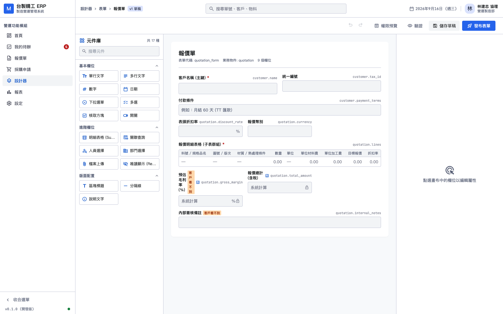

畫面分三欄：

| 區域 | 內容 |
|------|------|
| 左（280px）| 元件庫，17 種元件分三組：基本欄位、進階欄位、版面配置 |
| 中 | 畫布，以 12 欄網格預覽表單實際排版 |
| 右（340px）| 屬性面板，選取欄位後才有內容 |

**側邊欄可收合。** 左下角的「收合選單」把 240px 的選單縮成 56px，畫布寬度增加約 34%。設計時建議收起來，狀態會記住。

### 2.1 新增欄位

點左側元件庫的任一元件即可加入畫布。若已選取某個欄位，新欄位會插在它後面；否則加在最後。

### 2.2 編輯欄位屬性

點畫布上的欄位以選取，右側面板分三個頁籤：

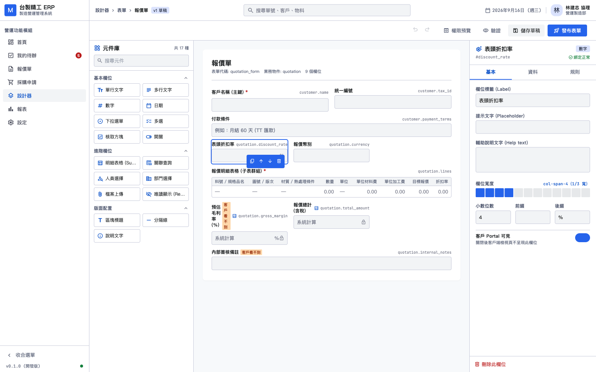

| 頁籤 | 對應 schema | 內容 |
|------|-------------|------|
| 基本 | `ui` | 標籤、提示文字、欄寬（12 欄網格）、小數位數、客戶 Portal 可見 |
| 資料 | `data` | 資料路徑、型別、預設值、最大最小值、計算公式 |
| 規則 | `workflow` | 顯示／唯讀／必填條件、可編輯與可檢視角色 |

**資料路徑格式為 `物件.欄位`**（例如 `quotation.discount_rate`）。格式錯誤時欄位下方會顯示紅字提示，發布時也會被擋下。

---

## 3. 設定欄位權限

切到右側面板的「規則」頁籤。

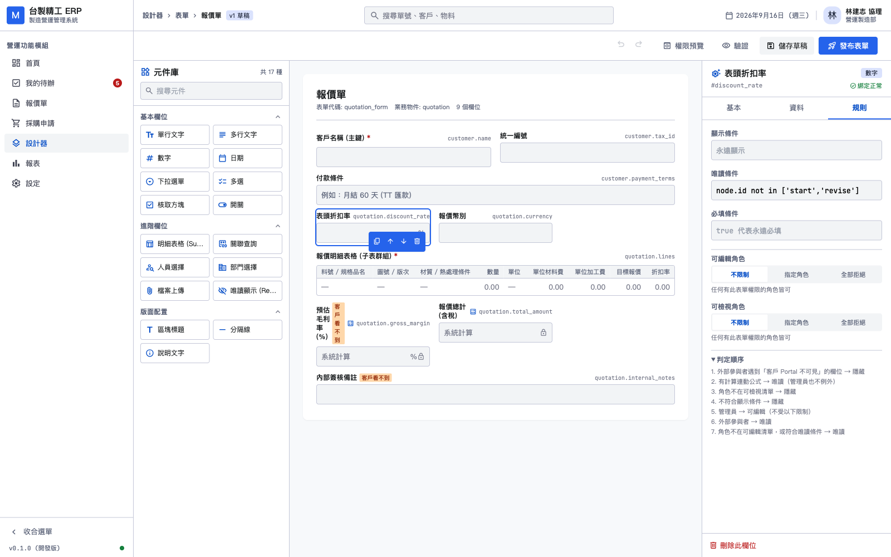

### 3.1 角色清單的三種狀態

可編輯角色與可檢視角色各有三種狀態，語意完全不同：

| 狀態 | 意義 | 使用時機 |
|------|------|----------|
| **不限制** | 任何有此表單權限的角色皆可 | 大多數欄位 |
| **指定角色** | 只有勾選的角色可以 | 成本、毛利等敏感欄位 |
| **全部拒絕** | 所有角色皆不可（管理員除外）| 純顯示欄位，或搭配條件式規則 |

> **為什麼要分三種而不是一個輸入框？**
>
> 「全部拒絕」與「不限制」若都用空白表示，使用者無從表達前者。
> 這兩者的效果完全相反——一個擋住所有人，一個放行所有人。

選「全部拒絕」時會顯示紅字警告，說明除系統管理員外所有角色都無法編輯。

### 3.2 判定順序

展開「判定順序」可看到完整規則。**順序很重要，前面的會覆蓋後面的**：

1. 外部參與者遇到「客戶 Portal 不可見」的欄位 → 隱藏
2. 有計算連動公式 → 唯讀（**管理員也不例外**）
3. 角色不在可檢視清單 → 隱藏
4. 不符合顯示條件 → 隱藏
5. 管理員 → 可編輯（不受以下限制）
6. 外部參與者 → 唯讀
7. 角色不在可編輯清單，或符合唯讀條件 → 唯讀

設計者最常誤解的是第 2 與第 5 條：設了計算公式的欄位，連管理員都改不了；而管理員不受角色清單限制，因此用管理員測試權限設定**看不出效果**。

### 3.3 即時預覽

點工具列的「權限預覽」展開底部面板。

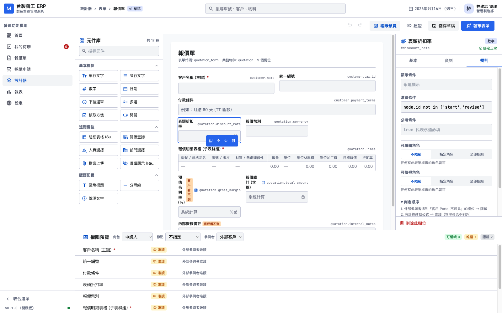

選擇角色、節點、參與者類型，立即看到每個欄位的判定結果與理由。

上圖是選「外部客戶」的結果：**可編輯 0、唯讀 7、隱藏 2**。兩個隱藏的欄位是「預估毛利率」與「內部簽核備註」，理由都是「外部參與者不可見」——這正是報價單「毛利不給客戶看」的實作。

> **預覽由後端計算，不是前端模擬。**
>
> 判定邏輯只該有一份。前端複製一份必然會與後端漂移，
> 而漂移的症狀是「畫面說可編輯、實際送出被擋」，極難追查。

**注意**：預覽反映的是**已儲存的草稿**。修改後未儲存時面板頂端會顯示黃色提示「草稿有未儲存的修改」，儲存後自動更新。

---

## 4. 設計流程

開啟 <http://localhost:3040/designer/workflows/quotation_approval>

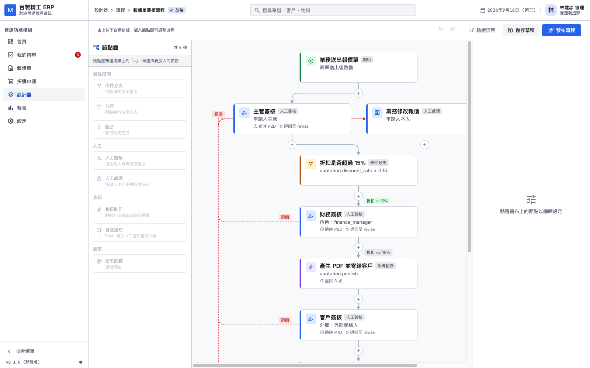

### 4.1 版面規則

**流程圖固定由上往下自動排版，不支援自由拖曳。**

這是刻意的設計決定。中小企業的流程多為「主幹加分支」的結構，自由拖曳會讓不同人畫出風格不一的圖，維護時反而難讀。

使用者的操作方式是：**先點連接線上的「+」選定插入位置，再從左側節點庫選型別**。未選插入點時節點庫是停用的——「加到哪」是必要資訊，不該由系統猜。

### 4.2 節點顏色

| 顏色 | 類別 | 節點 |
|------|------|------|
| 綠 | 開始 | trigger |
| 藍 | 人工 | human_approval、human_task |
| 黃 | 流程控制 | condition |
| 紫 | 系統 | action、notification |
| 深灰 | 結束 | end |

### 4.3 兩種連接線

| 樣式 | 意義 |
|------|------|
| 灰色實線 | 正常前進路徑 |
| **紅色虛線** | 退回路徑（`on_reject`／`on_failure`）|

退回路徑走畫面左側外緣，避免與主幹交錯。

### 4.4 節點屬性

點節點以選取，右側面板依型別顯示不同設定。

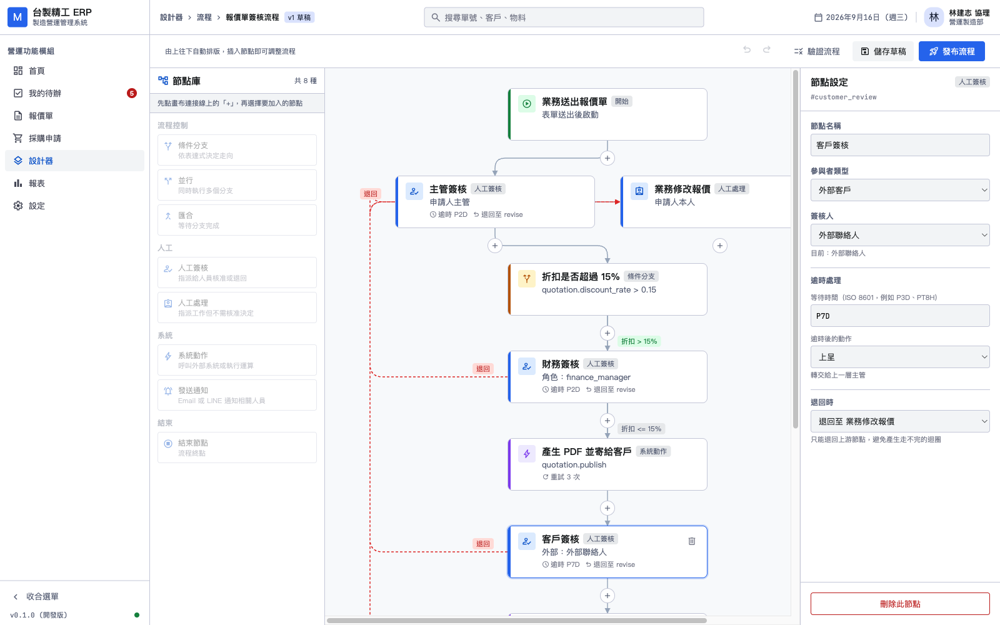

以「客戶簽核」為例：

- **參與者類型** 內部員工／外部客戶。選外部時後端一律判定為唯讀
- **簽核人** 申請人主管、部門主管、指定角色、指定人員、外部聯絡人等
- **逾時處理** ISO 8601 格式（`P2D` 為兩天、`PT8H` 為八小時）
- **退回時** 直接結束流程，或退回至某個上游節點

> **退回目標只列出上游節點。**
>
> 上圖的「客戶簽核」可退回 5 個節點，而流程開頭的「主管簽核」只能退回 1 個。
> 這是後端規則 WF-E004：退回目標必須在上游，否則會形成走不完的迴圈。
> 設計器先過濾一次，讓使用者根本選不到會被擋下的選項。

### 4.5 驗證流程

點工具列的「驗證流程」，後端會做圖結構檢查。

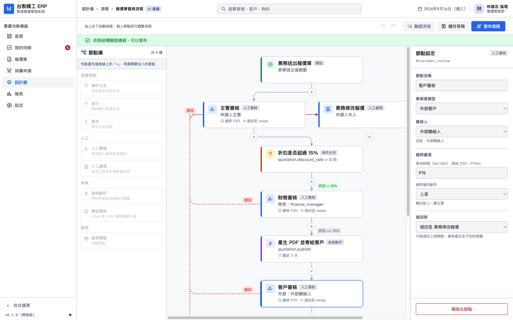

驗證失敗時會列出逐條錯誤，**點擊錯誤可跳到出問題的節點**，該節點在畫布上以紅框標示。

常見錯誤：

| 代碼 | 意義 |
|------|------|
| WF-E001 | 缺少 trigger 或 end 節點 |
| WF-E002 | 節點無法從 trigger 到達 |
| WF-E003 | condition 節點缺少 when=true／false 分支 |
| WF-E004 | 退回目標不在上游 |
| WF-E006 | 表達式無法解析，或退回目標不存在 |

---

## 5. 權限矩陣總覽

開啟 <http://localhost:3040/designer/permissions>

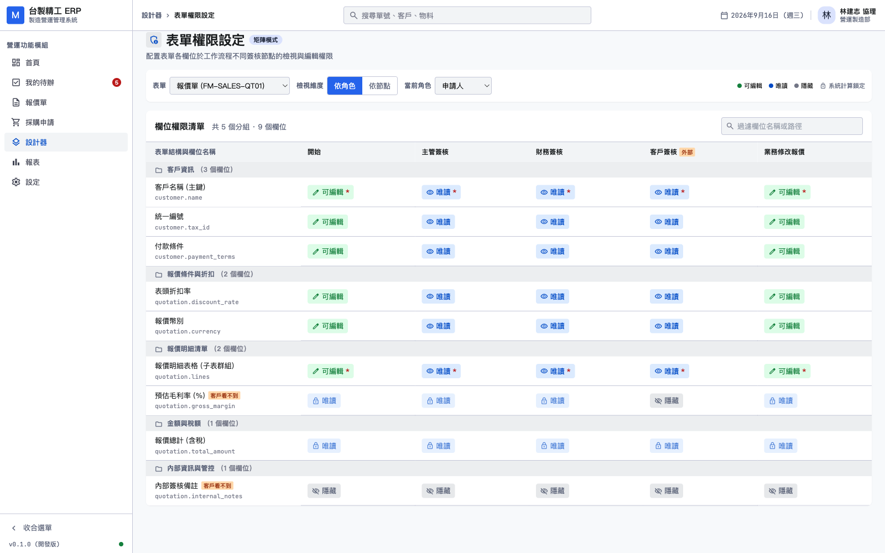

矩陣把「欄位 × 流程節點」的權限一次攤開。列為欄位（依 section 分組），欄為流程節點。

- 欄位自動帶出該表單對應流程的所有人工節點
- 「客戶簽核」欄標有橘色**外部**標記
- 每格顯示三態權限，滑鼠移上去可看判定理由
- 計算欄位的格子會鎖定，不可點擊

點擊格子可循環切換三態（可編輯 → 唯讀 → 隱藏），修改暫存在前端，按「儲存」才送出。

---

## 6. 設計單據版面

開啟 <http://localhost:3040/designer/templates/quotation>

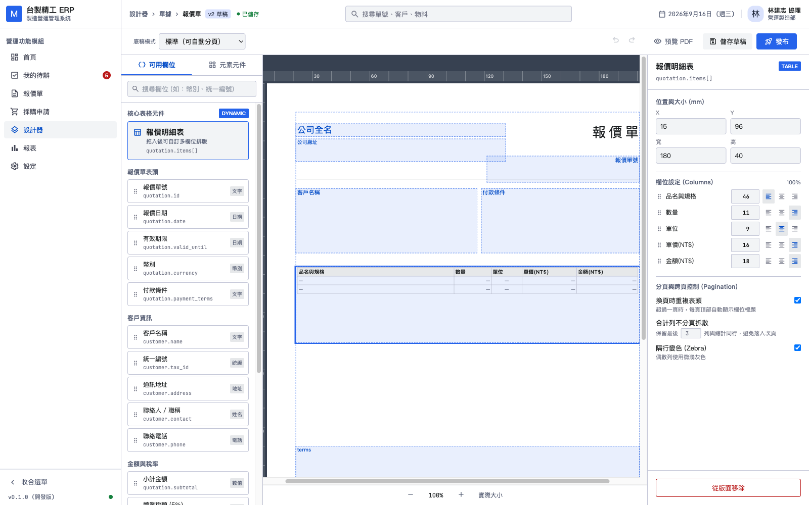

### 6.1 三欄結構

| 區域 | 內容 |
|------|------|
| 左 | 可用欄位／元素元件兩個頁籤 |
| 中 | A4 版面畫布，含 mm 標尺與 15mm 安全邊距虛線 |
| 右 | 元素屬性 |

**可用欄位**是這個設計器與一般繪圖工具的差別。每個欄位顯示中文標籤與資料路徑（例如 `customer.tax_id`），點擊即加入版面。綁定欄位的元素在畫布上以**淺藍底色與藍色虛線框**呈現，與靜態文字區分。

「報價明細表」獨立成一區並標記 `DYNAMIC`——它拖進去會展開成多欄動態表格，行為與其他單一值欄位不同。

### 6.2 操作方式

| 動作 | 方式 |
|------|------|
| 加入元素 | 點左側欄位或元素 |
| 選取 | 點畫布上的元素 |
| 移動 | 滑鼠拖曳，或方向鍵每次 1mm（按住 Shift 為 5mm）|
| 精確定位 | 右側面板直接輸入 X／Y 座標 |
| 縮放 | 底部 50%～200%，或按「實際大小」回到 100% |
| 復原／重做 | Cmd+Z／Cmd+Shift+Z |

### 6.3 明細表設定

選取明細表後，右側面板會顯示這個設計器最重要的一組設定：

**欄位設定（Columns）**：每欄可調整寬度百分比與對齊方式。面板右上角顯示總和，**不是 100% 時會顯示紅色警告**——總和不對會讓表格寬度與設定不符。

**分頁與跨頁控制**：

| 設定 | 說明 |
|------|------|
| 換頁時重複表頭 | 明細超過一頁時，每頁頂部自動顯示欄位標題 |
| 合計列不分頁拆散 | 保留最後 N 列與總計同行，避免落入次頁 |
| 隔行變色 | 偶數列使用微淺灰色 |

> **為什麼需要「合計列不分頁」？**
>
> 使用者看到上一頁只有「小計」、下一頁才出現「總計」，會誤以為金額有誤。
> 系統確保這三列永遠在同一頁。

### 6.4 預覽 PDF

點「預覽 PDF」會送到渲染服務產生**真實的 PDF**，不是前端模擬。

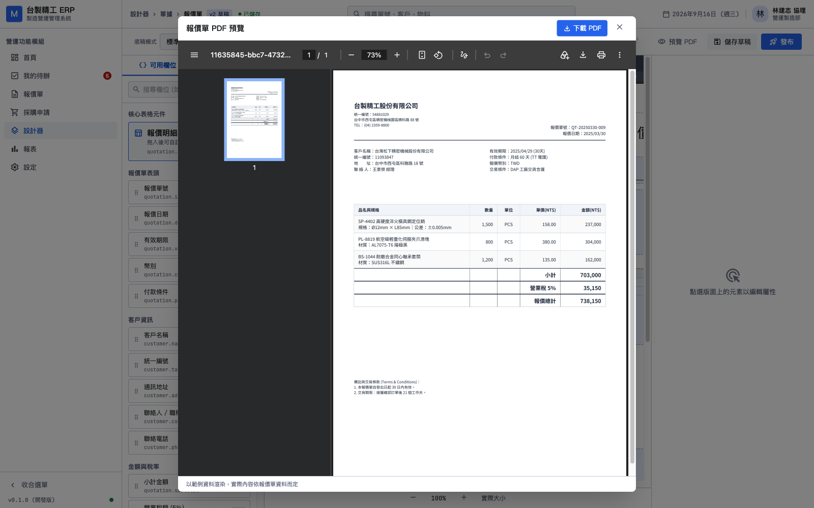

預覽以範例資料渲染，實際內容依報價單資料而定（視窗底部也有此提示）。可直接下載檢視。

> **設計時看到的就是印出來的。**
>
> 前端模擬會產生「畫面對了但 PDF 不對」的落差，因此預覽一律走真實渲染。

### 6.5 底稿模式

| 模式 | 說明 | 動態分頁 |
|------|------|----------|
| **標準** | 系統產生版面 | 支援 |
| **固定底稿** | 上傳既有 PDF 當背景 | **不支援** |

選固定底稿時畫面會顯示黃色警告：明細列數超過一頁會被截斷，僅適用於已有印刷格式且行數固定的單據。

---

## 7. 執行流程

目前尚無前端的「建立報價單」畫面，以 API 操作。

### 7.1 登入取得 token

```bash
TOKEN=$(curl -s -X POST http://localhost:3001/auth/login \
  -H 'Content-Type: application/json' \
  -d '{"tenant_code":"demo","email":"designer@demo.local","password":"demo1234"}' \
  | python3 -c 'import sys,json;print(json.load(sys.stdin)["access_token"])')
```

### 7.2 啟動流程

```bash
curl -X POST http://localhost:3001/instances \
  -H "Authorization: Bearer $TOKEN" -H 'Content-Type: application/json' \
  -d '{"workflow_key":"quotation_approval","business_key":"QT-MANUAL-001",
       "input":{"quotation":{"discount_rate":0.2,"amount":738150,
                "customer_contact_ids":["cust@example.com"]}}}'
```

回應：

```json
{"id":"bb4f719a-...","status":"RUNNING",
 "temporal_workflow_id":"11111111-...:quotation:QT-MANUAL-001"}
```

在 Temporal UI（<http://localhost:8080>）可看到流程正在執行：

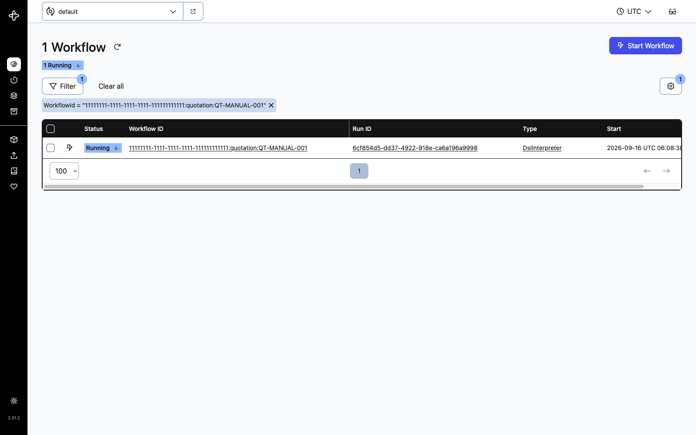

> **workflow_id 帶租戶前綴。**
>
> 格式為 `{tenant_id}:{business_object}:{business_key}`。
> 這不只是命名慣例，而是安全邊界——Signal 與 Cancel 都以它定位流程，
> 前綴由後端組合，呼叫端無從指定其他租戶。

### 7.3 查看收件匣

流程啟動後，Worker 會解析簽核人並建立待辦。本例的 `manager_of(initiator)` 解析為 designer 的主管，也就是 cfo。

```bash
CFO=$(curl -s -X POST http://localhost:3001/auth/login \
  -H 'Content-Type: application/json' \
  -d '{"tenant_code":"demo","email":"cfo@demo.local","password":"demo1234"}' \
  | python3 -c 'import sys,json;print(json.load(sys.stdin)["access_token"])')

curl -s http://localhost:3001/tasks -H "Authorization: Bearer $CFO"
```

### 7.4 送出決策

```bash
curl -X POST "http://localhost:3001/tasks/{task_id}/decision" \
  -H "Authorization: Bearer $CFO" -H 'Content-Type: application/json' \
  -d '{"decision":"APPROVE","comment":"金額合理，同意"}'
```

回應 `{"signalled":true}` 代表流程引擎已收到決策。

**本例的完整路徑**（折扣 20% > 15%，因此加簽財務）：

| 步驟 | 節點 | 操作者 | 結果 |
|------|------|--------|------|
| 1 | 主管簽核 | cfo@demo.local | APPROVED |
| 2 | 折扣判斷 | 系統 | 0.2 > 0.15，走「是」分支 |
| 3 | 財務簽核 | finance@demo.local | APPROVED |
| 4 | 產生 PDF 寄客戶 | 系統 | 執行 |
| 5 | 客戶簽核 | cust@example.com | APPROVED |
| 6 | 建立訂單、通知 | 系統 | 執行 |

流程完成：

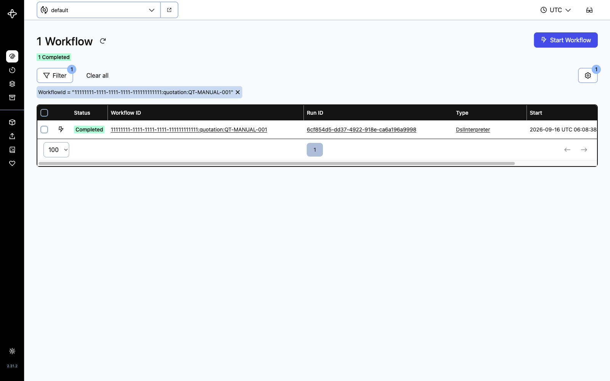

Temporal 記錄的最終路徑：

```json
["start","manager_approval","discount_gate","finance_approval",
 "publish_to_customer","customer_review","create_order","notify_done","end"]
```

### 7.5 決策送出的一致性保證

按下「核准」後要發生兩件事：資料庫記錄決策、Temporal 收到 Signal。兩者沒有分散式交易，因此順序是**先寫資料庫（未提交）→ 送 Signal → 成功才提交**。

Signal 失敗時交易回滾，待辦維持 PENDING，使用者重試即可。反過來做會出現最糟的狀態：待辦顯示「已核准」，但流程還停在原地等——而且沒有人會再送一次。

---

## 8. 產生報價單 PDF

```bash
curl -X POST http://localhost:3002/render/quotation \
  -H 'Content-Type: application/json' \
  -d @quotation-data.json -o quotation.pdf
```

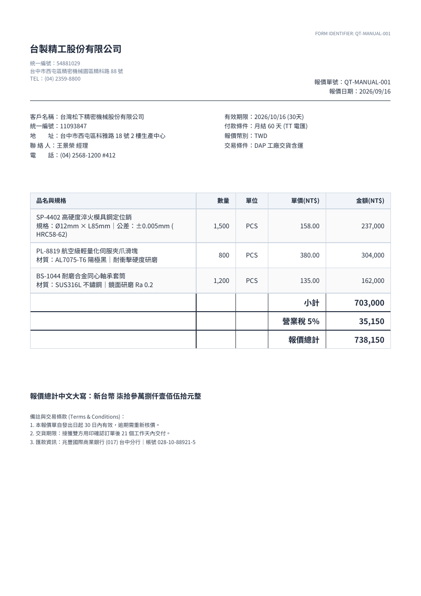

產出的 PDF 具備：

- **繁體中文**正常顯示（思源黑體，已內建）
- 金額欄**靠右對齊**，千分位格式
- 合計三列**粗體**，小計上方有分隔線
- **報價總計中文大寫**（防竄改用途）
- 明細超過一頁時自動分頁，每頁重複表頭，合計三列不被拆散

> **中文大寫為什麼重要？**
>
> 阿拉伯數字容易被竄改，「壹」不容易改成「貳」。
> 因此這個欄位的轉換必須精確——例如 `100001` 是
> 「壹拾萬**零**壹元整」而非「壹拾萬壹元整」，
> 少一個零會被讀成十萬一千。

---

## 9. 常見問題

### PDF 產出是一堆方框

未註冊中文字型。字型檔應位於 `pdfme/assets/fonts/`：

```
NotoSansCJKtc-Regular.otf
NotoSansCJKtc-Bold.otf
```

注意檔名是 `NotoSansCJKtc-*` 而非 `NotoSansTC-*`，後者在 noto-cjk repo 中不存在，下載會得到 HTML 錯誤頁。缺字型時渲染服務**會拒絕啟動**，不會等到印出豆腐字才發現。

### 流程啟動後停在第一個節點不動

Python Worker 未啟動。API 負責啟動流程，但實際執行在 Worker。

```bash
python-ai/.venv/bin/python python-ai/worker.py
```

若 Worker 已啟動仍不動，檢查 `INTERNAL_API_TOKEN` 是否設定——未設定時 internal API 停用，Worker 無法建立待辦。

### 流程相關端點回 503

Temporal 未連線。API 會正常啟動並記錄警告，但流程相關端點回 503。表單設計、權限矩陣等功能不受影響。

```bash
cd poc/temporal && docker compose up -d
```

### 權限設定了卻沒效果

三種可能：

1. **用管理員測試**。管理員不受角色清單限制，看不出效果。改用一般角色測試。
2. **欄位有計算公式**。計算欄位一律唯讀，連管理員都不例外。
3. **預覽未更新**。預覽反映已儲存的草稿，修改後需先儲存。

### 收件匣看不到待辦

待辦依「指派給誰」過濾。`manager_of(initiator)` 解析的是**發起人的主管**，不是發起人自己。用主管帳號登入才看得到。

---

## 10. 目前的限制

以下為已知且刻意未實作的部分，不是缺陷。

| 項目 | 現況 | 影響 |
|------|------|------|
| **外部客戶登入** | 無 Portal | 客戶簽核只能由內部人員代為操作。這是報價單流程完整價值的關鍵缺口 |
| 建立報價單畫面 | 無，僅 API | 需以 curl 操作 |
| 模板儲存與發布 | 按鈕僅顯示提示 | 版面調整無法保存 |
| `parallel`／`join` 節點 | 未支援 | 遇到時明確失敗，不會靜默跳過 |
| 逾時 ESCALATE | 未實作 | 暫時走退回路徑 |
| 系統動作與通知 | 僅記稽核 | 未接 ERP 與實際寄信 |
| 固定底稿模式 | 僅顯示警告 | 無法上傳 PDF 底稿 |
| 欄位拖放 | 點擊加入 | 非真正的拖放操作 |

---

## 附錄：測試涵蓋

| 元件 | 測試數 | 狀態 |
|------|--------|------|
| Rust（API、持久化、領域邏輯）| 144 | 全數通過 |
| 前端（Vue） | 201 | 全數通過 |
| PDF 渲染 | 57 | 全數通過 |
| Python（Interpreter、Policy、表達式）| 107 | 全數通過 |
| **合計** | **509** | **全數通過** |

執行方式：

```bash
cd server && cargo test
cd web && npm test
cd pdfme && npx vitest run
cd python-ai && .venv/bin/python -m pytest -q
```

租戶隔離另有獨立驗證：

```bash
set -a && . .env && set +a
APP_DATABASE_URL="$DATABASE_URL" bash server/migrations/verify_rls.sh
```
