# 建立表單操作手冊

- 對象：要自己維護表單的使用者（不需要資訊背景）
- 使用帳號：`designer@demo.local`（陳雅婷，流程設計者）
- 前置：系統已啟動，見 [開發環境建立](../交接手冊/01_開發環境建立.md)
- 截圖來源：`web/e2e/manual-01-form.spec.ts`（UI 改版時會失敗，截圖不會過期）

本手冊示範**從零建立一張全新的表單**，不是修改既有的。

---

## 1. 登入

開啟 http://localhost:3040

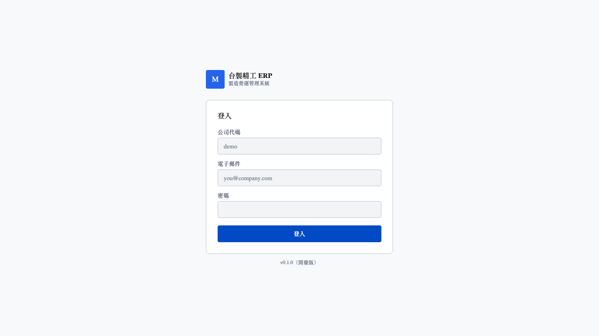

三個欄位：

| 欄位 | 填什麼 |
|------|--------|
| 公司代碼 | `demo` |
| 電子郵件 | `designer@demo.local` |
| 密碼 | `demo1234` |


按「登入」進入首頁。


---

## 2. 進入表單清單

左側選單點「設計器」展開四個子項目。

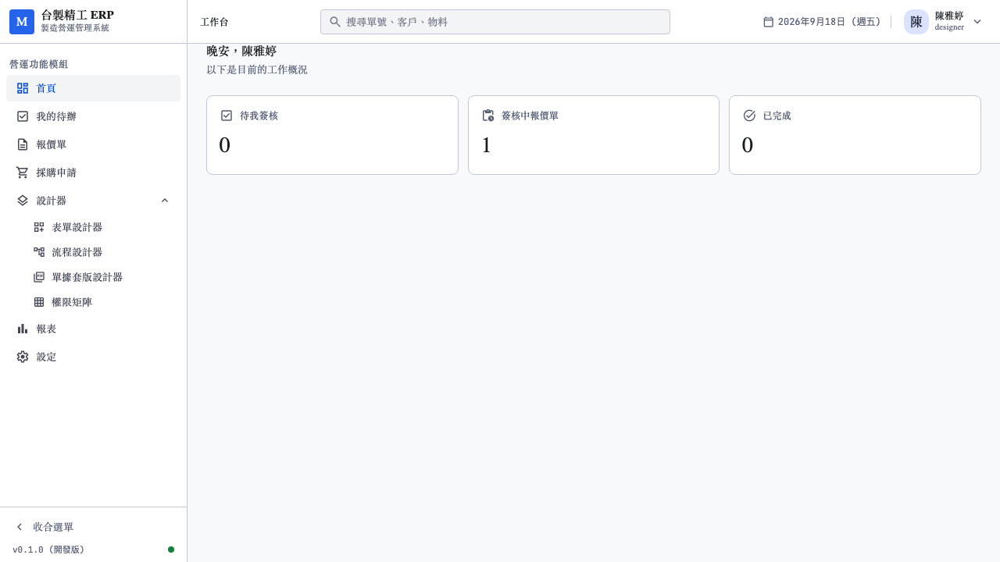

四個設計器各有用途：

| 子項目 | 用途 |
|--------|------|
| 表單設計器 | 定義單據有哪些欄位（本手冊）|
| 流程設計器 | 定義簽核要走幾關、誰簽 |
| 單據套版設計器 | 定義列印出來的 PDF 長什麼樣 |
| 權限矩陣 | 一次檢視所有欄位的權限設定 |

點「表單設計器」進入清單。

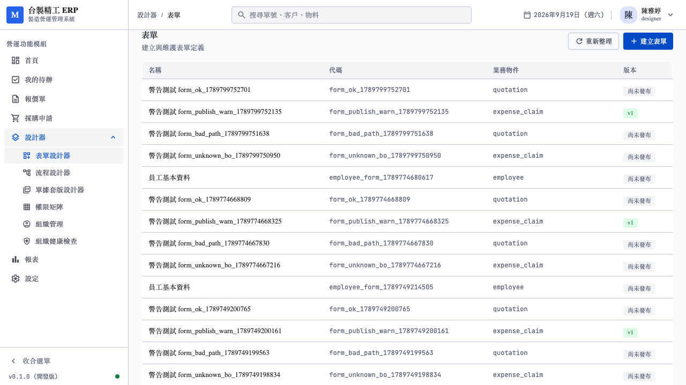

清單顯示每張表單的名稱、代碼、業務物件與版本狀態：

- **v3** — 已發布第 3 版，沒有未完成的修改
- **v2 · 有草稿** — 已發布第 2 版，另有編輯中的草稿
- **尚未發布** — 只有草稿，還沒有任何版本上線

---

## 3. 建立新表單

按右上角「建立表單」。

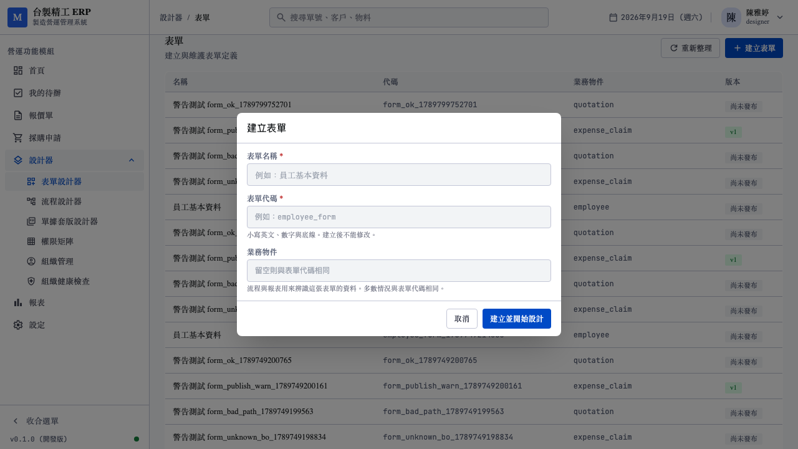

三個欄位：

| 欄位 | 說明 |
|------|------|
| **表單名稱** | 給人看的名稱，例如「員工基本資料」。之後可以改 |
| **表單代碼** | 系統用的識別碼，例如 `employee_form`。**建立後不能改** |
| 業務物件 | 這張表單管的是什麼資料。留空則與表單代碼相同 |

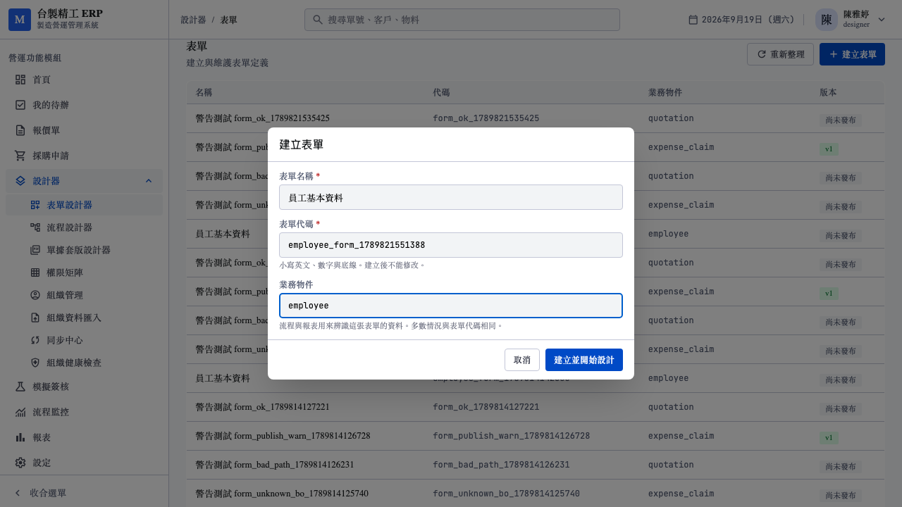

**表單代碼的限制**：只能用小寫英文、數字與底線，且要以英文開頭。

> 為什麼不能改？表單代碼會變成系統網址的一部分，也是資料庫關聯的依據。
> 改了會讓既有的單據找不到自己的表單定義。

**業務物件是什麼？** 它決定流程的條件式可以引用哪些資料。
業務物件填 `employee` 時，流程才能寫 `employee.salary > 50000`
這種判斷。同一個業務物件可以有多張表單（例如「員工基本資料」與
「員工異動申請」），它們共用同一套欄位名稱。

按「建立並開始設計」。

---

## 4. 新表單的起始畫面

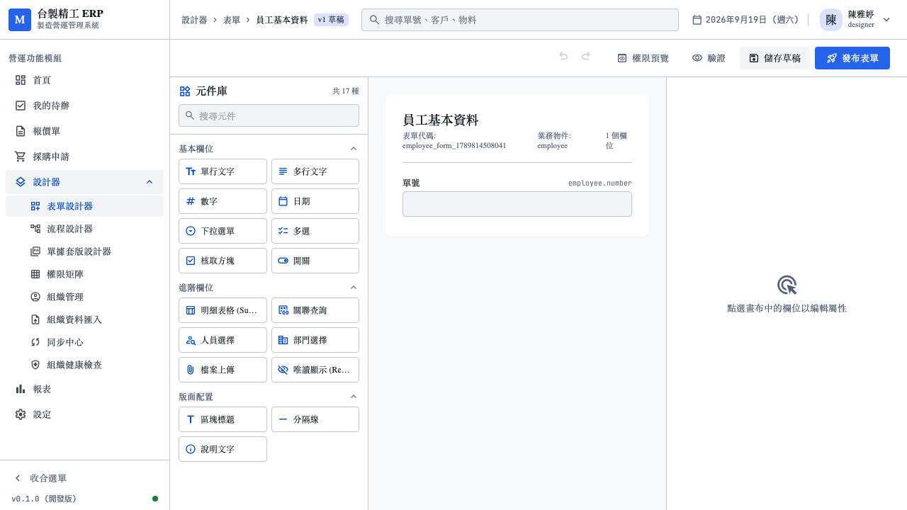

畫面分三區：

| 區域 | 內容 |
|------|------|
| 左 | **元件庫** — 可以加入的欄位類型，共 17 種 |
| 中 | **畫布** — 表單實際的樣子 |
| 右 | **屬性面板** — 選中欄位後在這裡設定 |

新表單會自帶一個「單號」欄位。這不是多餘的——幾乎每張單據都需要
一個編號，而且它示範了最基本的組合：一個欄位 + 一條資料路徑。

右上角的 `v1 草稿` 表示目前是尚未發布的草稿。

---

## 5. 元件庫

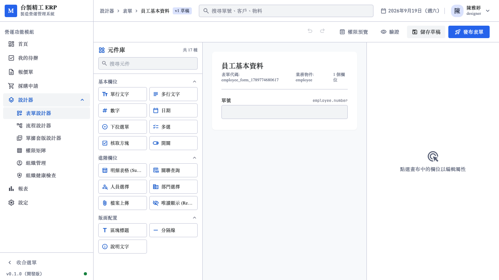

分三組：

**基本欄位**

| 元件 | 用途 |
|------|------|
| 單行文字 | 姓名、單號這類短文字 |
| 多行文字 | 備註、說明 |
| 數字 | 金額、數量 |
| 日期 | 到職日、有效期限 |
| 下拉選單 | 從固定選項挑一個 |
| 多選 | 從固定選項挑多個 |
| 核取方塊 | 是／否 |
| 開關 | 是／否（視覺上像開關）|

**進階欄位**

| 元件 | 用途 |
|------|------|
| **明細表格** | 子表格。工作經歷、家庭成員這類「一張單多筆資料」|
| 關聯查詢 | 從其他資料表挑一筆（例如挑部門）|
| 人員選擇 | 從使用者清單挑人 |
| 部門選擇 | 從部門清單挑 |
| 檔案上傳 | 附件 |
| 唯讀顯示 | 計算結果，使用者不能編輯 |

**版面配置**

區塊標題、分隔線、說明文字——不存資料，只影響版面。

---

## 6. 加入欄位

**點一下元件庫的項目就會加入畫布**，不需要拖曳。

點「單行文字」。

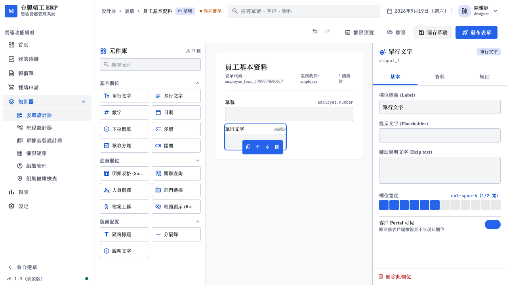

新欄位會自動選取，右側出現屬性面板。

### 6.1 基本分頁

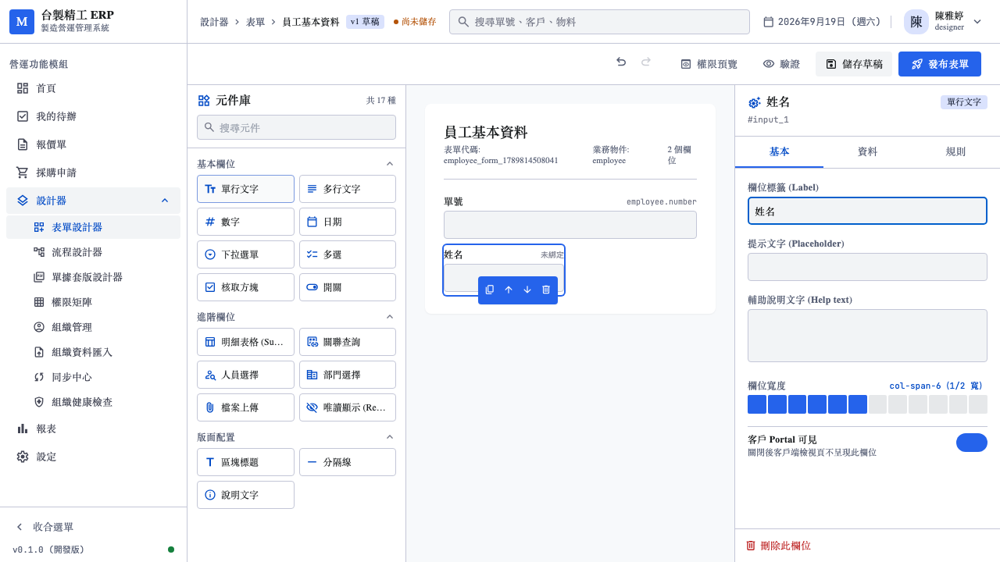

| 屬性 | 說明 |
|------|------|
| **欄位標籤** | 使用者看到的名稱，例如「姓名」 |
| 提示文字 | 欄位空白時顯示的灰字 |
| 輔助說明文字 | 欄位下方的小字說明 |
| 欄位寬度 | 佔幾格。12 格為滿版 |
| **客戶 Portal 可見** | 關掉的話外部客戶看不到這個欄位 |

> **客戶 Portal 可見**這個開關控制外部人員看不看得到這個欄位。
> 員工表單通常不會給外部看，但薪資、考績這類欄位仍建議關掉——
> 表單日後若被其他流程引用，關掉比事後補救安全。
>
> 這個開關在需要送給外部的單據上更關鍵。例如報價單的成本與毛利率
> 一定要關，否則等於把底價告訴客戶。

### 6.2 資料分頁

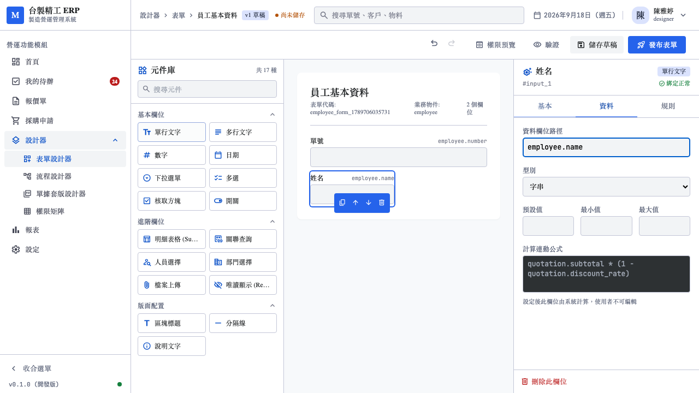

**資料路徑**決定這個欄位的值存到哪裡。

格式是 `業務物件.欄位名`，例如 `employee.name`。

規則：

- 用小寫英文與底線，例如 `hire_date` 不要寫 `hireDate`
- 同一個概念在不同表單要用**同一個名字**。「總計」一張表單叫 `total`
  另一張叫 `total_amount` 的話，流程的條件式會在其中一張上失效
- 巢狀路徑用點分隔，例如 `customer.contact_email`

> 這一步容易被略過，但它決定了流程能不能判斷這張單。
> 條件式 `employee.salary > 50000` 能成立的前提是有欄位宣告了
> `employee.salary` 這條路徑。

---

## 7. 加入更多欄位

重複同樣的動作：點元件 → 設標籤 → 設資料路徑。

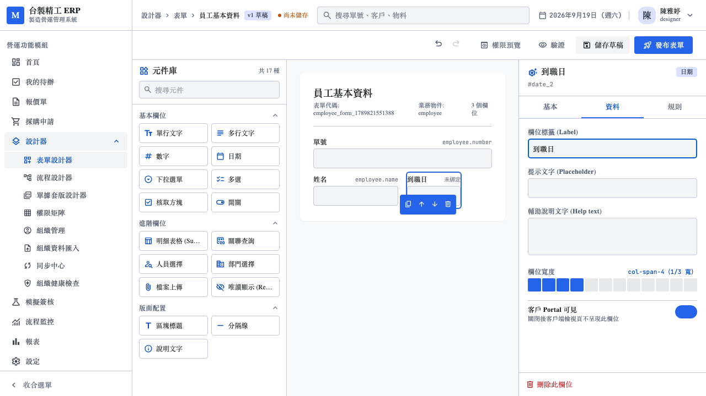

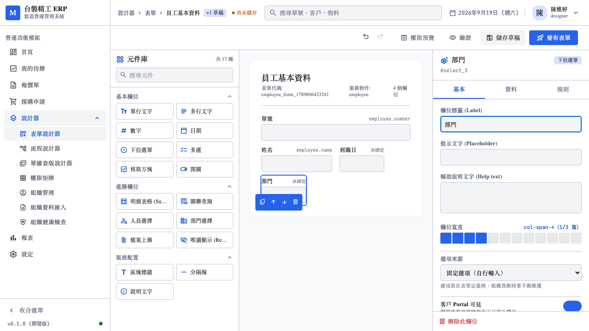

**注意**：屬性面板會停在上一次選的分頁。如果剛才在「資料」分頁，
加入新欄位後要自己切回「基本」才看得到欄位標籤。

---

## 8. 明細表格

點進階欄位的「明細表格」。

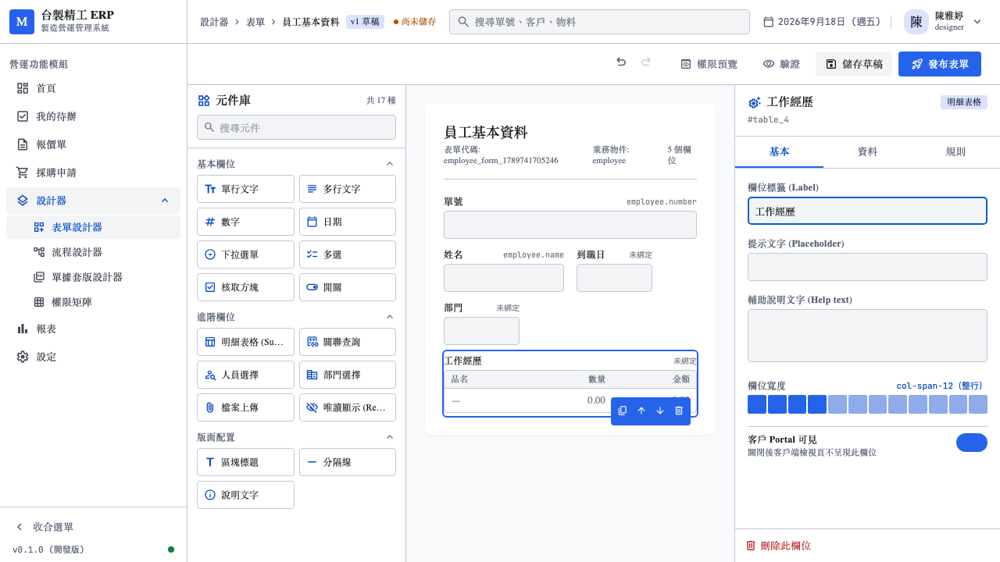

這裡加的是「工作經歷」。

明細表格是「一張單有多筆資料」的欄位。例如：

```
員工基本資料（一張）
  ├── 工作經歷 1：台積電  製程工程師  2018-2021
  ├── 工作經歷 2：聯電    設備工程師  2021-2023
  └── 工作經歷 3：日月光  課長        2023-2025
```

表格的每一欄要各自設定（公司、職稱、起訖日…）。
與一般欄位不同的是，它的資料路徑指向一個陣列。

> 截圖中表格的欄位還是預設的「品名／數量／金額」。
> 那是元件的預設欄位，要在「資料」分頁逐欄改成工作經歷需要的內容。

---

## 9. 欄位規則

切到「規則」分頁。

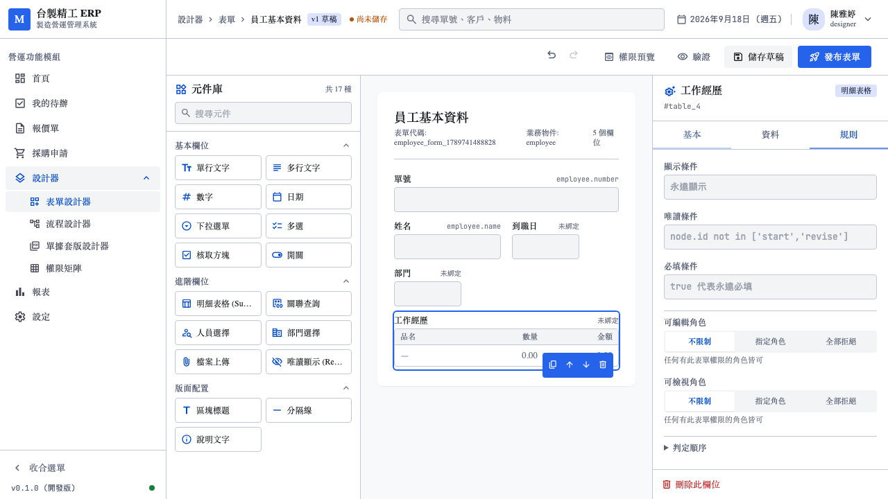

| 規則 | 說明 |
|------|------|
| **顯示條件** | 什麼情況下才顯示這個欄位 |
| **唯讀條件** | 什麼情況下不能編輯 |
| **必填條件** | 什麼情況下必須填 |

條件可以引用流程節點，例如：

```
node.id not in ['start', 'revise']
```

意思是「除了填寫與修改階段，其他關卡都唯讀」——
送簽之後金額就不該再被改動。

也可以引用欄位值：

```
employee.employment_type == 'contract'
```

意思是「員工類型是約聘時才顯示」（例如合約到期日）。

---

## 10. 權限預覽

設好權限後，用預覽確認實際效果。按上方「權限預覽」。


下方出現面板，顯示**每個欄位在特定角色眼中的樣子**：

| 標示 | 意思 |
|------|------|
| 可編輯 | 該角色可以填寫 |
| 唯讀 | 看得到但不能改 |
| 隱藏 | 完全看不到 |

切換角色看不同結果。

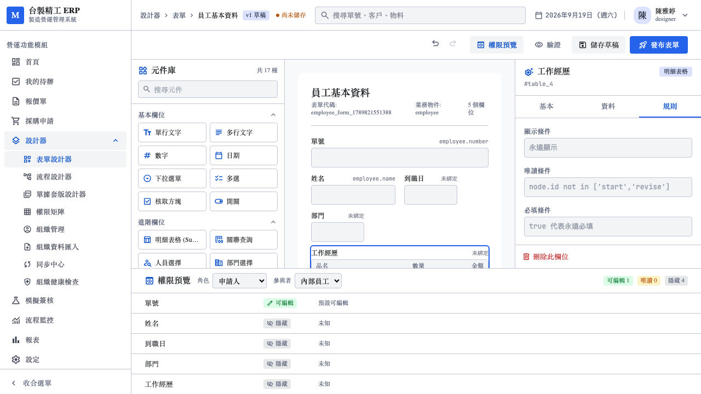

> 權限由六條規則依序判定，設計者很難從幾個獨立的設定推出最終結果。
> 預覽直接問系統「這個角色實際會看到什麼」，比自己推可靠。

---

## 11. 驗證

按「驗證」檢查表單有沒有問題。

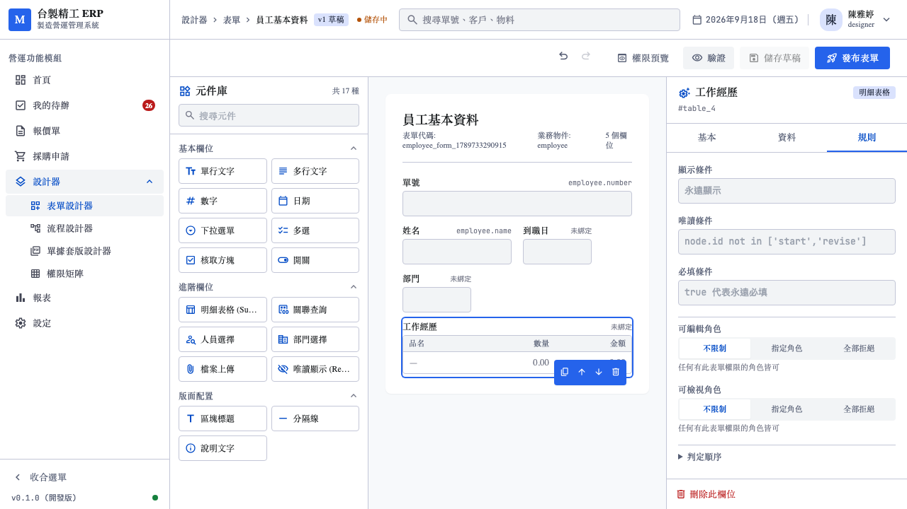

會檢查：欄位代碼有沒有重複、資料路徑格式對不對、
條件式寫得出來嗎、必填的設定完整嗎。

---

## 12. 儲存與發布

### 儲存草稿

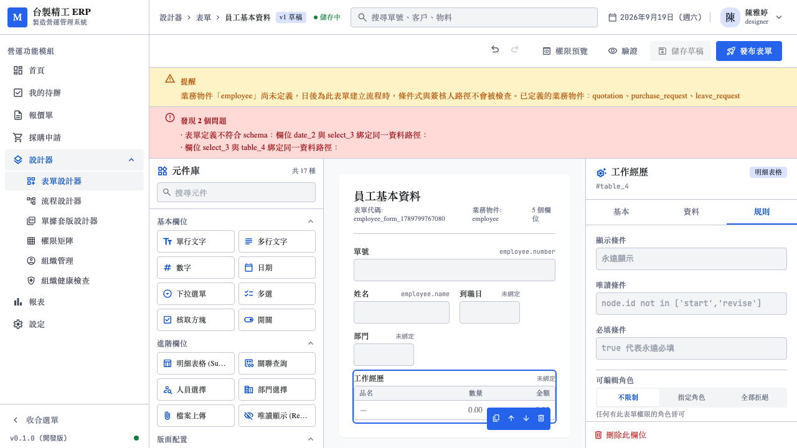

草稿只有自己看得到，不影響正在使用這張表單的人。
可以存很多次，改到滿意為止。

### 發布

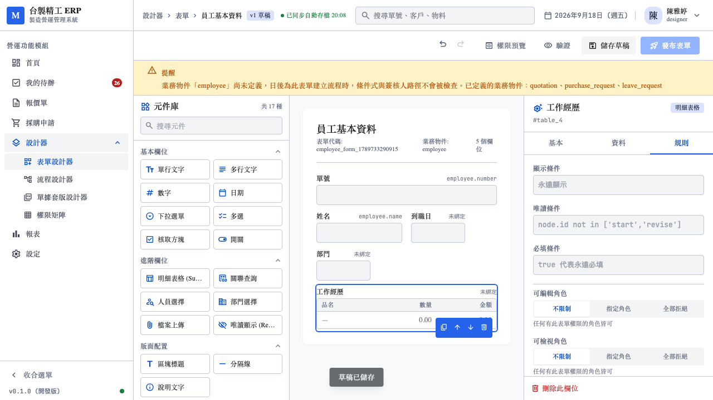

發布後這個版本才會生效。

| | 草稿 | 已發布 |
|---|---|---|
| 誰看得到 | 只有設計者 | 所有使用者 |
| 新建的單據 | 不會用到 | 會用到 |
| 可以再改嗎 | 可以 | 要另存新草稿 |

**發布不會影響進行中的單據**——它們仍用送簽當時的版本。

---

## 13. 完成

回到清單頁，新表單已經在裡面。

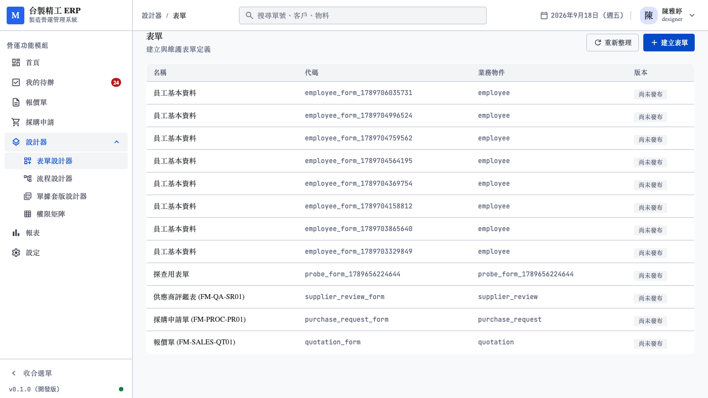

---

## 14. 下一步

表單定義了「要填什麼」，流程定義了「誰來簽」。兩者都需要。

接著看 [建立流程操作手冊](03_建立流程操作手冊.md)。

---

## 常見問題

**表單代碼可以改嗎？**
不能。它是網址與資料關聯的依據。取錯的話只能建一張新的。

**刪掉欄位會影響既有單據嗎？**
已送簽的單據用的是當時的版本，不受影響。但新建的單據就沒有那個欄位了，
而報表如果在查那個欄位會查不到。刪之前先確認沒有流程的條件式在引用它。

**「業務物件」和「表單代碼」有什麼差別？**
表單代碼是「這張表單」，業務物件是「這類資料」。
「員工基本資料」與「員工異動申請」是兩張表單（兩個代碼），
但都在管員工這件事（同一個業務物件 `employee`），
所以共用欄位名稱與流程條件式。

**為什麼新表單一定會有「單號」欄位？**
系統要求表單至少有一個欄位。用單號當預設是因為幾乎每張單據都需要它，
而且它示範了最基本的欄位設定。不需要的話可以刪掉，但要先加別的欄位。
