# 建立流程操作手冊

- 對象：要自己維護簽核流程的使用者（不需要資訊背景）
- 使用帳號：`designer@demo.local`（陳雅婷，流程設計者）
- 前置：已讀 [建立表單操作手冊](02_建立表單操作手冊.md)
- 截圖來源：`web/e2e/manual-02-workflow.spec.ts`

本手冊示範**從零建立一個全新的簽核流程**。

---

## 1. 登入

開啟 http://localhost:3040，用 `designer@demo.local` / `demo1234` 登入，
公司代碼 `demo`。


---

## 2. 進入流程清單

左側「設計器」展開後點「流程設計器」。

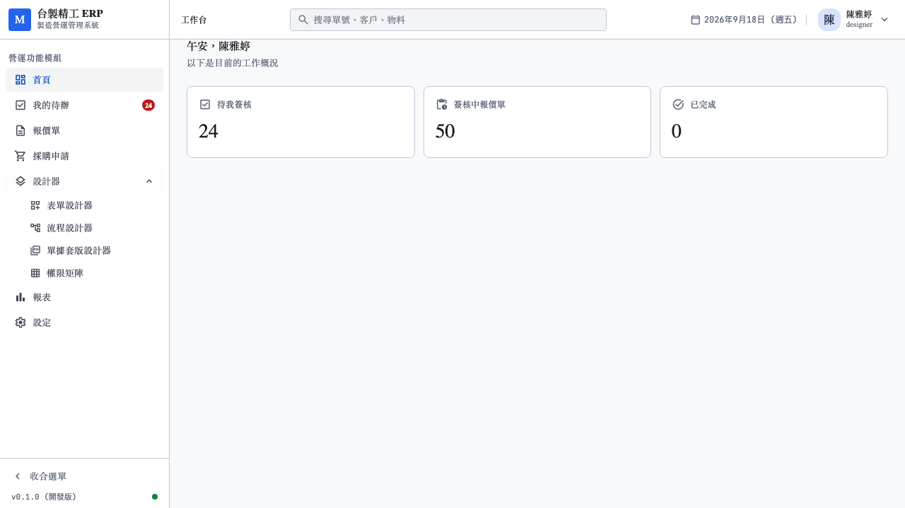

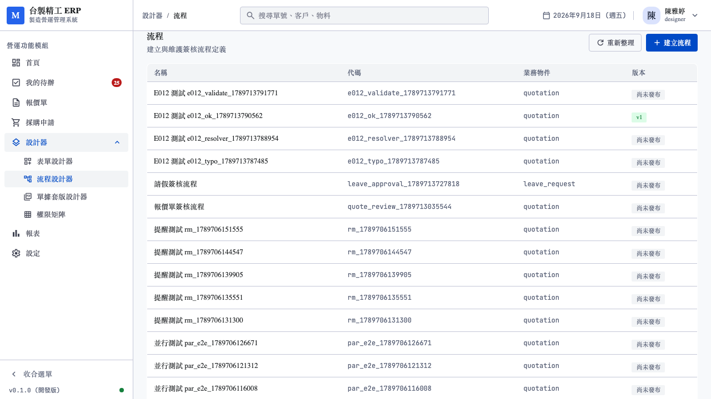

與表單清單一樣，顯示名稱、代碼、業務物件與版本狀態。

---

## 3. 建立新流程

按右上角「建立流程」。

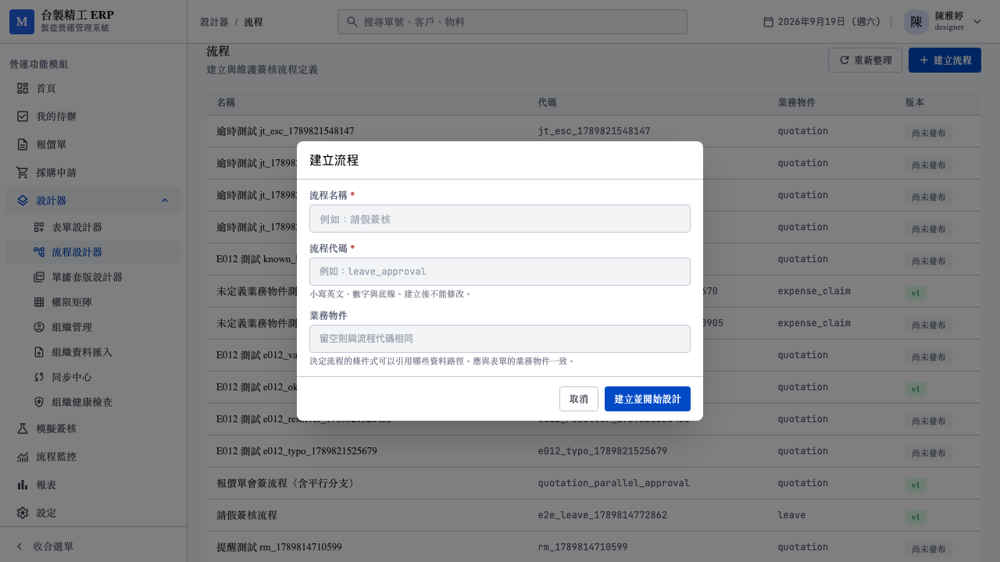

| 欄位 | 說明 |
|------|------|
| **流程名稱** | 給人看的名稱，例如「請假簽核流程」 |
| **流程代碼** | 系統識別碼，例如 `leave_approval`。**建立後不能改** |
| 業務物件 | **要與表單的業務物件一致**，這裡填 `leave_request` |

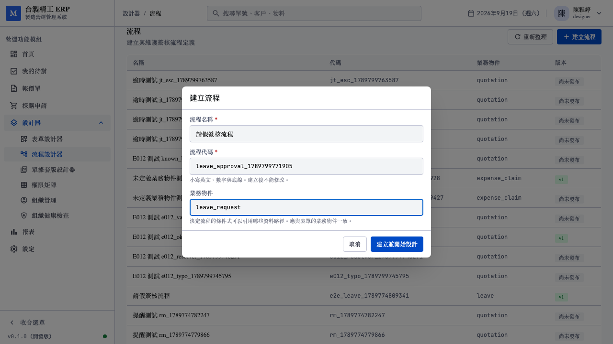

> **業務物件必須與表單一致。** 它決定流程的條件式可以引用哪些欄位。
> 填錯的話條件式會寫不出來——或者更糟，寫出來但永遠不成立。
>
> 業務物件必須已有欄位定義（`schemas/business-objects/*.json`）。
> 目前有 `quotation`（報價單）、`purchase_request`（採購申請）、
> `leave_request`（請假單）三個定義。填其他名稱的話，
> 條件式會在發布時被 WF-E012 擋下。

按「建立並開始設計」。

---

## 4. 新流程的起始畫面

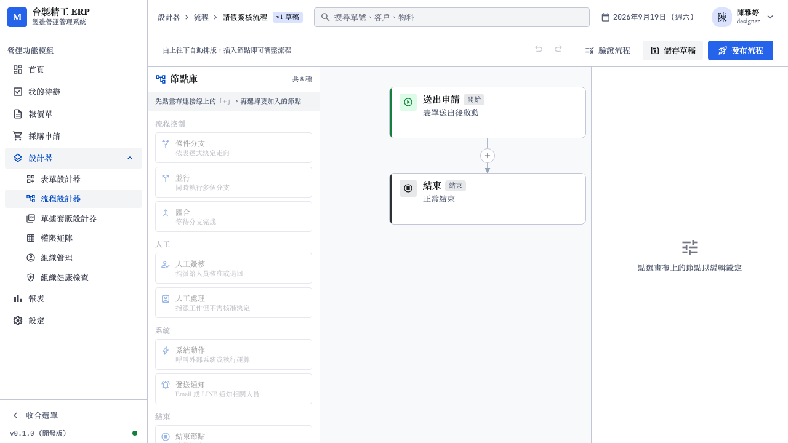

新流程是最小骨架：**送出申請 → 結束**，中間沒有任何簽核。

畫面分三區：

| 區域 | 內容 |
|------|------|
| 左 | **節點庫** — 可以加入的節點類型，共 8 種 |
| 中 | **畫布** — 流程圖。由上往下自動排版 |
| 右 | **節點設定** — 選中節點後在這裡設定 |

節點之間的連線上有 `+` 符號，那是**插入點**。

---

## 5. 節點類型

| 分類 | 節點 | 用途 |
|------|------|------|
| 流程控制 | **條件分支** | 依表達式決定走向，例如金額大小 |
| | **並行** | 同時執行多個分支，例如三個部門同時簽 |
| | **匯合** | 等待並行的分支完成 |
| 人工 | **人工簽核** | 指派給人，核准或退回 |
| | **人工處理** | 指派工作但不需要核准決定 |
| 系統 | **系統動作** | 呼叫外部系統或執行運算 |
| | **發送通知** | Email 或 LINE 通知相關人員 |
| 結束 | **結束節點** | 流程終點 |

---

## 6. 插入第一個簽核節點

點連線上的 `+`。

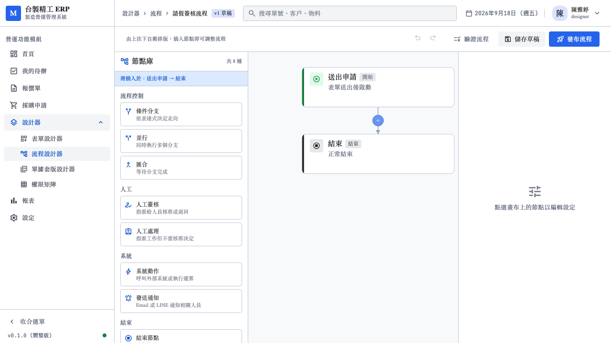

左側節點庫亮起，選「人工簽核」。

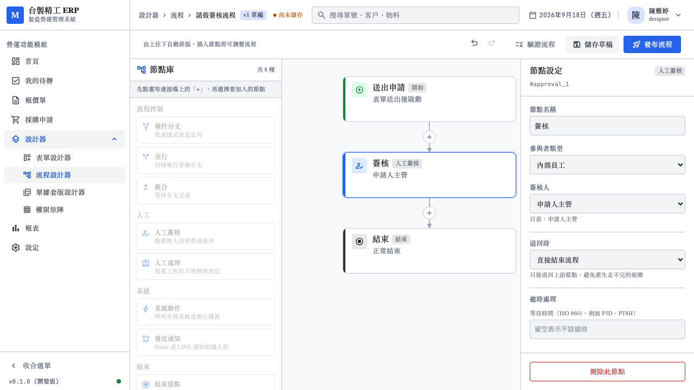

節點加入畫布，右側出現設定面板。

---

## 7. 設定簽核節點

### 7.1 節點名稱

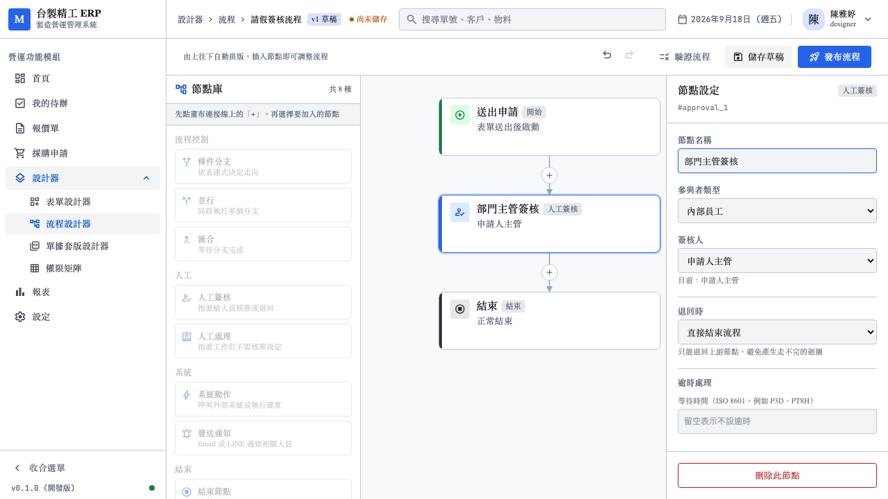

使用者在待辦清單看到的就是這個名稱。寫「部門主管簽核」比寫
「第一關」清楚得多。

### 7.2 誰來簽（最重要的一步）

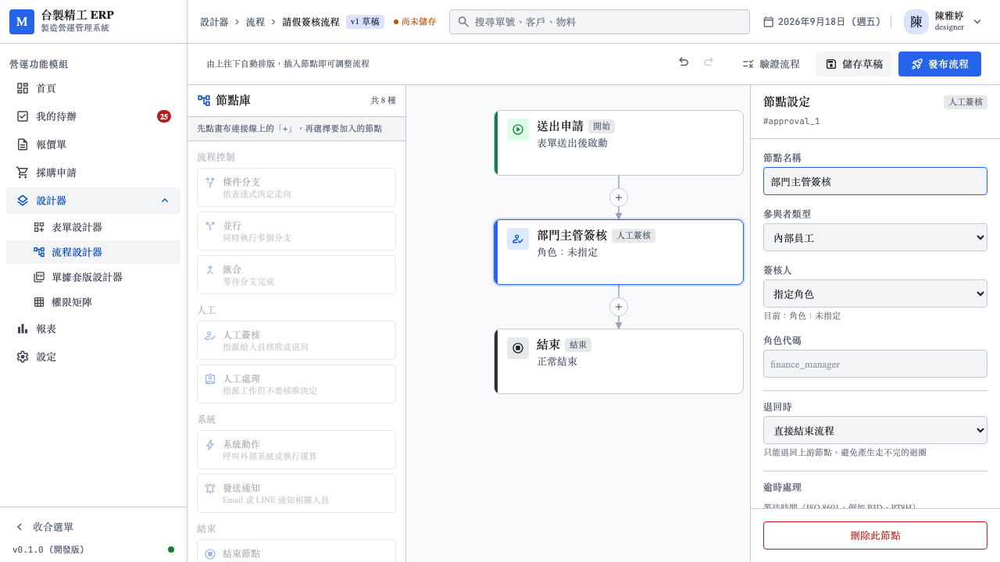

七種指派方式：

| 類型 | 說明 | 適用情況 |
|------|------|----------|
| **指定人員** | 直接選某個人 | 固定由某人簽，例如總經理 |
| **角色** | 擁有該角色的人 | 財務簽核由 finance_manager 簽 |
| **部門主管** | 申請人所屬部門的主管 | 一般的逐級簽核 |
| **某人的主管** | 指定對象的主管 | 跨部門的往上簽 |
| **申請人** | 發起這張單的人 | 退回後請他修改 |
| **外部聯絡人** | 客戶或供應商 | 報價單請客戶確認 |
| **表達式** | 用條件動態決定 | 金額大小決定簽核層級 |

選「角色」後填入角色代碼。

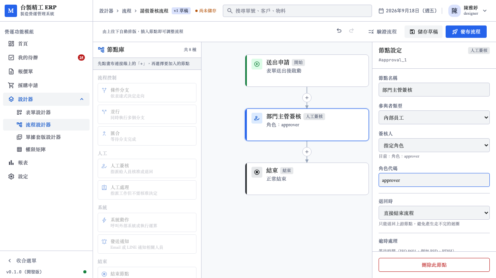

> **這一步設錯，流程會直接失敗。** 找不到符合條件的人時，
> 流程會停在 FAILED 而不是繼續走——這是刻意的設計，
> 因為「沒有人簽核就自動通過」比停下來危險得多。
>
> 常見錯誤：角色代碼打錯、指定的人員已離職、部門沒有設主管。

---

## 8. 逾時處理

簽核放著沒人理怎麼辦？


**等待時間**用 ISO 8601 格式：

| 寫法 | 意思 |
|------|------|
| `P3D` | 3 天 |
| `P1D` | 1 天 |
| `PT12H` | 12 小時 |
| `PT6H` | 6 小時 |

時間到了之後怎麼做，有四種選擇：

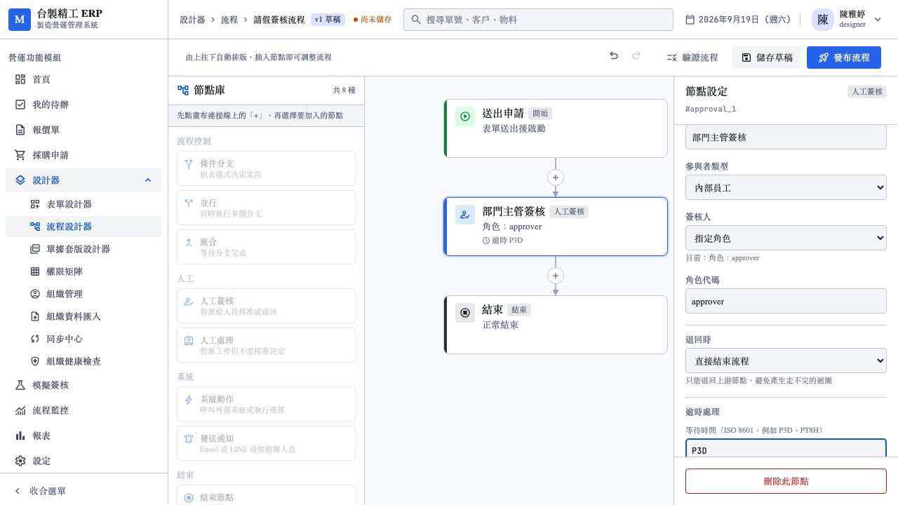

| 策略 | 行為 | 適用 |
|------|------|------|
| **繼續等待** | 不做事，持續等 | 一定要本人簽的關卡 |
| **自動核准** | 視同通過，往下走 | 低風險的知會性關卡 |
| **自動退回** | 視同退回 | 有時效性的申請 |
| **往上呈報** | 轉給上一層主管 | 主管請假時不卡住流程 |

> 選「自動核准」要謹慎——那等於說「沒人管就過」。
> 金額大的簽核建議用「往上呈報」或「自動退回」。

### 到期前提醒

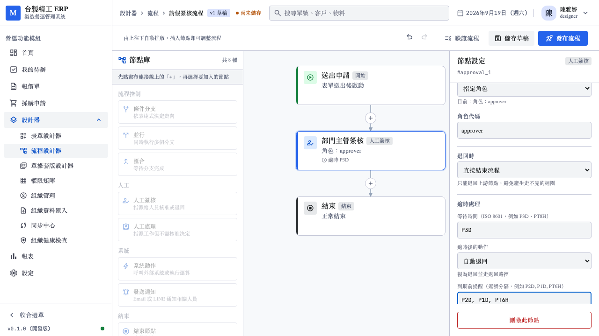

在到期前主動發信提醒。可以設多個時間點，用逗號分隔：

```
P2D, P1D, PT6H
```

意思是「到期前 2 天、1 天、6 小時各發一次」。

注意這些值是**距離到期還有多久**，不是「從現在起算」。
所以提醒時間不能比等待時間長——設 `P5D` 而等待時間只有 `P3D` 的話，
那個提醒點在流程開始之前，會被忽略。

---

## 9. 插入條件分支

流程常常需要「金額大的多簽一關」這種判斷。

點簽核節點前面的 `+`。

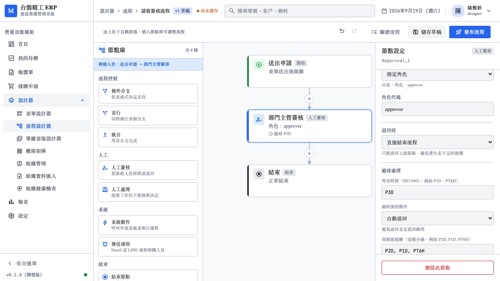

選「條件分支」。

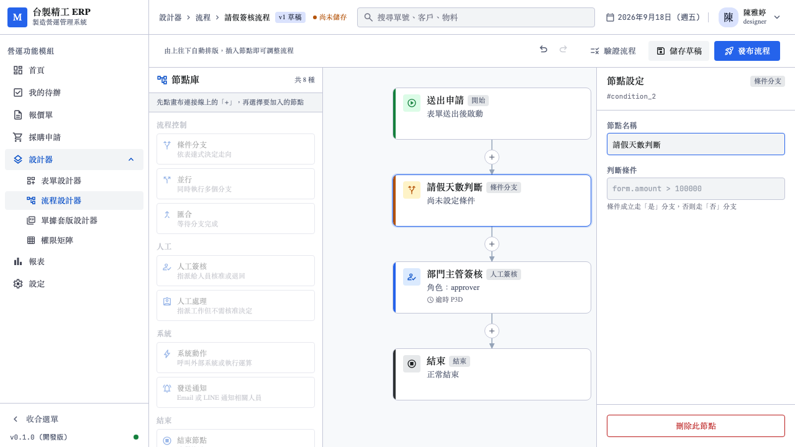

填入判斷條件。

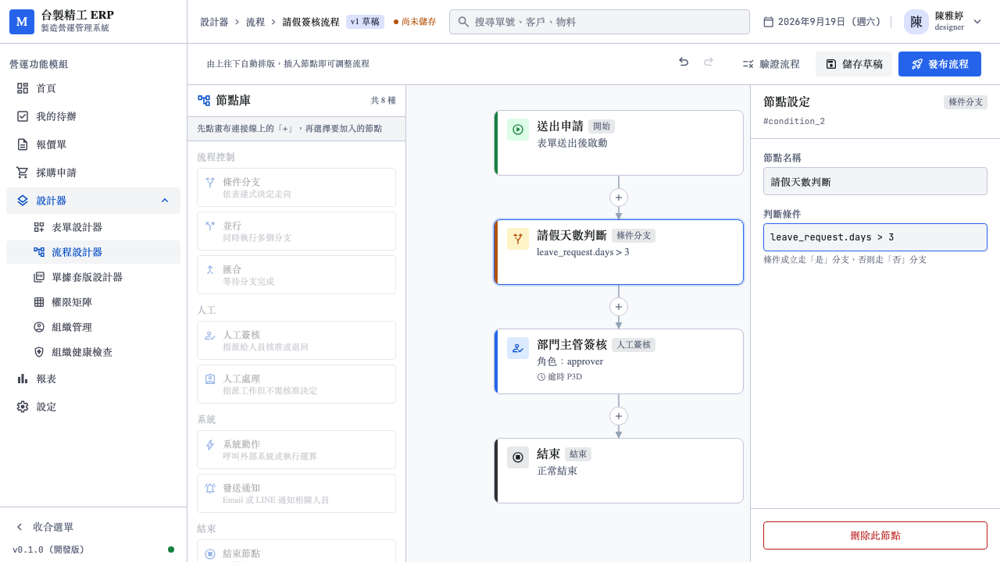

條件式引用表單的資料路徑：

```
leave_request.days > 3
```

意思是「請假超過 3 天時走『是』分支，否則走『否』分支」。
可以在『是』那條線接一個更高層的簽核節點。

> **路徑打錯會怎樣？**
>
> 系統會在發布時擋下來並告訴你哪裡錯了。這個檢查很重要——
> 沒有它的話，打錯字的條件式會被當成「不成立」，
> 流程就安靜地少走一段簽核，而沒有任何錯誤訊息。
>
> 例如請假 5 天的單子沒有經過處長核准就直接生效，而沒有人會發現。

可以用的運算子：`>` `<` `>=` `<=` `==` `!=`，
以及 `&&`（而且）、`||`（或者）。

---

## 10. 驗證

按「驗證流程」。

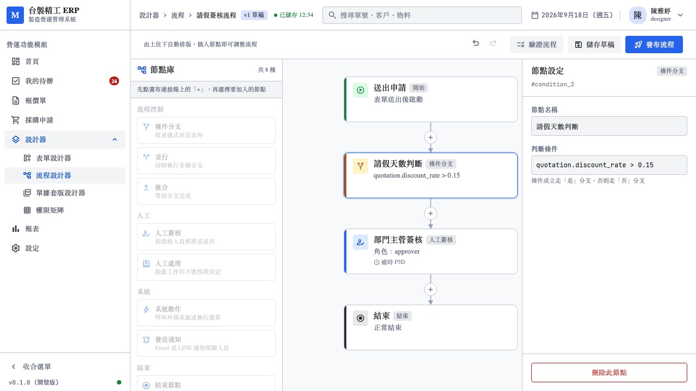

系統會檢查十二項，包括：

| 檢查 | 說明 |
|------|------|
| 有起點與終點嗎 | 流程要有頭有尾 |
| 有沒有孤兒節點 | 連不到的節點永遠不會執行 |
| 有沒有無限迴圈 | 流程要能走得完 |
| 簽核節點有指派對象嗎 | 沒有的話會 FAILED |
| **資料路徑存在嗎** | 條件式引用的欄位必須真的有 |
| 並行分支有匯合嗎 | 分開了要合得回來 |

---

## 11. 儲存與發布

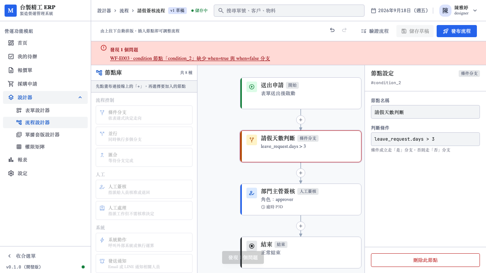

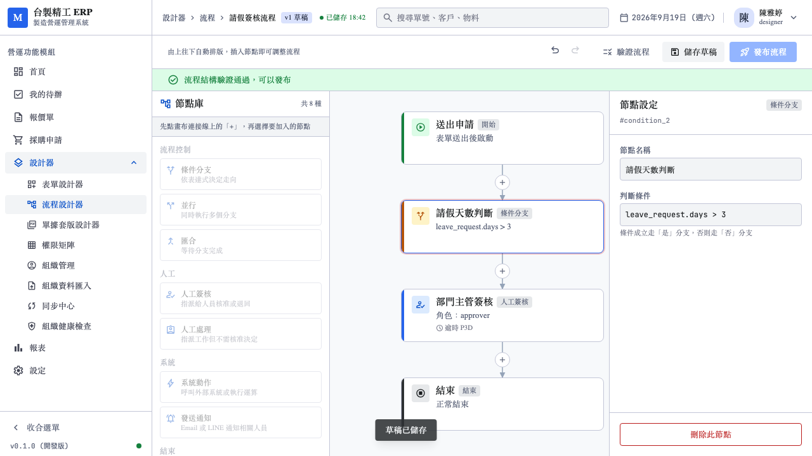

發布後，新建的單據就會走這個流程。

**進行中的單據不受影響**——它們走的是送簽當時的版本。
這一點很重要：改流程不會讓正在跑的單據突然換規則。

---

## 12. 完成

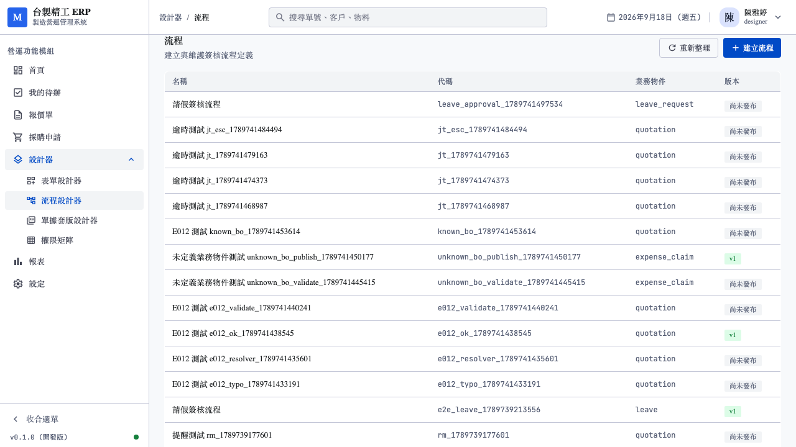

---

## 13. 下一步

流程定義了「誰來簽」，但還要設定「誰看得到哪些欄位」。

接著看 [權限設定操作手冊](04_權限設定操作手冊.md)。

---

## 常見問題

**條件分支的兩條線要各接什麼？**
「是」接條件成立時要走的節點，「否」接不成立時要走的。
兩條都要接，不然驗證不會過。

**可以讓兩個部門同時簽嗎？**
可以。用「並行」節點分出兩條線，各接一個簽核節點，最後用「匯合」合起來。
匯合可以設定「全部通過才算過」或「任一個通過就算過」。

**簽核被退回後會怎樣？**
回到申請人手上修改，改完重新送簽。可以在節點設定裡指定退回要回到哪一關。

**流程改了，進行中的單據會怎樣？**
不受影響，繼續走舊版。只有發布後**新建**的單據才用新版。

**為什麼我的流程一直 FAILED？**
最常見是簽核人解析不到——角色代碼打錯、指定的人離職、部門沒設主管。
到 Temporal UI（http://localhost:8080）可以看到失敗的確切原因。
