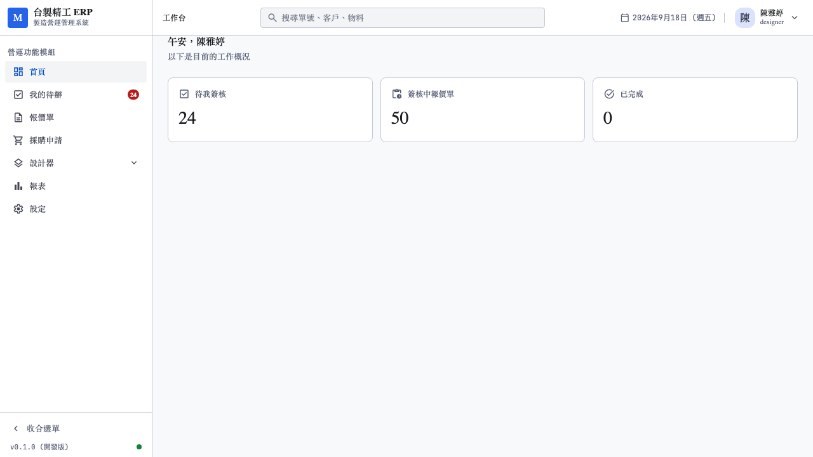
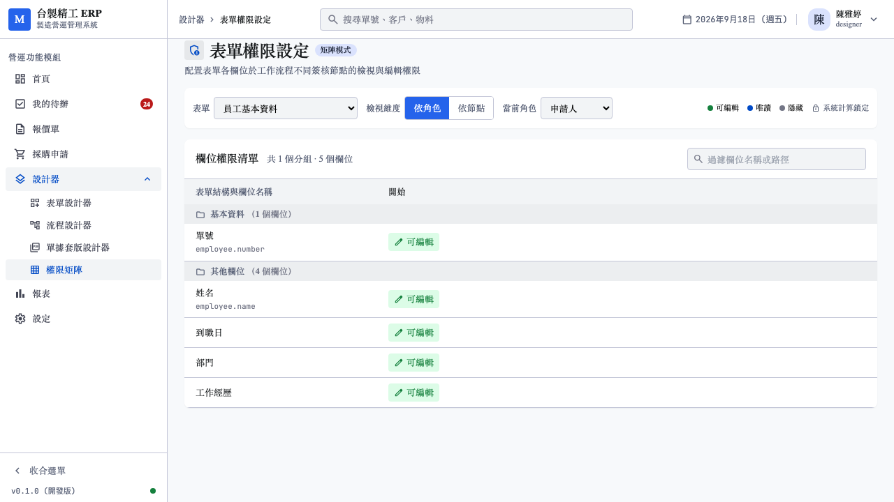
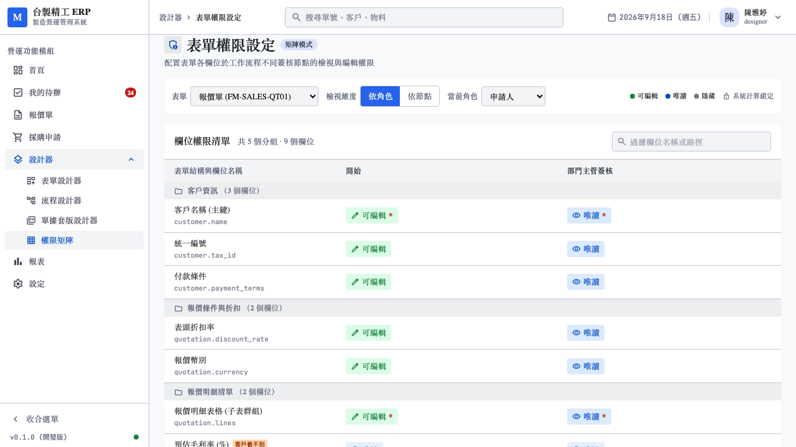
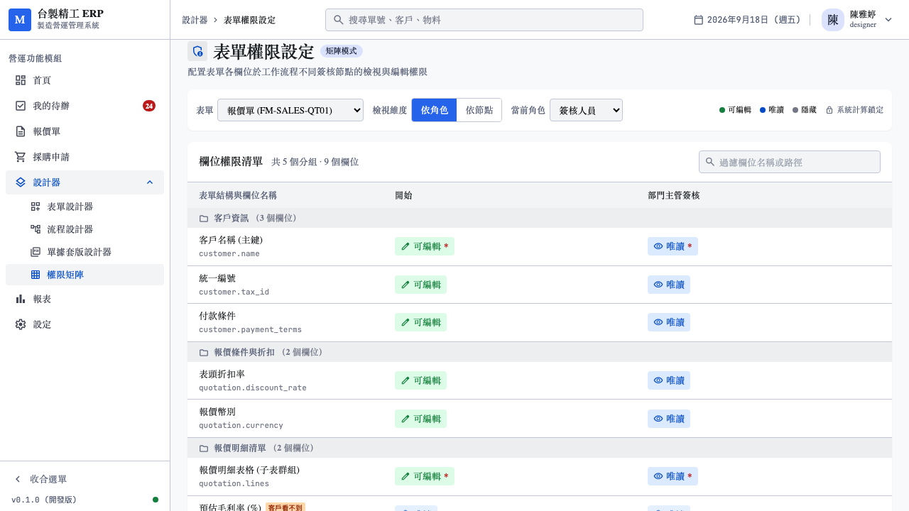
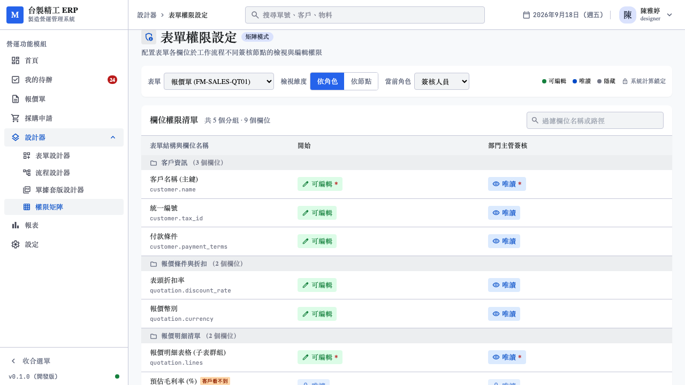
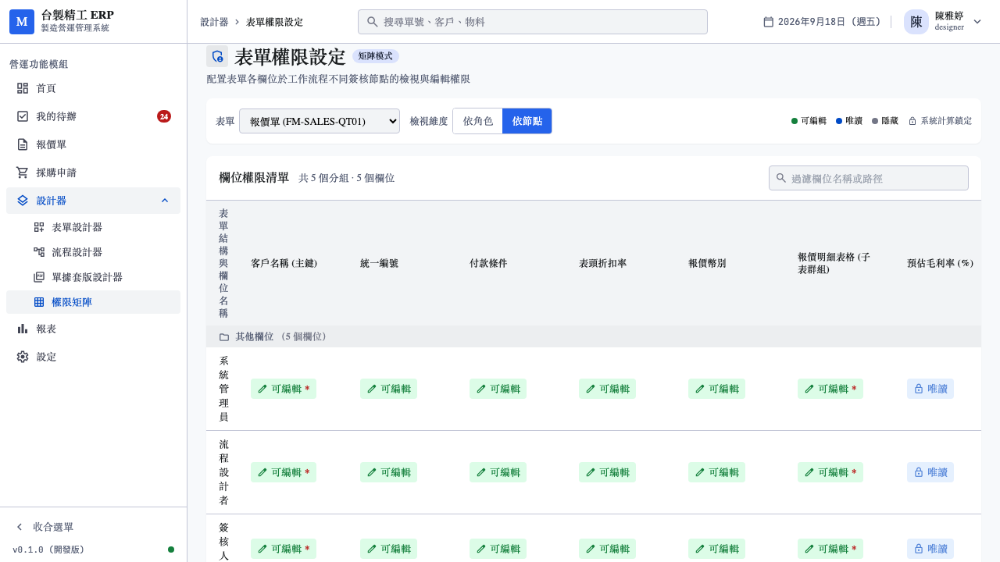
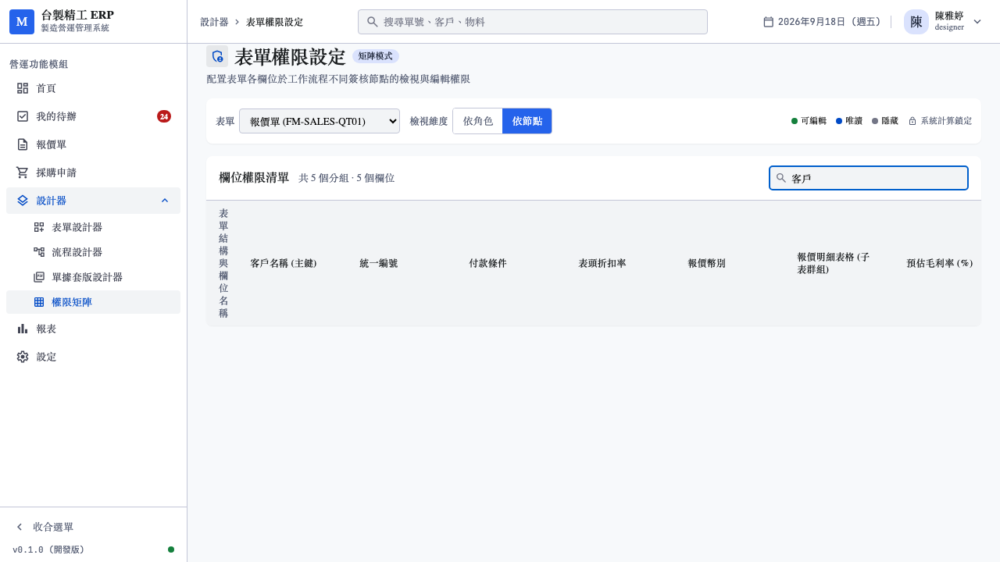
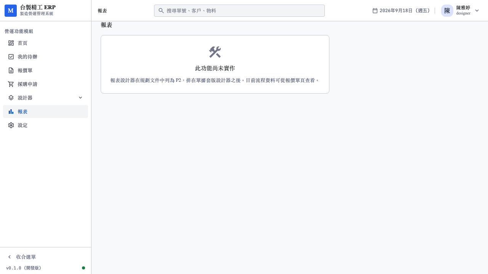

# 權限設定操作手冊

- 對象：要設定誰看得到哪些欄位的使用者
- 使用帳號：`designer@demo.local`（陳雅婷，流程設計者）
- 前置：已讀 [建立表單操作手冊](02_建立表單操作手冊.md)
- 截圖來源：`web/e2e/manual-03-permission.spec.ts`

---

## 1. 為什麼需要權限設定

同一張報價單，不同的人看到的內容應該不一樣：

| 誰 | 看得到 | 看不到 |
|----|--------|--------|
| 業務 | 客戶、金額、明細 | — |
| 主管 | 全部，含成本與毛利率 | — |
| 財務 | 全部 | — |
| **客戶** | 客戶、金額、明細 | **成本、毛利率、內部備註** |

最後一列是重點。**報價單發給客戶時，成本與毛利率絕不能被看到**——
那等於把底價告訴對方。

---

## 2. 登入與進入

用 `designer@demo.local` / `demo1234` 登入，公司代碼 `demo`。

左側「設計器」展開後點「權限矩陣」。

---

## 3. 選擇表單

上方下拉選單選要設定的表單。

右上角有四種標示的說明：

| 標示 | 意思 |
|------|------|
| 🟢 可編輯 | 該角色可以填寫這個欄位 |
| 🔵 唯讀 | 看得到但不能改 |
| ⚫ 隱藏 | 完全看不到 |
| 🔒 系統計算鎖定 | 由公式算出來的，任何人都不能改 |

---

## 4. 兩種檢視模式

### 4.1 依角色

一次看**一個角色**在所有節點的權限。

適合回答：「業務在填寫階段可以改哪些欄位？」

切換角色看不同結果。

### 4.2 外部可見性

這個模式會標出**客戶看不到的欄位**。

有「客戶看不到」標記的欄位，在客戶簽核頁面不會出現。

> **送給客戶之前一定要檢查這裡。** 少關一個欄位，
> 客戶就會看到你的成本結構。

### 4.3 依節點

一次看**一個節點**上所有角色的權限，排成矩陣。

適合回答：「財務簽核這一關，各角色分別能做什麼？」

---

## 5. 欄位篩選

欄位多的時候用上方的篩選框。

可以用欄位名稱或資料路徑搜尋。

---

## 6. 權限怎麼決定的

權限不是單一設定，是**六條規則依序判定**的結果：

| 順序 | 規則 | 效果 |
|------|------|------|
| 1 | 計算欄位 | 一律唯讀，管理員也不能改 |
| 2 | 外部參與者 + 不可見 | 隱藏 |
| 3 | 可讀角色清單 | 不在清單內 → 隱藏 |
| 4 | 節點的唯讀條件 | 成立 → 唯讀 |
| 5 | 可編輯角色清單 | 不在清單內 → 唯讀 |
| 6 | 以上都不符合 | 可編輯 |

**先判定的優先。** 例如計算欄位就算把所有角色都加進可編輯清單，
它仍然是唯讀——因為第 1 條先成立了。

### 三種設定狀態

角色清單有三種狀態，語意不同：

| 設定 | 意思 |
|------|------|
| **沒有設定** | 不限制，所有人都可以 |
| **空清單** | 全部拒絕，沒有人可以 |
| **列了角色** | 只有清單內的角色可以 |

> 「沒有設定」與「空清單」看起來像，效果完全相反。
> 想開放給所有人就不要設定；想全部擋掉才設成空清單。

---

## 7. 在哪裡改權限

權限矩陣是**檢視**用的，改要回到表單設計器：

1. 表單設計器 → 選中欄位
2. 「基本」分頁 → **客戶 Portal 可見**（控制外部可見性）
3. 「規則」分頁 → **唯讀條件**、**必填條件**、**顯示條件**

改完回到權限矩陣確認效果。

---

## 8. 報表

左側選單的「報表」。

報表功能尚未實作，目前是說明頁。

---

## 9. 下一步

表單、流程、權限都設定好之後，可以實際走一次完整的簽核。

接著看 [完整流程實作手冊](05_完整流程實作手冊.md)。

---

## 常見問題

**為什麼某個欄位怎麼設都是唯讀？**
可能它是計算欄位（規則第 1 條）。計算欄位的值由公式決定，
可以編輯的話公式就沒意義了。

**客戶看得到我的成本，怎麼辦？**
到表單設計器把那個欄位的「客戶 Portal 可見」關掉，重新發布表單。
注意進行中的單據仍用舊版，要確認沒有正在等客戶簽核的單。

**角色清單留空和不設定有什麼差別？**
不設定 = 所有人都可以；留空 = 沒有人可以。兩者相反。

**改了權限，進行中的單據會變嗎？**
不會。權限跟著表單版本走，進行中的單據用送簽當時的版本。
