# 登入與選單導覽測試報告

- 日期：2026-09-16
- 範圍：登入／登出、路由守衛、側邊欄選單（含四個設計器）、待辦核准
- 環境：本機 PostgreSQL 17、Temporal 1.25.2、Rust API `:3001`、前端 `:3040`
- 截圖：`screenshots/auth-navigation/`（21 張）、`screenshots/task-approval/`（7 張）

---

## 1. 起因

使用者回報兩件事：

1. 系統不能登入登出
2. 點左邊的選單沒有反應

兩者都確認屬實，且原因不同。

### 1.1 登入：被開發用的自動登入蓋掉了

`web/src/dev-auth.ts` 在應用啟動時自動以 `designer@demo.local` 登入，
token 寫進 `localStorage`。系統因此永遠處於登入狀態——
沒有登入頁，也沒有登出的入口。

檔案開頭的註解寫著「登入頁尚未實作，此模組在開發模式下自動登入，
正式版由登入頁取代」。它如實說明了自己是暫時的，但沒有人回來取代它。

右上角顯示的「林建志 協理／營運製造部」是設計稿的假資料，
與實際登入的陳雅婷無關。

**後端並沒有問題。** `POST /auth/login`、JWT 簽發與驗證、
Argon2 密碼雜湊、`Actor` extractor、`last_login_at`、稽核事件
全部都在。缺的是前端。

### 1.2 選單：七個項目只有一個有路由

`AppShell.vue` 的側邊欄有七個項目，`router.ts` 只註冊了四條路由，
全都在 `/designer/` 底下。`/`、`/tasks`、`/quotations`、
`/purchase-requests`、`/reports`、`/settings` 都沒有對應路由，
點擊後撞上 catch-all：

```ts
{ path: '/:pathMatch(.*)*', redirect: '/designer/forms/quotation_form' }
```

全部被彈回表單設計器。畫面看起來沒動，實際上是換了路由又被導回原地。

「設計器」看似有效是巧合：它同樣沒註冊，但被導回的目標剛好在
`/designer/` 底下，而 `isActive` 用 `startsWith('/designer')` 判斷，
所以那一項一直亮著。

### 1.3 四個設計器只有一個有入口

補完上述路由後使用者再次回報：選單裡只看得到表單設計器。

確認屬實。四個設計器的路由都註冊了，頁面也都實作完成：

| 路由 | 頁面 | 檔案大小 |
|------|------|----------|
| `/designer/forms/:formKey` | 表單設計器 | 16.1K |
| `/designer/workflows/:workflowKey` | 流程設計器 | 15.2K |
| `/designer/templates/:templateKey?` | 單據套版設計器 | 12.8K |
| `/designer/permissions` | 權限矩陣 | 18.2K |

但側邊欄的「設計器」是單一項目，`/designer` 直接
redirect 到 `/designer/forms/quotation_form`。
另外三個**沒有任何入口**——功能做完了，使用者卻無從得知它們存在。

改成可展開的子選單（見步驟 11）。

---

## 2. 測試結果

| 項目 | 數量 | 結果 |
|------|------|------|
| 前端單元／元件測試 | 265 | 全數通過 |
| ├ 原有 | 201 | 通過 |
| ├ 登入狀態（useSession） | 14 | 通過 |
| ├ 登入頁 | 12 | 通過 |
| ├ 路由守衛 | 6 | 通過 |
| ├ AppShell 使用者區塊 | 6 | 通過 |
| ├ 待辦 API client | 9 | 通過 |
| └ 我的待辦頁 | 10 | 通過 |
| **E2E（Playwright）** | **29** | **全數通過** |
| ├ 登入與選單導覽 | 22 | 通過 |
| └ 待辦核准（實機） | 7 | 通過 |
| TypeScript 型別檢查 | — | 零錯誤 |

```bash
cd web && npx vitest run          # 265
cd web && npx playwright test     # 29
cd web && npx vue-tsc --noEmit    # ok
```

本次新增 Playwright。先前的 E2E 是以瀏覽器工具手動操作並把截圖
貼在對話中，沒有存檔也無法重跑。改用 Playwright 後截圖自動落地，
`npx playwright test` 可隨時重驗。

---

## 3. E2E 逐步驗證

以真實服務執行，無 mock。

### 3.1 登入

#### 步驟 1：未登入存取受保護頁面

直接開 `/tasks`，被 guard 導向登入頁。


#### 步驟 2：原路徑記在 redirect

開 `/designer/permissions`，網址列變成
`/login?redirect=/designer/permissions`，原本要去的地方被記下來。

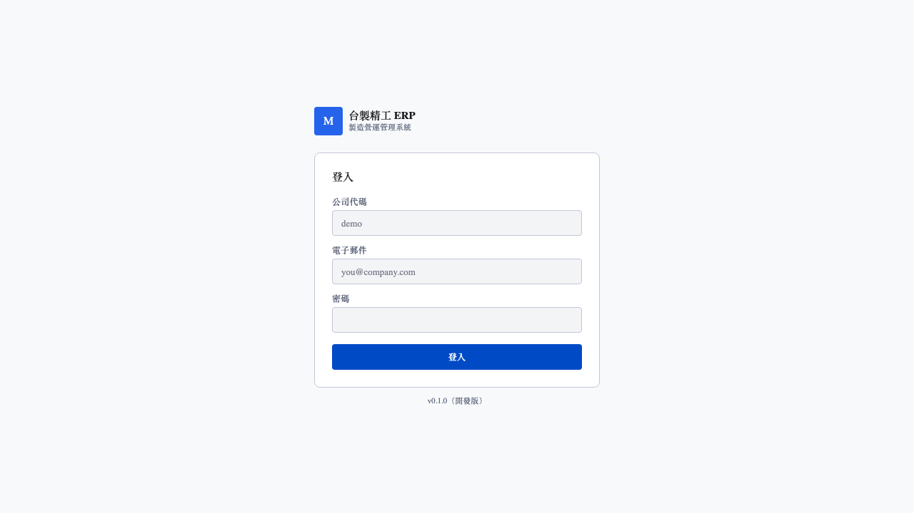

#### 步驟 3：密碼錯誤

輸入錯誤密碼，顯示後端回傳的「帳號或密碼錯誤」。
**租戶與帳號保留，只清密碼**——全部清掉會讓使用者重打一次
多半是對的資訊。

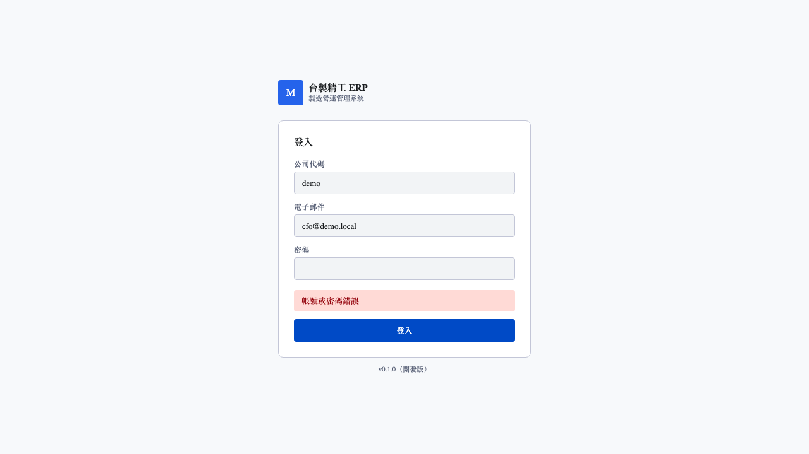

#### 步驟 4：登入成功

以 `cfo@demo.local` 登入，進入首頁。右上角顯示**張文華 / cfo**，
是實際登入者——這是這次修正的核心證據，原本這裡寫死
「林建志 協理／營運製造部」。

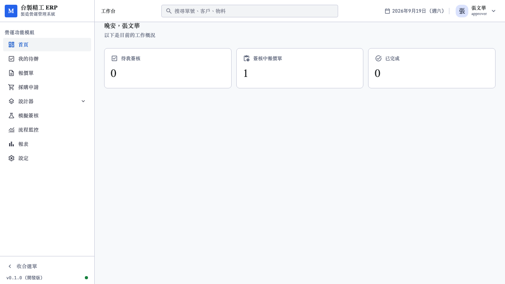

#### 步驟 5：帶 redirect 登入回原頁

從 `/designer/permissions` 被導來的使用者，登入後直接回到
權限矩陣，而非首頁。

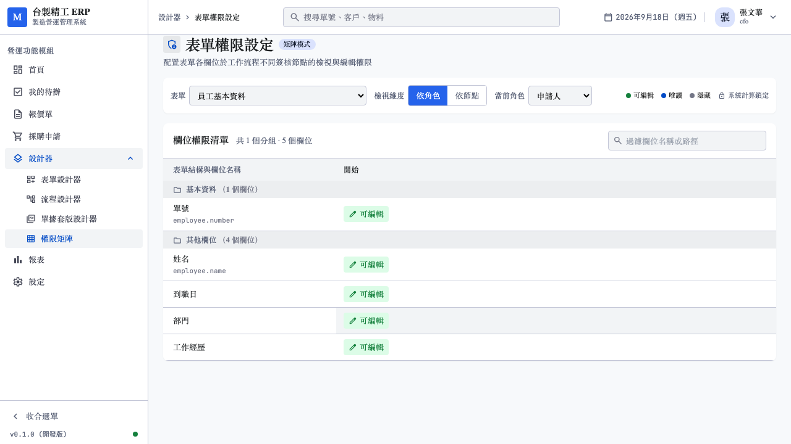

#### 步驟 6：重新整理保持登入

按 F5 後停在原頁，未被踢回登入頁。`main.ts` 在掛載前
`restore()` 回復狀態，guard 才不會誤判為未登入。

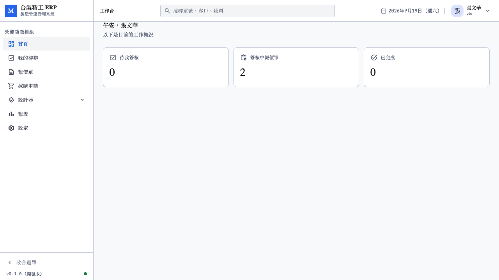

### 3.2 選單導覽

七個項目逐一點擊，全部進到對應頁面，無一被 catch-all 彈回。

#### 步驟 7：首頁

三張卡片顯示待辦數與報價單狀態，數字來自實際 API。


#### 步驟 8：我的待辦

收件匣。此時為空（既有待辦都已處理完），顯示提示而非空白畫面。

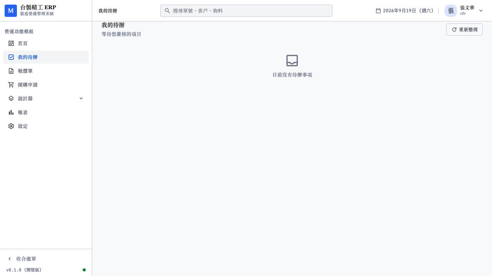

#### 步驟 9：報價單

列出 `QT-MANUAL-001`，狀態「已完成」——真實的流程實例，
不是假資料。

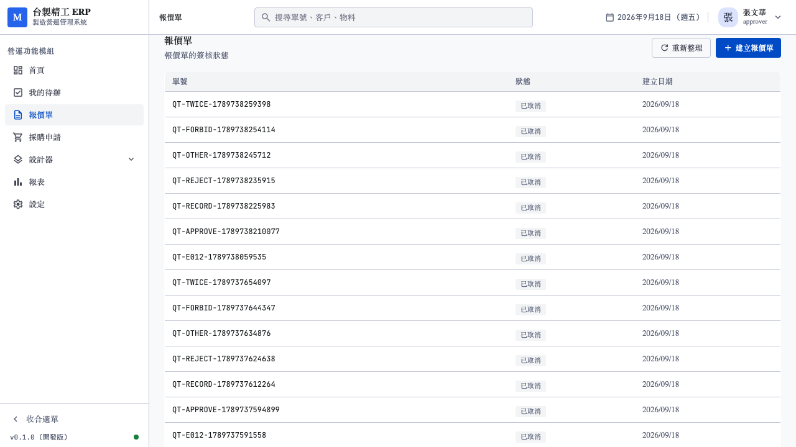

#### 步驟 10：採購申請（未實作）

不是被彈回設計器，而是明確說明缺什麼。

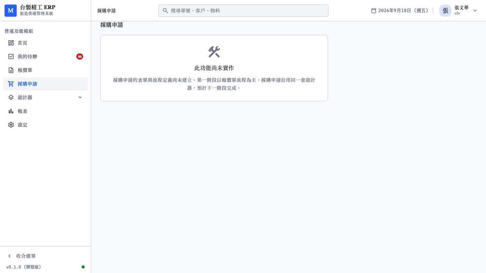

#### 步驟 11：設計器（四個子項目）

四個設計器都已實作，但先前選單只有一個「設計器」項目直接
redirect 到表單設計器，另外三個**沒有任何入口**——使用者
無從得知它們存在。

改成可展開的子選單：

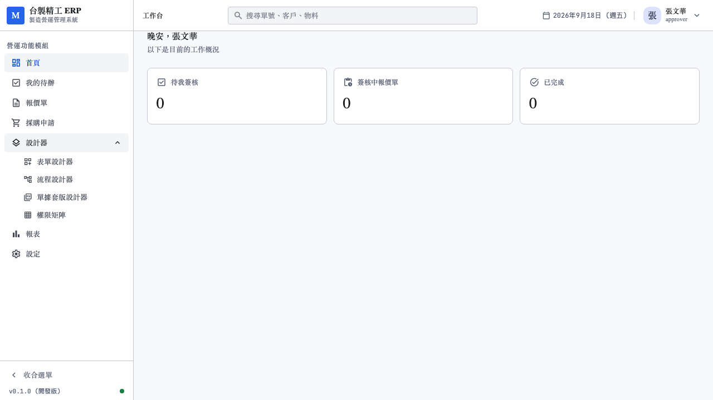

**表單設計器**

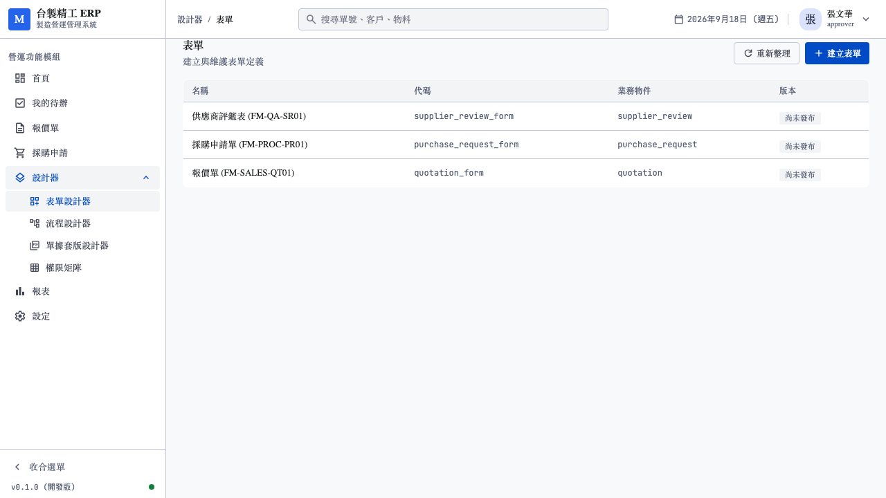

**流程設計器**——節點庫、畫布、退回路徑都在

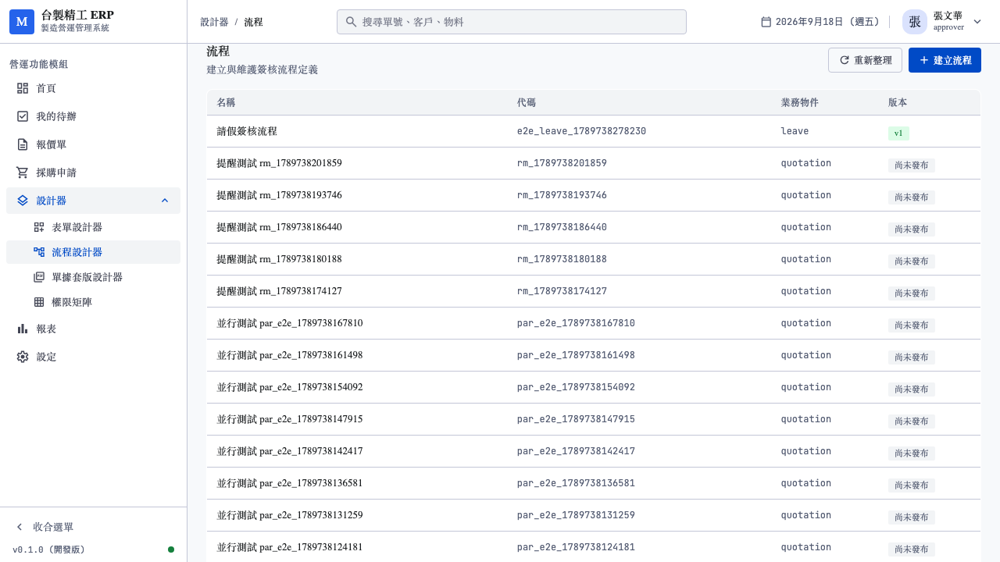

**單據套版設計器**——A4 畫布與欄位庫

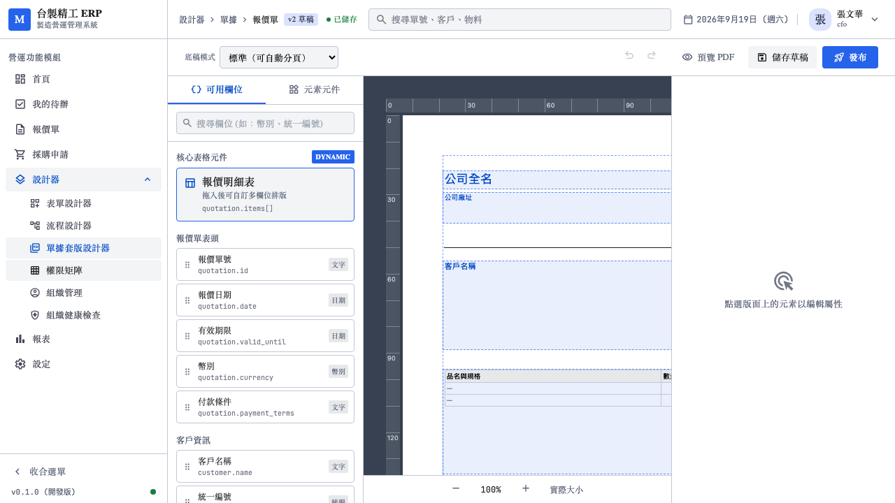

**權限矩陣**

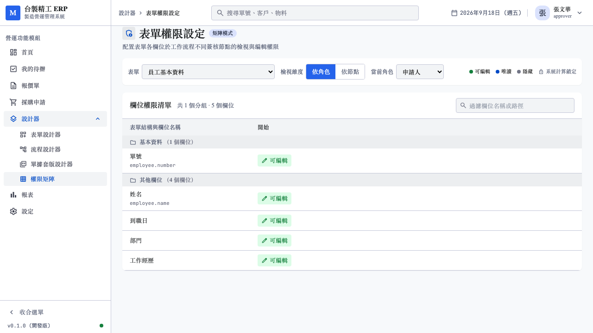

側邊欄收合時（56px）退化成單一連結指向表單設計器——
那個寬度放不下子選單。

#### 步驟 12：報表（未實作）

說明寫「規劃文件中列為 P2，排在單據套版設計器之後」，
而非空泛的「開發中」。

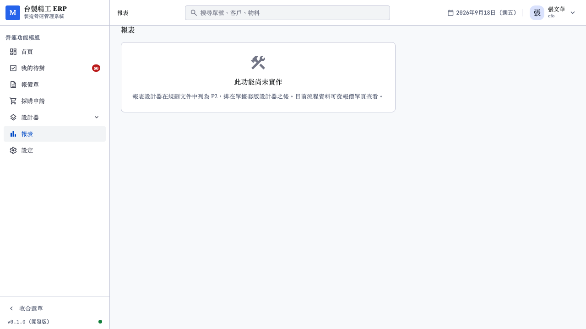

#### 步驟 13：設定（未實作）

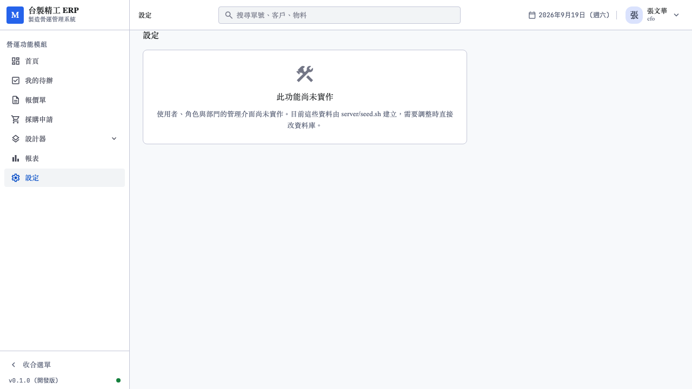

另有一條測試連續點擊七個項目，逐一斷言 URL，確認無一被彈回。

### 3.3 登出

#### 步驟 14：展開使用者選單

顯示姓名與 email，以及登出項目。

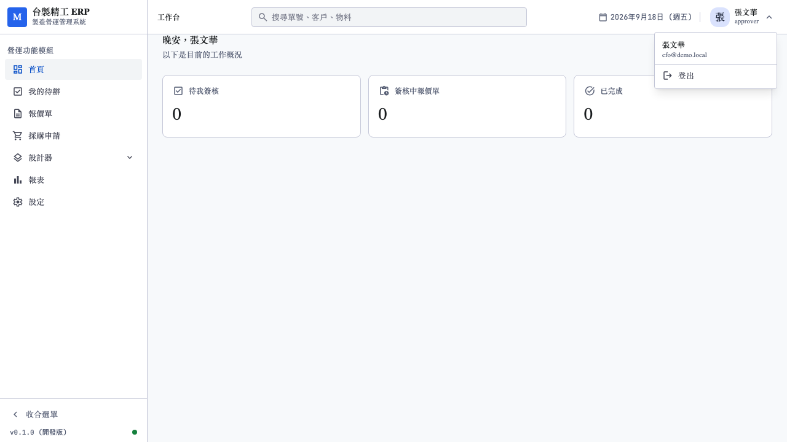

#### 步驟 15：登出

導向 `/login`，`localStorage` 的 session 清空。


#### 步驟 16：登出後需重新登入

原本可進的 `/tasks` 又被導回登入頁。


#### 步驟 17：換帳號

改以 `designer@demo.local` 登入，右上角變成**陳雅婷 / designer**。
使用者資訊確實跟著登入者變動。


---

## 4. 實作內容

### 4.1 新增

| 檔案 | 說明 |
|------|------|
| `src/auth/useSession.ts` | 登入狀態，模組層級單一來源 |
| `src/auth/guard.ts` | 路由守衛，預設拒絕 |
| `src/pages/LoginPage.vue` | 登入頁 |
| `src/pages/HomePage.vue` | 首頁，待辦與報價單概況 |
| `src/pages/TaskInbox.vue` | 我的待辦，簽核操作入口 |
| `src/pages/QuotationList.vue` | 報價單列表 |
| `src/pages/NotBuiltPage.vue` | 未實作功能的共用說明頁 |
| `src/api/tasks.ts` | 待辦 API client |
| `src/api/instances.ts` | 流程實例 API client |
| `playwright.config.ts`、`e2e/` | E2E 設定與測試 |

### 4.2 修改

| 檔案 | 變更 |
|------|------|
| `src/main.ts` | 移除自動登入，改為掛載前 `restore()` |
| `src/router.ts` | 補齊七條路由，掛上守衛，catch-all 改導首頁 |
| `src/components/AppShell.vue` | 使用者區塊接 session，加登出選單，徽章接真實待辦數 |
| `src/api/client.ts` | 預設 tokenGetter 改回 `null` |

### 4.3 刪除

`src/dev-auth.ts` — 開發用自動登入。

---

## 5. 設計決定

**token 存 localStorage 而非 sessionStorage。**
關掉分頁再開回來不該要求重新登入。代價是 XSS 時 token 會被讀走，
但那要靠 CSP 與輸入清理防範，換 sessionStorage 並不能解決。

**登出是純前端清除。**
JWT 無狀態，後端沒有 session 可作廢，token 會一直有效到 `exp`。
要做到立即失效需要黑名單或 refresh token，屬於後續工作。
這一點寫在 `useSession.logout()` 的註解裡。

**`redirect` 只接受 `/` 開頭的路徑。**
否則會變成開放重導向——攻擊者可以用一條看似正常的登入連結
把使用者導到釣魚站。

**前端 `hasRole` 讓 admin 通過所有檢查。**
與後端 `Actor::is_admin` 對齊。兩邊不一致的話，畫面會藏起
使用者其實有權限做的操作。

**未實作的功能做說明頁，不藏選單也不做假畫面。**
藏起來的話，使用者不知道這個功能未來會有；做假畫面的話，
填著假數字的報表會被當成真的。說明頁寫「缺什麼」而非「開發中」——
後者等於沒說。

**待辦徽章查不到時不顯示，而非顯示 0。**
0 會讓使用者以為真的沒有待辦，而實際上是沒查到。

---

## 6. 過程中發現並修正的缺陷

### 6.1 `ApiError` 沒有 `body` 屬性

登入頁原本寫 `error.body.message`，但 `ApiError` 把訊息放在
`message`（建構時 `super(body.message)`）。讀 `undefined.message`
拋出 TypeError，整個 catch 區塊中斷——錯誤訊息沒顯示，密碼也沒清。

四個 401／403 測試因此失敗，而網路錯誤的測試反而通過，
因為它走 else 分支不碰 `.body`。這個對比正好指出問題在哪。

### 6.2 409 之後錯誤訊息被清掉

待辦頁收到 409（別人已處理）時會重新載入列表，
而 `load()` 成功時把 `errorMessage` 清成空字串，
蓋掉剛設好的「待辦已被處理」。

使用者會看到自己按的那一筆憑空消失，沒有任何說明。

修正：`load()` 不主動清除錯誤，另開 `refresh()` 給使用者
主動觸發的重新整理用。清除的時機由呼叫端決定。

### 6.3 截圖搶在導航完成前拍攝

`05-登入後回原頁.png` 第一次只有 21.8K，內容是停在「登入中…」
的登入頁，而非預期的權限矩陣。

`toHaveURL` 會重試到通過為止，`page.screenshot()` 卻是立即執行——
URL 已經變了，畫面還沒換完。

修正：截圖前 `waitForLoadState('networkidle')`，
並在該測試補上元素可見的斷言。修正後 123.2K，內容正確。

**這個問題值得記錄**：測試全部通過，截圖卻是錯的。
斷言與截圖看的是不同時間點，前者通過不代表後者拍對。

---

## 7. 已知限制

| 項目 | 現況 |
|------|------|
| **外部客戶 Portal** | 未實作。仍是報價單流程無法真正端到端完成的缺口 |
| 建立報價單畫面 | 僅 API，列表只能檢視 |
| 採購申請、報表、設定 | 說明頁，無實際功能 |
| 登出無法立即失效 token | JWT 無狀態，需黑名單或 refresh token |
| 收件匣無自動更新 | 需手動按重新整理 |
| E2E 測試資料不清理 | 見 9.4 |

---

## 8. 待辦核准的實機驗證

啟動 Temporal 後補做。這條路徑先前只有元件測試（MSW 假造 API）覆蓋。

### 8.1 環境

六個服務全部啟動：

| 服務 | 埠 | 啟動方式 |
|------|-----|----------|
| PostgreSQL | 5432 | 系統服務 |
| Temporal + UI | 7233 / 8080 | `cd poc/temporal && docker compose up -d` |
| Rust API | 3001 | `./server/target/debug/api` |
| Python Worker | — | `python-ai/.venv/bin/python python-ai/worker.py` |
| 前端 | 3040 | `npm run dev` |

啟動時 Rust API 記錄「Temporal 已連線」，Worker 記錄
「Worker 啟動，task_queue=workflow-platform」。

### 8.2 測試結果

七條全部通過，執行時間 15 秒。

| # | 測試 | 驗證內容 | 截圖 |
|---|------|----------|------|
| 1 | 核准後流程前進 | 完整往返（見 8.3） | `01`～`04` |
| 2 | 核准寫入資料庫 | 決策、意見、時間都留下 | — |
| 3 | 退回 | REJECT 並記錄原因 | `05`、`06` |
| 4 | 看不到別人的待辦 | 收件匣不含他人項目 | `07` |
| 5 | 直接打 API 核准他人待辦 | 回 403 | — |
| 6 | 未登入取待辦 | 回 401 | — |
| 7 | 同一張決策兩次 | 第二次回 409 | — |

第 5 條是重點：前端看不到不等於後端擋得住。這條繞過畫面直接打 API，
驗證的是 `tasks.rs` 的 assignee 檢查。

### 8.3 完整往返

單號 `QT-APPROVE-1789562190189`，折扣率 0.2。

#### 步驟 1：cfo 收到主管簽核的待辦

designer 啟動流程後，Worker 解析 `manager_of(initiator)`，
建立待辦給 cfo。左側徽章顯示實際待辦數（先前寫死 5）。

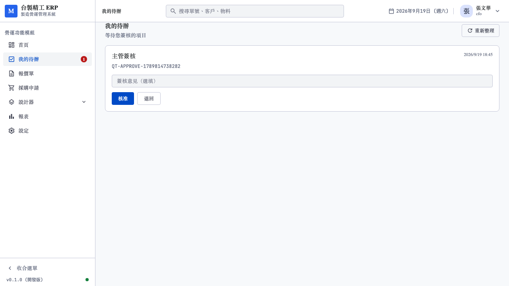

#### 步驟 2：填寫簽核意見

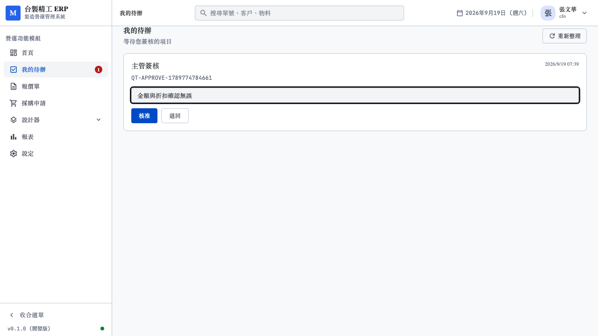

#### 步驟 3：核准後該筆從收件匣消失

按下核准，Rust API 寫資料庫（未提交）→ 送 Signal 給 Temporal →
成功才提交。

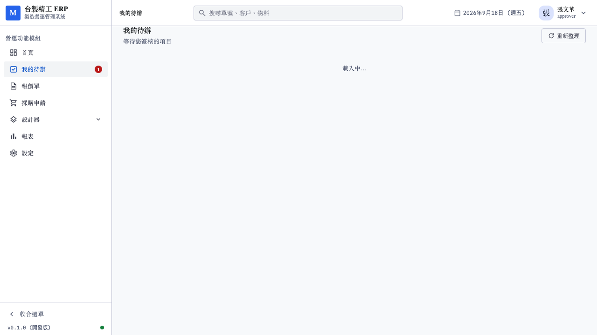

#### 步驟 4：流程前進到財務簽核

**這是完整往返的證據。** 換成 `finance@demo.local` 登入，
右上角顯示**李淑芬 / finance_manager**，收件匣裡出現
**同一個單號**的「財務簽核」。

折扣 0.2 通過 `discount_gate` 的 `quotation.discount_rate > 0.15`
判斷，走了加簽財務的分支。

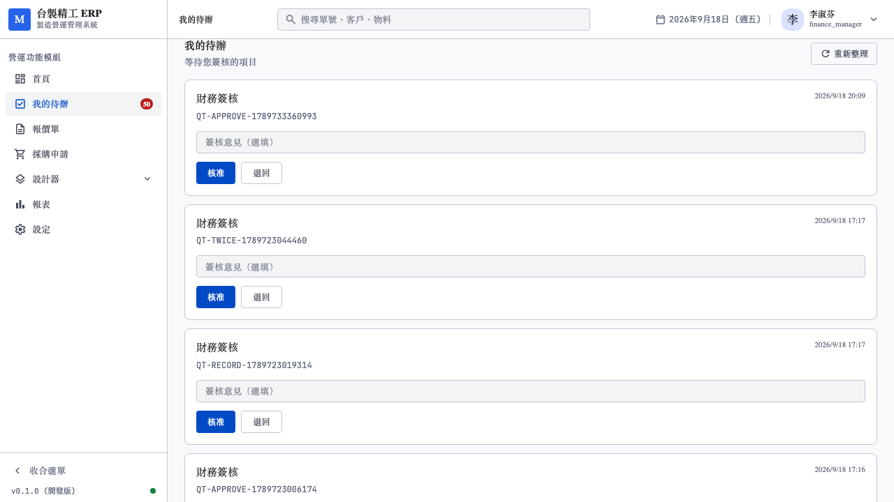

完整鏈路：

1. designer 啟動流程
2. Worker 解析 `manager_of(initiator)` → 建立待辦給 **cfo**
3. cfo 在畫面核准，填意見「金額與折扣確認無誤」
4. Rust API 寫資料庫（未提交）→ 送 Signal → 提交
5. Worker 收到 Signal，`discount_gate` 判斷 `0.2 > 0.15` 為真
6. 走財務加簽分支，建立待辦給 **finance**
7. 畫面上 finance 看到同一單號的「財務簽核」

資料庫最終狀態：

```
business_key                | node_label | 待辦    | decision | comment
QT-APPROVE-1789562190189    | 主管簽核   | APPROVED | APPROVE  | 金額與折扣確認無誤
QT-APPROVE-1789562190189    | 財務簽核   | PENDING  |          |
```

### 8.4 退回

#### 步驟 5：填寫退回原因

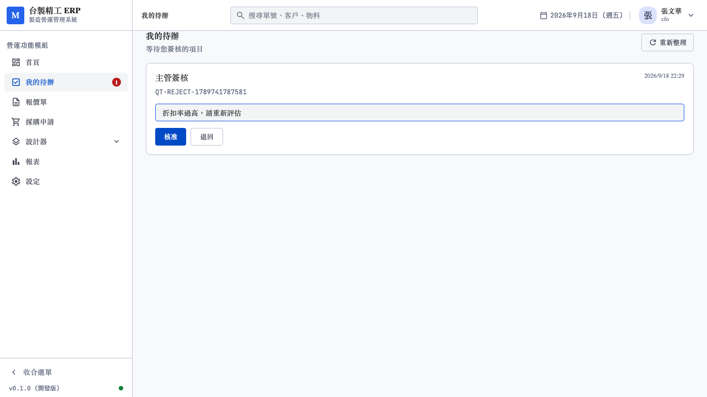

#### 步驟 6：退回後

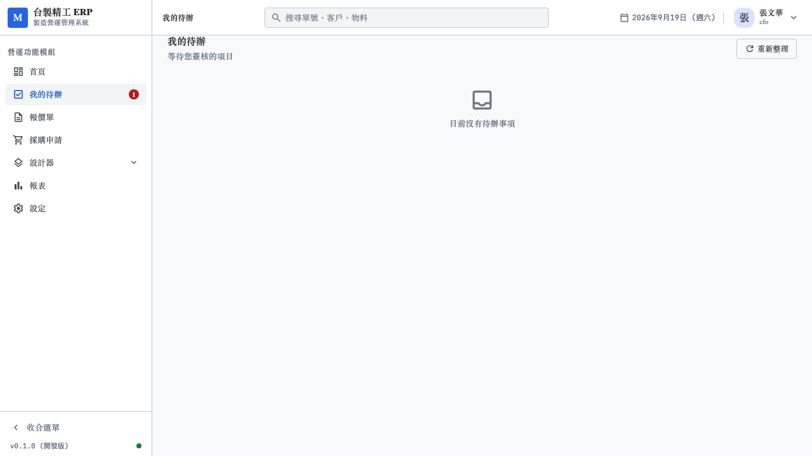

`on_reject` 的 goto 生效，流程回到「業務修改報價」：

```
QT-REJECT-1789562196529     | 主管簽核     | REJECTED | REJECT | 折扣率過高，請重新評估
QT-REJECT-1789562196529     | 業務修改報價 | PENDING  |        |
```

### 8.5 授權

#### 步驟 7：他人的待辦不可見

以 `procure@demo.local` 登入，收件匣不含指派給 cfo 的項目。

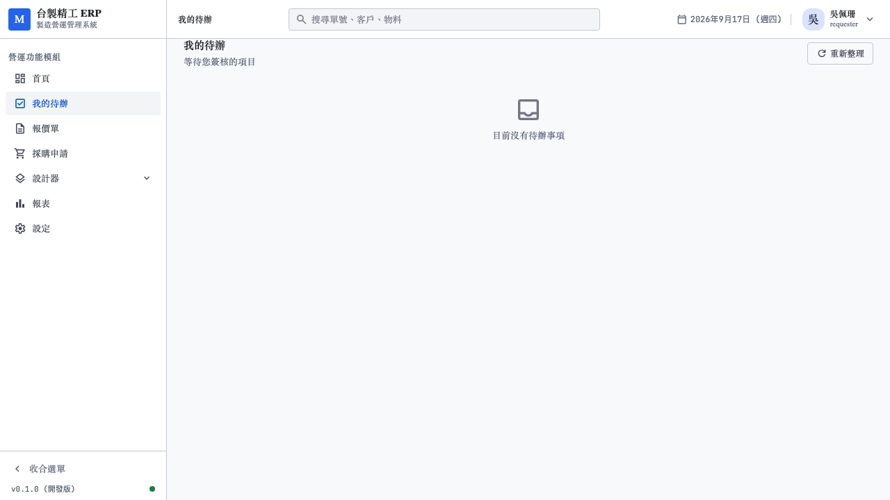

畫面看不到只是第一層。另一條測試繞過畫面直接打
`POST /tasks/{id}/decision`，後端回 **403「此待辦不是指派給您的」**——
`tasks.rs` 的 assignee 檢查才是真正的防線。

---

## 9. 實機驗證中發現的問題

### 9.1 測試資料欄位放錯層級

第一次執行時流程狀態為 `FAILED`，錯誤是
「NoParticipants: 節點 customer_review 找不到任何參與者」。

原因是我寫的測試資料把欄位放在頂層：

```jsonc
// 錯誤
{ "discount_rate": 0.2, "external_contacts": ["cust@example.com"] }
```

而流程定義讀的是 `quotation` 底下：

```jsonc
"expression": "quotation.discount_rate > 0.15"
"resolver": { "type": "external_contacts", "path": "quotation.customer_contact_ids" }
```

兩個後果不同：

- **條件式取不到值 → 當成 false**，靜默跳過財務簽核。
  流程照跑，只是少了一個節點，不會有任何錯誤。
- **resolver 取不到 → NoParticipants**，整個流程 FAILED。

第二點的失敗是明確的，第一點是靜默的。**表達式取不到值時當成
false 而非報錯，是值得檢討的設計**——寫錯路徑的流程會安靜地
少走一段簽核，而沒有人會發現。

這次是測試資料寫錯，但正式環境若有人打錯 `quotation.discount_rate`，
後果是「高折扣的報價單不經財務就發出去」。建議後續在 DSL 驗證時
檢查條件式引用的路徑是否存在於業務物件結構中。

### 9.2 Temporal 以 workflow_id 去重，重複單號靜默失敗

用先前用過的單號 `QT-E2E-001` 啟動時，API 回 201 並建立了新的
資料庫紀錄，但 Temporal 沒有新的執行——`temporal workflow describe`
顯示的是一天前的舊執行。

Temporal 以 workflow_id 去重是正常行為，問題是 **Rust API 沒把
這個情況往上報**，呼叫端拿到 201 會以為啟動成功。

實務上單號本來就不該重複，但「重複時靜默失敗」比「明確報錯」
難查得多。E2E 因此改用帶時間戳的單號。

### 9.3 換帳號時測試卡住

第二次 `login()` 逾時，卡在找不到登入表單。

原因是 guard 的正確行為：已登入時 `/login` 會被導回首頁，
登入表單根本不會渲染。測試直接 `goto('/login')` 換帳號因此卡住。

這不是缺陷——guard 就該這樣。修正的是測試：換帳號前先清 session。

### 9.4 E2E 測試不清理資料

七條測試各啟動一個流程，跑一次留下約 10 筆實例與對應待辦。
反覆執行後累積到 38 筆。

與報告 06 記錄的 574 個測試租戶是同一類問題：測試建立資料但不回收。

待辦徽章因此顯示 11（截圖 `01`），數字本身是正確的，
但其中多數是測試殘留。

後續應在 E2E 加 teardown，或提供以單號前綴為界的清理腳本。

---

## 10. 結論

兩個回報的問題都已修正並驗證，待辦核准也完成實機驗證。

登入登出可用，七個選單項目全部可導覽，簽核的完整往返
（畫面 → API → Temporal → Worker → 下一個節點）走通。

- 258 個單元測試通過
- 25 個 E2E 測試通過（18 導覽 + 7 核准）
- 24 張截圖存檔：
  `screenshots/auth-navigation/`（17）、`screenshots/task-approval/`（7）
- TypeScript 型別檢查零錯誤

本次補上 Playwright，E2E 從此可重跑、截圖自動落地。

### 後續

| 優先 | 項目 |
|------|------|
| 高 | 外部客戶 Portal——仍是報價單流程無法端到端完成的缺口 |
| 高 | DSL 驗證時檢查條件式引用的路徑是否存在（見 9.1） |
| 中 | 啟動流程時 workflow_id 重複應明確報錯，而非靜默失敗（見 9.2）|
| 中 | E2E 與整合測試的資料回收（見 9.4）|
| 低 | 收件匣自動更新 |
