# 並行分支（Parallel + Join）測試報告

- 日期：2026-09-17
- 範圍：流程引擎的並行分支與匯合，含 DSL 驗證、執行期、設計器前端
- 環境：本機 PostgreSQL 17、Temporal 1.25.2、Rust API `:3001`、前端 `:3040`
- 截圖：`screenshots/parallel-designer/`（11 張）
- 需求來源：[需求規劃 04](../../需求規劃/202609/04_AI時代表單與流程功能彙整.md) 第 3.4 節

---

## 1. 為什麼做這個

多個 AI 的意見彙整中，ChatGPT 對這一項的說法最直接：

> 我會把「Parallel + Join + Token」列為你的 Workflow Engine MVP 的核心功能，
> 而不是後期再補。因為一旦你的目標是企業流程，沒有這個能力，
> 很多「多人會簽、並簽、跨部門協作、AI+人工混合流程」都會變得很彆扭。

本系統先前的狀態：

| 層 | 狀態 |
|----|------|
| JSON Schema | `nodeParallel`、`nodeJoin`、`joinPolicy` 都已定義 |
| DSL 驗證器 | **完全沒有處理** parallel/join |
| Interpreter | 遇到就拋 `UnsupportedNodeType` |
| 設計器前端 | 節點庫有「並行」「匯合」兩項，但點了只會插入單一節點 |

也就是說：schema 說得出口，系統做不出來，而畫面看起來像是可以用。

---

## 2. 測試結果總覽

| 元件 | 數量 | 本次新增 |
|------|------|----------|
| Rust | 151 | +7 |
| Python | 126 | +19 |
| 前端單元／元件 | 319 | +17 |
| pdfme | 57 | — |
| **E2E（Playwright）** | **42** | **+13** |
| **合計** | **695** | **+56** |

TypeScript 型別檢查零錯誤。

```bash
cd server    && cargo test                          # 151
cd python-ai && .venv/bin/python -m pytest -q       # 126
cd web       && npx vitest run                      # 319
cd web       && npx playwright test                 #  42
cd pdfme     && npx vitest run                      #  57
```

---

## 3. 設計決定

### 3.1 Token：用 Temporal 原生並行，不建資料表

ChatGPT 建議建立 `workflow_parallel_group` 與 `workflow_token` 資料表，
記錄 `total_count` / `completed_count` / `approved_count` 等欄位。

**採用另一種做法**：用 `asyncio.gather` 讓分支同時跑，
由 Temporal 持久化每個分支的進度。

| | 資料表方案 | Temporal 原生 |
|---|---|---|
| 狀態來源 | SQL + Temporal 兩份 | Temporal 一份 |
| 重啟／當機／重放 | 要自己處理 | Temporal 保證 |
| 監控查詢 | SQL 直接查 | 查 Temporal |
| 對帳風險 | 兩份狀態可能不一致 | 無 |

選後者的理由：Temporal 本來就是為了「持久化執行狀態」而存在的，
再存一份 SQL 等於重做它已經做好的事，而且多出一組要對帳的資料。

代價是「現在哪些分支在跑」要查 Temporal 而非 SQL。
待辦表已有 `node_id`，收件匣顯示分支來源不受影響。

### 3.2 分支是完整子流程，不是單一簽核

分支可以有多個節點、條件判斷、巢狀的並行。`_walk` 加了 `stop_at`
參數，分支走到 join 就停下回報，由 parallel 節點統一判定。

```
parallel
  ├─ 財務簽核 → 金額判斷 → CFO 簽核 ─┐
  ├─ 法務簽核 ──────────────────────┤
  └─ 採購簽核 → 通知倉管 ──────────┴→ join
```

### 3.3 複用既有的 policy engine

四種完成策略（ALL／ANY／N_OF_M）與三種結果策略
（ALL_SUCCESS／ANY_REJECT／MAJORITY）先前已為「單節點多參與者」
實作過，是純函數。

並行把**一個分支當成一個參與者**（`_BranchOutcome.as_task_result()`），
直接餵給同一個 policy engine。兩種並簽語意因此完全一致，
不必維護兩套判定邏輯。

### 3.4 設計器：並行一次插入整組

單獨插一個 parallel 會立刻違反 WF-E009（分支不足）與
WF-E010（沒有匯合點），使用者得連做好幾步才能回到合法狀態。

`insertParallel` 一次建立 parallel + N 個分支 + join，
共 N+2 個節點、2N+1 條邊。刪除也是整組。

---

## 4. 新增的驗證規則

| 代碼 | 檢查 | 為什麼重要 |
|------|------|-----------|
| WF-E009 | parallel 至少 2 個分支 | 單一分支的 parallel 沒有意義 |
| WF-E009 | N_OF_M 必須指定 n | 缺 n 時 policy engine 會拋例外 |
| WF-E009 | n 不得大於分支數 | 否則條件永遠無法滿足，流程永久卡住 |
| WF-E010 | 每個分支都要匯合到 join | 分支跑到 end 會讓流程提前結束 |
| WF-E010 | 各分支要匯合到同一個 join | 不同 join 代表圖的結構有誤 |
| WF-E010 | join 必須有對應的 parallel | 孤立的 join 執行期會拋 `OrphanJoin` |

執行期也會檢查這些（`NoBranches`／`NoJoinNode`），
但**那時使用者可能已經簽了一半**——那些簽核就白做了。
設計器就該擋下來。

---

## 5. Python 測試（19 條）

`python-ai/tests/test_parallel.py`

| 類別 | 測試內容 |
|------|----------|
| 基本並行 | 三分支同時產生待辦、全部核准後繼續、路徑含所有分支、簽核順序無關、未全簽完不前進 |
| 分支含多節點 | 分支內節點依序執行、較長分支不被較短的搶先結束 |
| 完成策略 | ANY 任一即繼續、ANY 取消其餘待辦、N_OF_M 達標即繼續、N_OF_M 未達標繼續等 |
| 結果策略 | ALL_SUCCESS 任一退回則退回、ANY_REJECT 不等其他人、MAJORITY 過半通過／未過半退回 |
| 決策歸屬 | 某分支的決策不影響其他分支、不存在的節點決策被忽略 |
| 錯誤處理 | parallel 無分支明確失敗、分支未匯合明確失敗 |

### 5.1 最關鍵的一條：決策歸屬

並行時多個節點同時等待，決策必須落到正確的節點。

先前的 interpreter 用單一 `self._current` 與 `self._results`，
單線流程沒問題，但並行時三個分支會共用同一組結果——
**財務的核准會被法務節點看見，policy engine 立刻誤判為完成**。

改為 per-node 的 `_NodeWait`（`dict[str, _NodeWait]`），
每個活躍節點各一份參與者、待辦、結果、期限。

---

## 6. E2E 測試（13 條）

`web/e2e/parallel-designer.spec.ts`，全數通過。

### 6.1 建立

#### 步驟 1：原始線性流程

三個節點的最小流程，供插入並行。

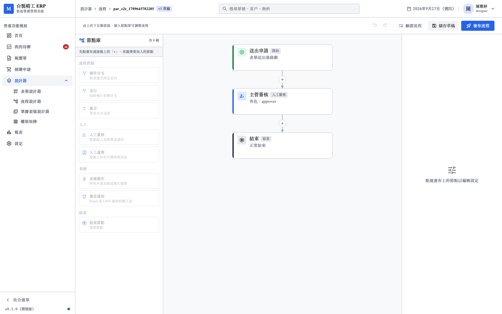

#### 步驟 2：選取插入點

點連接線上的加號，節點庫顯示「將插入於：送出申請 → 主管簽核」，
項目從灰階變為可點。

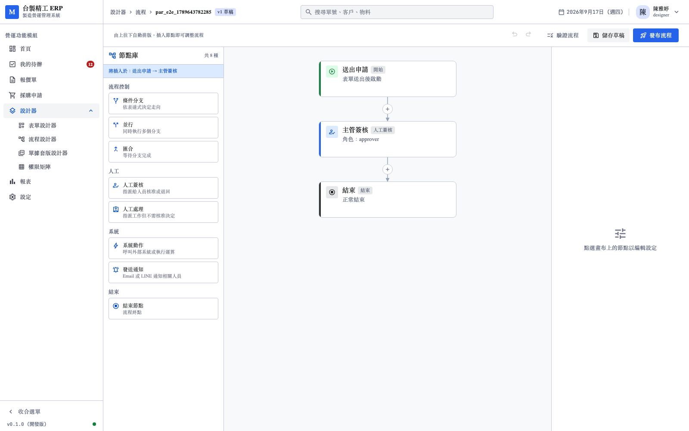

#### 步驟 3：一次建立整組並行

點「並行」一次生成：**並行開始 → 分支簽核 1／分支簽核 2 → 匯合**。
右側自動選中 parallel 節點，標題列顯示「尚未儲存」。

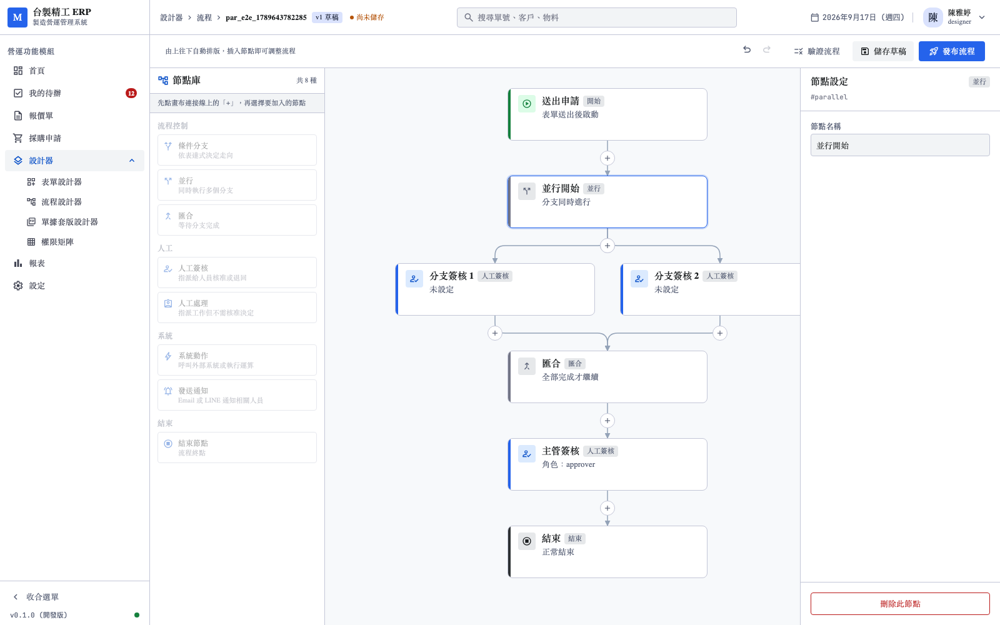

#### 步驟 4：匯合不可單獨插入

點節點庫的「匯合」會顯示提示，導引使用者改用「並行」。
join 單獨存在會立刻違反 WF-E010。

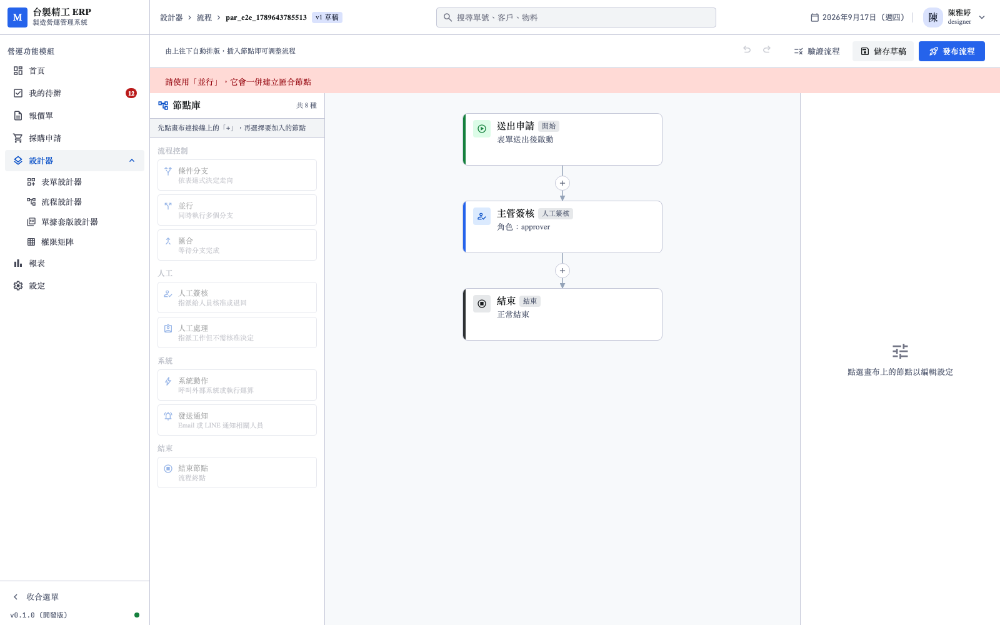

### 6.2 編輯 join 策略

#### 步驟 5：預設策略

完成條件 ALL、判定方式 ALL_SUCCESS。兩者是不同的事：
**完成條件管「等幾個」，判定方式管「怎麼算」**。

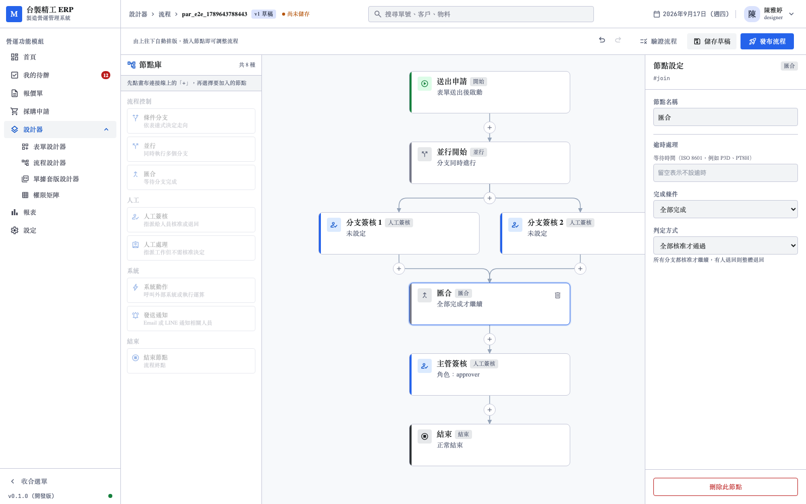

#### 步驟 6：N_OF_M 自動帶入 n

切到 N_OF_M 時自動填 `n=1`，卡片顯示「1 人完成即繼續」。

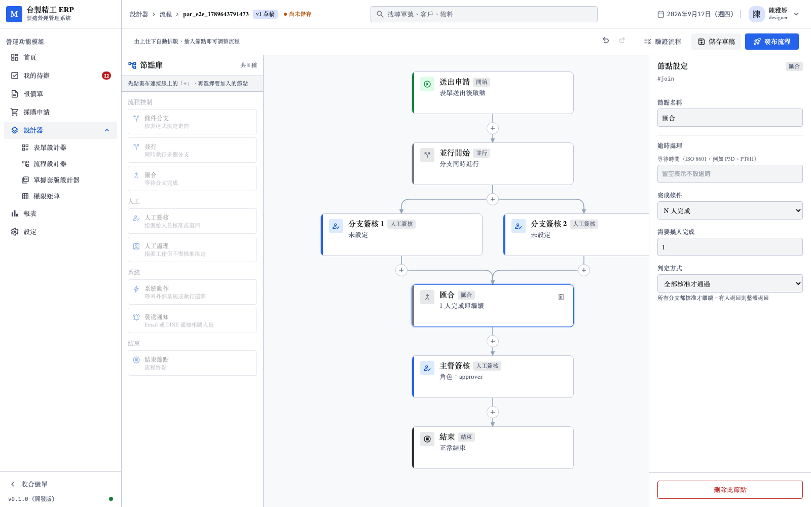

#### 步驟 7：判定方式的說明

三種策略的差別不看例子很難懂，尤其 ANY_REJECT 與 ALL_SUCCESS
在「全部核准」時結果相同，差別只在有人退回時。因此加了說明文字。

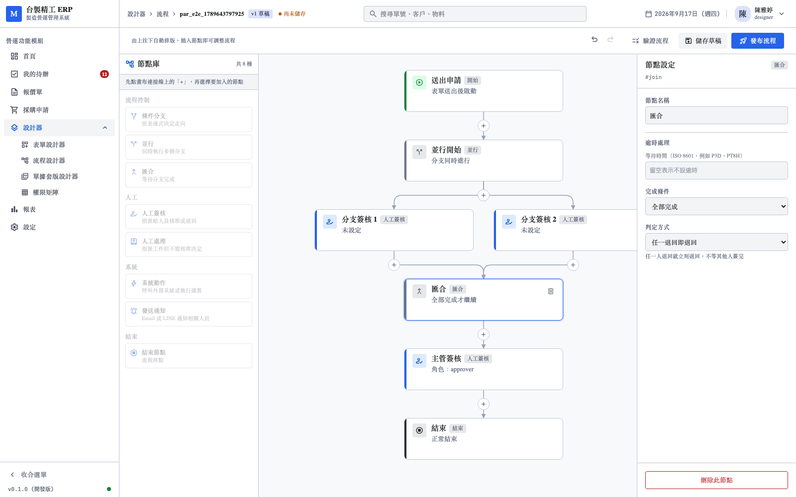

### 6.3 刪除

#### 步驟 8：刪除後回到線性

刪 parallel 會一併移除分支與 join，前後重新接起來。
刪 join 也是同樣效果——留下任一個都會立刻變成非法狀態。

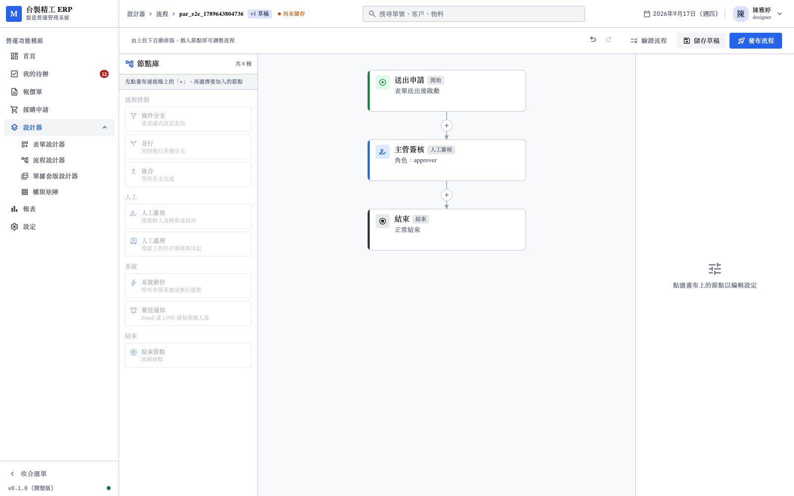

### 6.4 儲存與驗證

#### 步驟 9：驗證通過

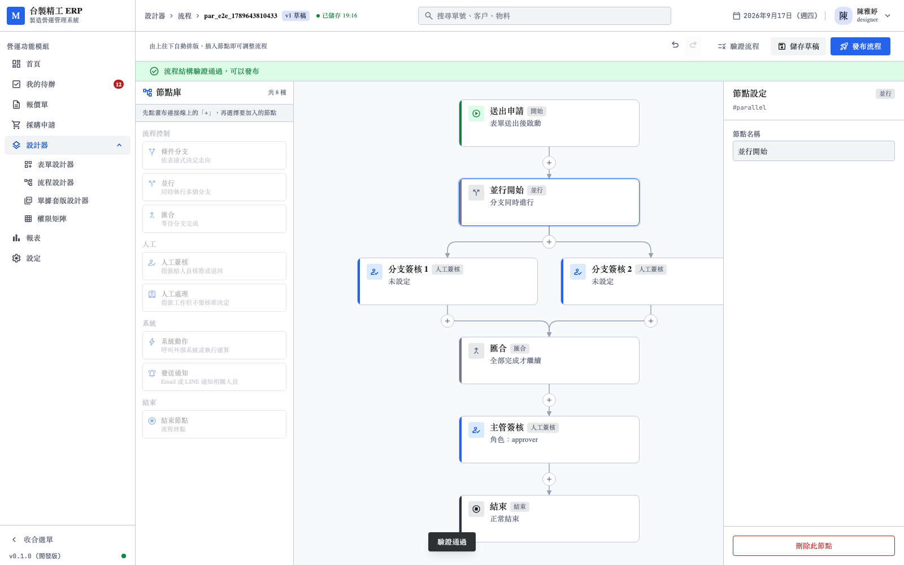

另有一條測試繞過畫面直接查 API，確認存檔後的定義
確實含 1 個 parallel、1 個 join、3 個 human_approval。

#### 步驟 10：兩組並行串接

巢狀並行同樣通過驗證。

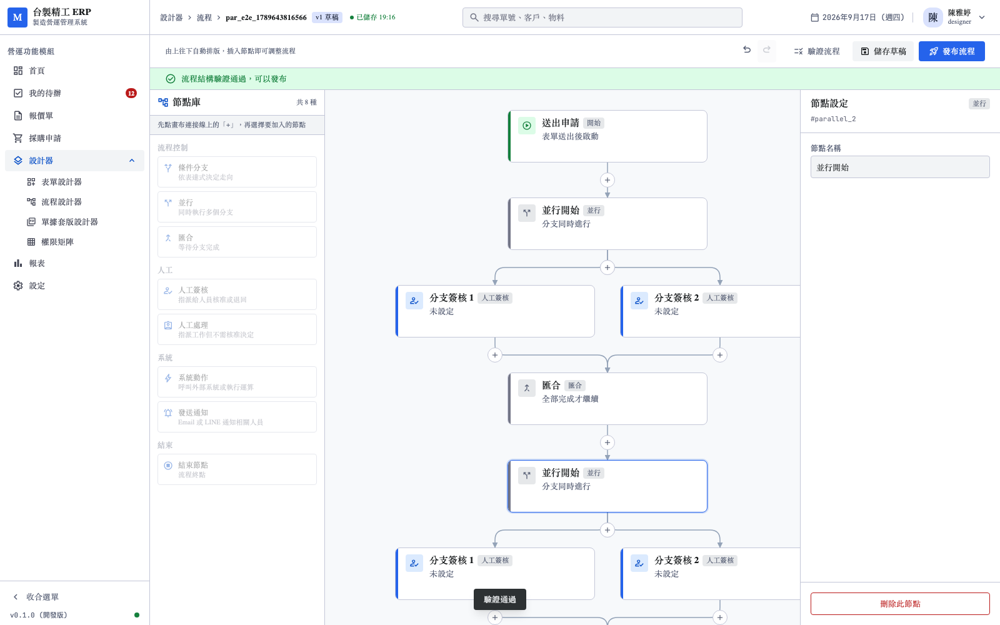

### 6.5 授權

#### 步驟 11：無 designer 角色不能存檔

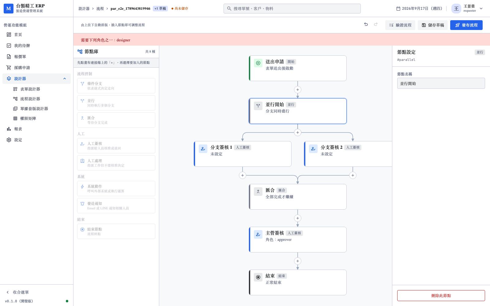

---

## 7. 實機驗證

E2E 之外另做一次完整的執行期驗證。

建立 `parallel_demo` 流程（三方並簽），發布 v1 後啟動實例：

```
送出申請 → 三方並簽 ⇉ 財務／法務／採購 ⇉ 並簽完成 → 結束
```

### 7.1 三個分支同時產生待辦

```
 node_label | status  |        指派
------------+---------+--------------------
 財務簽核   | PENDING | finance@demo.local
 法務簽核   | PENDING | cfo@demo.local
 法務簽核   | PENDING | finance@demo.local
 法務簽核   | PENDING | qa@demo.local
 採購簽核   | PENDING | procure@demo.local
 採購簽核   | PENDING | sales@demo.local
 採購簽核   | PENDING | sales2@demo.local
```

各分支獨立解析參與者：財務 1 人、法務 3 人（approver 角色）、
採購 3 人（requester 角色）。

### 7.2 兩層 join 的區別

三個分支各簽一人後，實例仍為 RUNNING。

這是**正確的**：法務與採購各有 3 位參與者，節點層級的 `join`
未指定，預設 `completion: ALL`，要 3 人都簽完該節點才算完成。

| 層級 | 判定對象 | 設定位置 |
|------|----------|----------|
| 節點層 | 該節點的多位參與者 | `human_approval` 的 `join` |
| 並行層 | 多個分支 | `join` 節點的 `join` |

七人全簽完後實例 **COMPLETED**。

### 7.3 Temporal 記錄的路徑

```json
["start", "split", "finance", "legal", "purchase", "merge", "end"]
```

三個分支都在路徑裡，匯合正確。

---

## 8. 過程中發現並修正的問題

### 8.1 `_context()` 讀取已移除的 `self._current`

移除單一 current node 後，條件式求值的 `node.id` 抓不到值，
拋 `AttributeError`，且**症狀是測試無限等待而非明確失敗**——
跑全套從 24 秒變成超過 10 分鐘。

修正：`_context(node_id)` 由呼叫端傳入。並行時本來就沒有
單一「當前節點」可言，表達式裡的 `node.id` 必須指向正在求值的那一個。

### 8.2 N_OF_M 沒有預設 n

切到 N_OF_M 時 `n` 是 undefined，卡片顯示「**?** 人完成即繼續」。
使用者可能就這樣存檔，等到驗證才被 WF-E009 擋下。

修正：切到 N_OF_M 自動填 `n=1`，切回其他模式時移除 `n`
（留著會讓 JSON 有無意義的欄位）。

**這個缺陷是實機操作才發現的**——單元測試測的是 `updateNode`，
而問題出在屬性面板的 `patchJoin`。

### 8.3 我一度加了兩個測不到目標的測試

想驗證 8.2 的修正，但寫的測試呼叫 `updateNode` 而非 `patchJoin`，
實際上沒有驗到目標。已移除，改在瀏覽器實測。

記錄這件事是因為它很容易發生：測試通過不代表測對了東西。

### 8.4 節點 id 的序號從 2 開始

E2E 第一次執行有兩條失敗，斷言 `node-branch_1` 找不到。
`uniqueId` 的規則是 base 本身算第一個，重複時才加 `_2`、`_3`。

### 8.5 用 JS 直接 click() 不會觸發 Vue 事件

在瀏覽器 console 用 `element.click()` 操作節點庫，畫面有反應
但草稿存進去是空的——事件沒有真的走到 Vue 的處理函式。

改用 Playwright 的真實滑鼠點擊才正確。

---

## 9. 已知限制

| 項目 | 現況 |
|------|------|
| 分支的預設內容 | 固定是 human_approval，不能選其他型別 |
| 分支的增刪 UI | `addBranch` / `removeBranch` 已實作但畫面尚無按鈕 |
| Timeout Policy | join 節點尚未支援逾時（WAIT／ESCALATE／AUTO_APPROVE／AUTO_REJECT）|
| CUSTOM_EXPRESSION | 結果策略尚未支援自訂表達式 |
| 監控 | 「現在哪些分支在跑」要查 Temporal，無 SQL 視圖 |

其中 **Timeout Policy** 值得優先補：並簽時某人長期不簽會讓
整個流程卡住，而目前沒有出口。

---

## 10. 結論

並行分支從 schema 到執行期到設計器全線打通。

- DSL 驗證新增 WF-E009／WF-E010，設計期就擋下非法結構
- Interpreter 用 Temporal 原生並行，複用既有的 policy engine
- 設計器一次插入整組，刪除也是整組
- **695 個測試全數通過**（本次 +56）
- 11 張截圖存檔於 `screenshots/parallel-designer/`

實機驗證三方並簽的完整往返：三分支同時產生待辦、七人簽完、
流程 COMPLETED、Temporal 路徑含所有分支。
