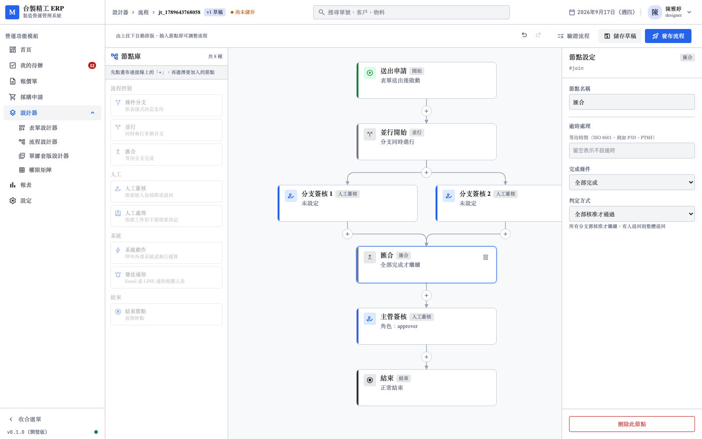
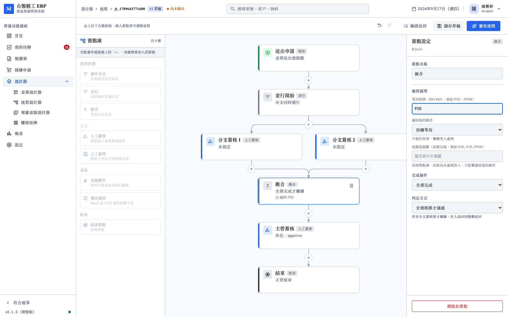
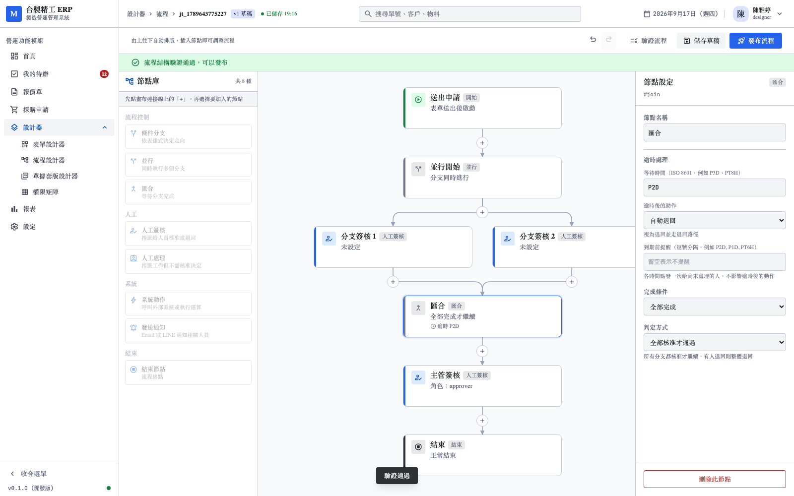
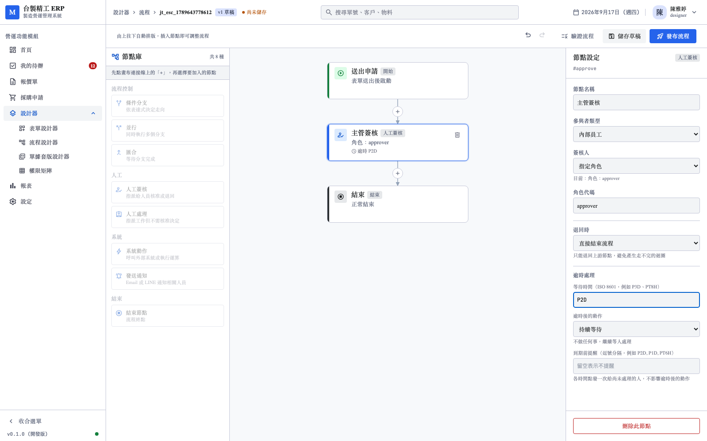

# 逾時策略測試報告

- 日期：2026-09-17
- 範圍：四種逾時策略（WAIT／ESCALATE／AUTO_APPROVE／AUTO_REJECT），
  含簽核節點與 join 節點
- 環境：本機 PostgreSQL 17、Temporal 1.25.2、Rust API `:3001`、前端 `:3040`
- 截圖：`screenshots/join-timeout/`（4 張）
- 前置：[08_並行分支測試報告](08_並行分支測試報告.md)

---

## 1. 為什麼做這個

報告 08 的第 9 節列為「值得優先補」：

> 並簽時某人長期不簽會讓整個流程卡住，而目前沒有出口。

清點時發現的實況比預期嚴重：

| 項目 | 狀態 |
|------|------|
| JSON Schema | `timeoutPolicy` 四種策略都定義了 |
| `nodeJoin` | **沒有 timeout 屬性**，且 `additionalProperties: false` |
| 簽核節點的 WAIT | **靜默走退回路徑**——與語意相反 |
| 簽核節點的 ESCALATE | **靜默走退回路徑**，使用者設了加簽卻得到退回 |
| join 的逾時 | 完全沒有，`asyncio.gather` 永遠等下去 |
| 逾時的測試 | **一條也沒有**（`test_interpreter.py` 的註解指向不存在的 `test_timeout.py`）|

也就是說：四種策略只有兩種真的能用，另外兩種會做出與設定相反的事，
而且沒有任何測試會發現。

---

## 2. 測試結果總覽

| 元件 | 數量 | 本次新增 |
|------|------|----------|
| Rust | 154 | +3 |
| Python | 142 | +16 |
| 前端單元／元件 | 324 | +5 |
| pdfme | 57 | — |
| **E2E（Playwright）** | **46** | **+4** |
| **合計** | **723** | **+28** |

TypeScript 型別檢查零錯誤。

---

## 3. 四種策略的語意

| 策略 | 行為 | 離開節點？ |
|------|------|-----------|
| `WAIT` | 繼續等，不做任何事 | 否 |
| `ESCALATE` | 加簽給指定的人，繼續等 | 否 |
| `AUTO_APPROVE` | 視為通過，流程前進 | 是 |
| `AUTO_REJECT` | 視為退回，走 `on_reject` | 是 |

實作上分成兩段：`_handle_timeout_inline` 處理不離開節點的兩種，
回傳 False 才交給 `_route_timeout` 決定去向。

### 3.1 WAIT 的修正

先前 WAIT 與 ESCALATE 都走 `_route_reject`，理由寫在註解裡：

> WAIT 語意上是「繼續等」，但既然已經逾期還是要有出口，
> 兩者暫時都走退回路徑。

這個推論有問題：**「繼續等」就是它的出口**。使用者設 WAIT 是為了
「記錄一個預期時間但不自動處理」，得到退回不是折衷，是相反。

修正後 WAIT 會清掉 deadline 改為無限等待——不清的話
`wait_condition` 會立刻再次逾時，形成忙迴圈。

---

## 4. ESCALATE 的語意決定

兩個問題在實作前先確認，因為選錯會讓行為很難改回來。

### 4.1 原本的待辦保留（2026-09-17 定案）

| 選項 | 語意 |
|------|------|
| **保留，兩邊都能簽** | 是「加簽」——多一個人可以處理 |
| 取消原待辦，改由上級處理 | 是「升級」——換人 |

採用前者。理由：`ESCALATE` 在企業流程的慣例是加簽，
原簽核人晚一點回來仍應能處理。

### 4.2 加簽者算進分母（2026-09-17 定案）

`ALL`（1 人）加簽一人後變成 **2 人都要簽**才過。

理由：加簽者與原簽核人地位相同。不算進分母的話，
加簽等於只是「通知一下」，沒有實質的簽核責任。

實作上 `decided()` 每次都取 `len(wait.participants)` 而非
快取的 total——加簽後分母自然變大。

### 4.3 加簽只做一次

加簽後清掉 deadline。不清的話每次逾時都再加一個人，
最後全公司都收到待辦。

### 4.4 去重

解析出的加簽者若已在名單裡，過濾掉。同一人收到兩張待辦
只會造成困惑。全部被濾掉時記 warning 並改為繼續等待——
不該因為「加簽對象剛好就是原簽核人」而讓流程失敗。

---

## 5. join 不支援 ESCALATE

**分支各有自己的簽核人，加簽給誰沒有明確語意。**

```
parallel
  ├─ 財務簽核（張三）
  ├─ 法務簽核（李四）  ← join 逾時了，加簽給誰？
  └─ 採購簽核（王五）
```

三種可能的解讀都說得通，但都不是使用者預期的唯一答案：

- 加給所有未完成的分支
- 加給最慢的那個分支
- 另開一個獨立的簽核

**猜一個比明確失敗更糟**：使用者以為設好了，實際上加簽給了不預期的人。

處理方式：

| 層 | 行為 |
|----|------|
| 驗證器 | WF-E009，訊息說明「請改在各分支的簽核節點設定」 |
| Interpreter | `UnsupportedJoinTimeout`，明確失敗 |
| 屬性面板 | 選單直接不列 ESCALATE |

三層都擋，使用者不會走到執行期才發現。

---

## 6. 新增的驗證規則

| 代碼 | 檢查 | 為什麼 |
|------|------|--------|
| WF-E009 | join 的 timeout policy 不得為 ESCALATE | 見第 5 節 |
| WF-E011 | ESCALATE 必須指定 `to` | 缺 `to` 執行期才失敗，而那時使用者已等了設定的天數 |

schema 也補了 `nodeJoin.timeout` 與 `nodeJoin.on_reject`——
原本 `additionalProperties: false` 會直接擋掉。

---

## 7. Python 測試（16 條）

`python-ai/tests/test_timeout.py`。用 time-skipping 環境，
「等兩天」在測試裡是瞬間的事。

| 類別 | 條數 | 內容 |
|------|------|------|
| 單節點逾時 | 5 | AUTO_APPROVE／AUTO_REJECT／走 goto／取消待辦／無 timeout 不逾時 |
| ESCALATE | 4 | 建立加簽待辦／原待辦保留／加簽者算進分母／缺 to 明確失敗 |
| join 逾時 | 7 | AUTO_APPROVE／AUTO_REJECT／取消分支待辦／無 timeout 無限等待／逾時前簽完不受影響／WAIT 繼續等／不支援 ESCALATE |

### 7.1 「沒設 timeout 就不該逾時」

這條測試釘住一個容易寫錯的邊界：快轉三十天後，
沒設 timeout 的節點仍應在等待。

實作上 `deadline is None` 時走 `wait_condition` 不帶 timeout，
不會進入逾時分支。

---

## 8. E2E 測試（4 條）

`web/e2e/join-timeout.spec.ts`

### 8.1 join 可設定逾時



逾時區塊原本寫在簽核節點的 `v-if="isHuman"` 區塊內，
join 看不到。移到外層並改用 `showTimeout` 判斷。

### 8.2 策略選單不含加簽



### 8.3 設定逾時後驗證通過



右側顯示逾時處理（P2D／自動退回）、完成條件、判定方式；
卡片摘要顯示「逾時 P2D」；綠色橫幅「流程結構驗證通過，可以發布」。

### 8.4 簽核節點保留加簽



限制只針對 join，簽核節點的 ESCALATE 仍可用。

---

## 9. 過程中發現的問題

### 9.1 逾時完全沒有測試

`test_interpreter.py` 的註解寫著：

> 逾時相關的測試另外用 time-skipping，見 test_timeout.py。

**那個檔案不存在。** 註解指向一個從未建立的檔案，
而四種策略中有兩種的行為與設定相反，沒有任何測試會發現。

### 9.2 join 逾時測試一開始跑不完

第一次執行卡住超過 5 分鐘。原因是 `_run_parallel` 的
`asyncio.gather` 沒有 timeout，沒有 timer 可讓 time-skipping 快轉。

這反過來證實了缺陷的存在——測試「應該逾時」的行為時卡住，
就是因為根本不會逾時。

### 9.3 測試取消流程後噴 Not in workflow event loop

`handle.cancel()` 只是送出取消請求，分支還在跑而測試環境已拆。

加了 `settle()` 輔助函式等流程收尾。取消後流程以 CANCELLED 結束，
也可能拋 CancelledError，兩者都是預期的。

### 9.4 mock 讓 ESCALATE 的去重邏輯誤判

測試的 `resolve_participants` 永遠回同一組人，加簽者被去重濾掉，
日誌顯示「解析不到新的參與者」。

去重是對的（同一人不該收兩張待辦），問題在 mock 太簡化。
改成依 resolver 的 `value` 回不同的人。

**這類問題很容易被誤判成程式缺陷**——實際上是測試沒有模擬出
真實情境。

### 9.5 我把逾時區塊插到錯的層級

第一次移動時插在 `<template v-if="isHuman">` 內部，
`showTimeout` 被外層條件蓋掉，測試仍然全紅。

用腳本改 Vue template 的結構容易出這種錯，第二次改用
明確的 marker 定位才正確。

---

## 10. 已知限制

| 項目 | 現況 |
|------|------|
| ESCALATE 的加簽對象 | 只支援 resolver，不能指定「原簽核人的主管」這類相對關係 |
| 逾時起算點 | 從進入節點開始，不支援「從表單送出起算」 |
| 逾時前通知 | 沒有「剩一天時提醒」的機制 |
| 加簽次數 | 固定一次。連續加簽（加了還不簽就再往上加）未支援 |

其中**逾時前通知**值得補：現況是時間到才動作，
使用者事前沒有任何提示。

---

## 11. 結論

四種逾時策略全部可用，簽核節點與 join 節點都支援。

- 修正 WAIT 與 ESCALATE 先前靜默走退回的行為
- ESCALATE 實作加簽，原待辦保留、加簽者算進分母
- join 明確不支援 ESCALATE，三層都擋
- 新增 WF-E009（join 的 ESCALATE）與 WF-E011（缺 to）
- 補上先前完全缺席的逾時測試
- **723 個測試全數通過**（本次 +28）
- 4 張截圖存檔於 `screenshots/join-timeout/`
