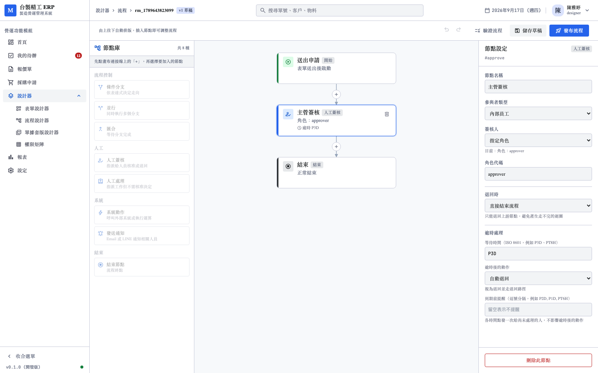
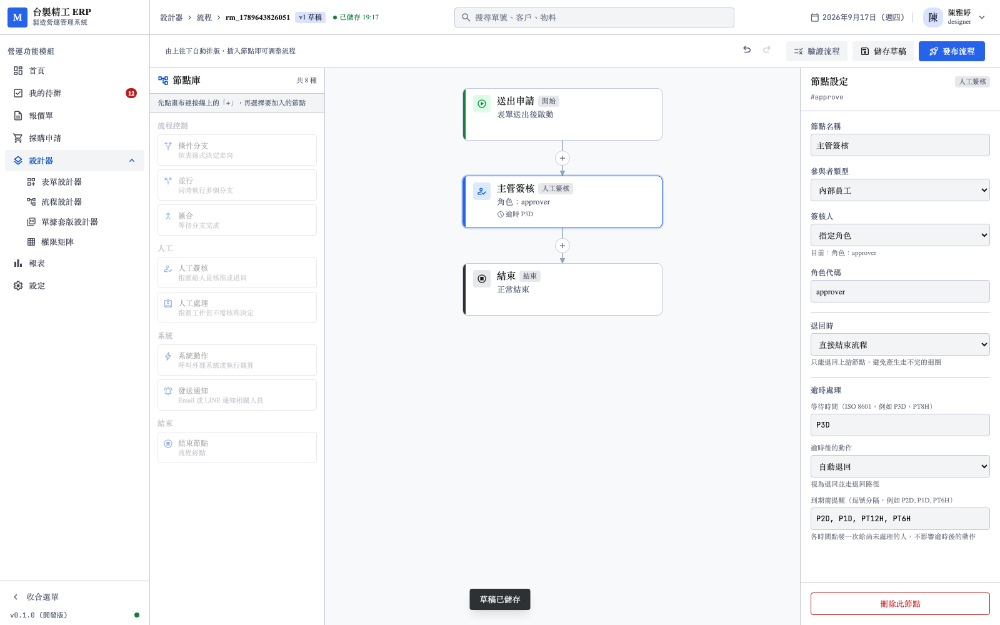
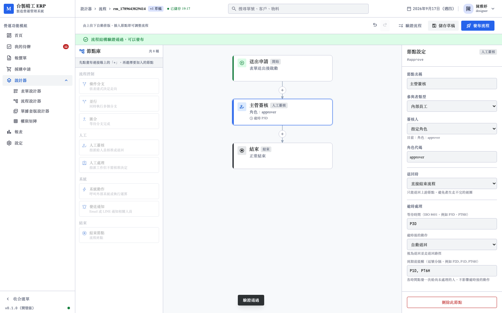

# 逾時前提醒與狀態一致性測試報告

- 日期：2026-09-17
- 範圍：節點層的提醒排程、流程結束回報的無限重試
- 環境：本機 PostgreSQL 17、Temporal 1.25.2、Rust API `:3001`、前端 `:3040`
- 截圖：`screenshots/reminder/`（3 張）
- 相關決議：[D-06](../../需求規劃/202609/02_決議紀錄.md)（修訂）

---

## 1. 起因：我把兩件事混在一起了

使用者提出做一個 job service 定期掃描逾時的流程。我當時的回應是
「Temporal timer 已經處理逾時，不需要」，並記為決議 D-06。

那個回應只對了一半。使用者接著指出：

> 逾時前提醒就是剛剛講的 job service 要做的工作！
> 使用者可以自己排程，可能到期前 2 天、1 天、12 小時、6 小時都發一次提醒！
>
> 對帳的應該是 Temporal timer 要同步更新 postgresql

兩點都成立，而且指出了我判斷上的問題：

| 我的說法 | 實際 |
|---------|------|
| 「逾時已自動處理，不需要定期任務」 | **提醒**不是逾時處理，是另一件事——多次觸發、可設定間隔 |
| 「對帳可由定期任務修正」 | 對帳不該事後補，**寫入當下就該成功** |

---

## 2. 測試結果總覽

| 元件 | 數量 | 本次新增 |
|------|------|----------|
| Rust | 154 | — |
| Python | 154 | +12 |
| 前端單元／元件 | 330 | +6 |
| pdfme | 57 | — |
| **E2E（Playwright）** | **51** | **+5** |
| **合計** | **746** | **+23** |

TypeScript 型別檢查零錯誤。

---

## 3. 狀態一致性：不再放棄

### 3.1 先前的做法與它的問題

```python
retry_policy=TemporalRetry(maximum_attempts=5),
...
except Exception as e:
    workflow.logger.warning("回報流程結束失敗：%s", e)
```

註解寫著「可由對帳程序修正」。

兩個問題：

1. **那個對帳程序從未實作**——註解把責任推給一個不存在的東西
2. **事後補本來就比當下寫成功脆弱**——補的時候要重新判斷該寫什麼，
   而那個判斷可能也是錯的

後果：重試 5 次失敗後，那筆單據在 PostgreSQL 永遠顯示「進行中」，
而 Temporal 知道它早就完成了。收件匣與報表都查 PostgreSQL，
使用者看到的就是錯的。

### 3.2 改為無限重試

```python
# 不設 maximum_attempts：Temporal 以指數退避持續重試
retry_policy=TemporalRetry(),
```

代價是資料庫長期斷線時流程停在這裡。但**那本來就是系統無法運作的狀態**，
在 Temporal UI 看得到卡住的流程，比資料靜默不一致好得多。

### 3.3 測試（4 條）

`python-ai/tests/test_reconcile.py`

| 測試 | 驗證 |
|------|------|
| 一次成功時只呼叫一次 | 沒有多餘的重試 |
| **失敗後重試直到成功** | 失敗 8 次（超過先前的 5 次上限），第 9 次成功 |
| 重試期間狀態不會寫成錯的 | 只有成功那次寫入，不是四筆 |
| 回報的內容正確 | status / instance_id / tenant_id 都對 |

第二條是關鍵。RED 時的輸出精準命中問題：

```
RuntimeError: 模擬資料庫斷線（第 5 次）
WARNING  回報流程結束失敗：Activity task failed
```

第 5 次就放棄了，資料永久不一致。

---

## 4. 逾時前提醒

### 4.1 設定在節點層（2026-09-17 定案）

```jsonc
"timeout": {
  "after": "P3D",
  "policy": "AUTO_REJECT",
  "remind_at": ["P2D", "P1D", "PT12H", "PT6H"]
}
```

`remind_at` 的每個值是**距離到期還有多久**，不是「從現在起算多久」。
`P2D` 代表到期前兩天發一次。

選節點層而非租戶層的理由：不同節點的重要性不同。
緊急採購可能要提醒四次，例行的請購一次就夠。

### 4.2 為什麼不用 Temporal timer 而要另外處理

逾時本身用 timer 很合適——一個節點一個 deadline。
但提醒是**多個**時間點，每張待辦要 N 個 timer。

實作上仍在同一個等待迴圈裡完成，只是每次算出「下一個要醒來的時間點」
取提醒與到期的較早者：

```python
next_at = wait.deadline
if pending_reminders and pending_reminders[0][0] < next_at:
    next_at = pending_reminders[0][0]
    is_reminder = True
```

沒有增加服務，也沒有輪詢。

### 4.3 幾個邊界

| 情況 | 處理 |
|------|------|
| `remind_at` 比 `after` 長 | 忽略——那個時間點在流程開始之前 |
| 有人簽完了 | 剩餘的提醒不發 |
| ESCALATE／WAIT 之後 | deadline 被清掉，剩餘提醒沒有意義 |
| 發送失敗 | 記 warning 繼續——寄信失敗不該讓整張單卡住 |
| 已簽的人 | 不發——要催的是還沒簽的那些 |

### 4.4 測試（Python 8 條）

`python-ai/tests/test_reminder.py`

| 類別 | 測試 |
|------|------|
| 發送 | 依設定各發一次、沒設不發、不影響逾時策略、帶剩餘時間、發給該節點簽核人、超過期限的設定被忽略 |
| 與簽核的互動 | 簽完之後不再發提醒 |
| 失敗處理 | 提醒失敗不中斷流程 |

「帶剩餘時間」這條釘住一個容易漏的細節：使用者要知道**還剩多久**，
不只是「快到期了」。訊息帶原始標籤（`P1D`）而非算出來的時間戳。

---

## 5. 前端

### 5.1 提醒設定



設了逾時才出現——沒有期限就沒有「到期前」可言。

### 5.2 多個時間點



逗號分隔，比多個輸入框好編輯。右側完整呈現：
等待時間 P3D、逾時後動作「自動退回」、到期前提醒
`P2D, P1D, PT12H, PT6H`。

### 5.3 驗證通過



### 5.4 E2E 測試（5 條）

其中兩條繞過畫面直接查 API：

- **存進去的是陣列而非字串**——`["P2D","P1D","PT6H"]` 而非 `"P2D, P1D, PT6H"`
- **清空後移除設定**——`remind_at` 是 undefined 而非空陣列

前端顯示正確不代表存進去的結構正確，這兩條測的是後者。

---

## 6. 決議 D-06 的修訂

原決議「不做 job service」仍然成立，但理由要修正：

| 原本的說法 | 修訂 |
|-----------|------|
| 「逾時已自動處理，三個缺口日後用 Temporal Schedule」 | 提醒與對帳**這次就做了**，都不需要獨立服務 |
| 「對帳可由定期任務修正」 | 對帳改為寫入當下無限重試，不留給事後 |

剩下一項仍未做：**測試資料回收**（574 個測試租戶）。
那確實適合定期任務，但與流程執行無關。

---

## 7. 已知限制

| 項目 | 現況 |
|------|------|
| 提醒的實際發送 | `send_notification` 仍只記稽核，未接 SMTP 與 LINE API |
| 提醒的訊息內容 | `template_key: task_reminder` 已傳，但模板尚未建立 |
| 提醒的發送管道 | 預設 `["email", "line"]`，節點可用 `remind_channel` 覆寫，但 UI 尚未提供 |
| 提醒次數上限 | schema 限 10 個，無其他保護 |

**提醒的實際發送是最大的缺口**——目前流程會在正確的時間點呼叫
`send_notification`，但那個 Activity 只寫稽核記錄，沒有真的寄出。
這與 notification 節點是同一個缺口，見交接手冊 4.3。

---

## 8. 結論

- 流程結束回報改為無限重試，不再有「重試失敗就放棄」的資料不一致
- 逾時前提醒可由使用者自訂多個時間點，設定在節點層
- 兩者都不需要獨立的 job service
- **746 個測試全數通過**（本次 +23）
- 3 張截圖存檔於 `screenshots/reminder/`

修正了我先前一個判斷錯誤：把「提醒」歸類成「逾時處理」而認為不需要做。
它們的觸發次數、設定方式、與流程狀態的關係都不同。
