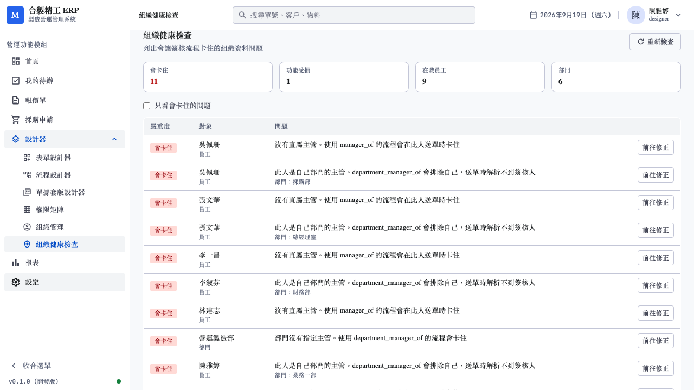
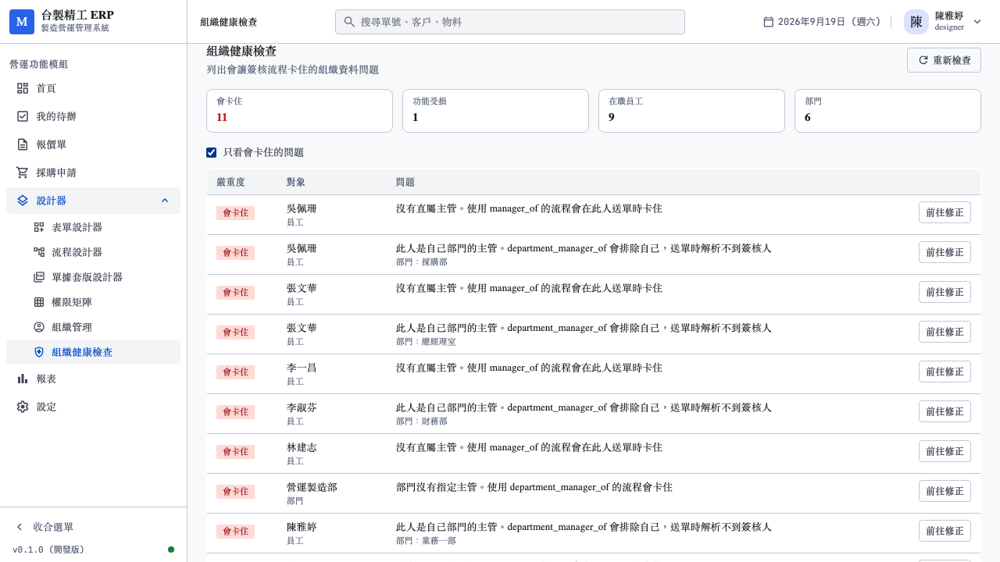

# 14. 組織健康檢查測試報告

日期：2026-09-19
對應需求：[07_組織基本資料與客戶系統同步需求.md](../../需求規劃/202609/07_組織基本資料與客戶系統同步需求.md) §9
範圍：需求 07 的 P0 剩餘項目（組織健康檢查）

---

## 1. 這個功能要解決什麼

需求 §9 的原話是「本案對簽核最大的價值」。具體的問題是：

客戶把組織資料建進系統之後，沒有人知道**哪些人送單會卡住**。
問題要等到第一個使用者按下送出、流程停在「找不到簽核人」才浮現，
而那時通常已經是上線日。

健康檢查把這件事提前：一張報表列出所有會讓 Approver Resolver
解析失敗的組織資料問題，導入期就能修完。

---

## 2. 檢查項的來源

**不是照需求 §9 的表格抄的。**

§9 的表格是從資料品質的角度列的。實際要檢查什麼，取決於
[participant.rs](../../../server/crates/persistence/src/participant.rs)
裡的 resolver 怎麼查。兩邊不一致的話，報表會說一切正常而流程照卡——
那比沒有報表更糟。

所以實作前先讀了 resolver 的 SQL，得到三個與需求文件不同的結論：

### 2.1 多出一項：`DEPARTMENT_MANAGER_IS_SELF`

`department_manager_of` 的查詢有 `m.id <> u.id`：

```sql
select m.id, m.name, null::text as role
from app_user u
join department d on d.id = u.department_id
join app_user m on m.id = d.manager_user_id
where u.id = $1 and m.id <> u.id
```

這條件是為了避免「自己簽自己」，但後果是**部門主管本人送單時
解析回空**。這在需求 §9 的表格裡沒有，實務上卻很常見——
部門主管自己請假、自己提採購申請。

實機驗證證實這是 demo 種子裡最多的一項（5 次，見 §5）。

### 2.2 一項的性質與文件描述不同：`MANAGER_INACTIVE`

`manager_of` 的 join 只有 `m.id = u.manager_id`，**完全不看主管的
狀態**。所以主管離職不會讓解析失敗，而是成功解析出一個收不到信的人。

這比解析失敗更難發現：流程照走、任務照建、通知照寄（寄到停用信箱），
只是永遠沒有人處理。

### 2.3 少一項：email 重複

需求 §9 列了「員工 email 空白或重複」。但 `app_user` 有
`unique (tenant_id, email)` 且欄位 `not null`
（[0001_tenant_identity.sql:49,59](../../../server/migrations/0001_tenant_identity.sql)），
重複與 NULL 在資料庫層就進不來。

**這項檢查是死碼，已移除。** 只保留空字串的檢查——
`emails_of` 用 `email <> ''` 過濾，空字串確實收不到信。

> 這是寫測試時才發現的：`detects_duplicate_email` 在建測試資料那一步
> 就撞上 `duplicate key value violates unique constraint
> "app_user_tenant_id_email_key"`。測試寫不出來，是因為被測的情況
> 不可能發生。

---

## 3. 最終的檢查項

| 代碼 | 嚴重度 | 對應的失敗路徑 |
|---|---|---|
| `EMPLOYEE_NO_MANAGER` | HIGH | `manager_of` 解析回空 |
| `MANAGER_INACTIVE` | HIGH | `manager_of` 解析到離職 / 停用者 |
| `MANAGER_CYCLE` | HIGH | 多階簽核無限迴圈 |
| `DEPARTMENT_NO_MANAGER` | HIGH | `department_manager_of` 解析回空 |
| `DEPARTMENT_MANAGER_IS_SELF` | HIGH | `m.id <> u.id` 排除本人，解析回空 |
| `EMPLOYEE_NO_DEPARTMENT` | MEDIUM | 依部門解析的 resolver 失效 |
| `EMPLOYEE_NO_EMAIL` | MEDIUM | `emails_of` 過濾掉，通知靜默不寄 |
| `DEPARTMENT_BROKEN_PARENT` | MEDIUM | 組織樹斷裂 |

只有兩級嚴重度，刻意不設 LOW：分不出輕重的等級會讓人忽略整張報表。

只檢查在職員工（`status = 'ACTIVE' and (left_at is null or
left_at > current_date)`）。離職者沒有主管不是問題——他不會送單。
把他們算進來會讓報表充滿永遠不必修的項目。

---

## 4. 測試結果

### 4.1 後端整合測試（9 項，對真實 PostgreSQL）

`server/crates/http-public/tests/org_health_api.rs`

| 測試 | 驗證什麼 |
|---|---|
| `healthy_org_reports_only_the_root` | **健康的組織不誤報** |
| `detects_inactive_manager` | 主管離職被抓到，且離職者本人不列入分母 |
| `detects_department_manager_managing_own_department` | §2.1 的第八項 |
| `detects_department_without_manager` | 部門沒主管 |
| `detects_manager_cycle` | 遞迴 CTE 偵測到環會停下來 |
| `detects_medium_issues` | 沒部門、沒 email |
| `high_issues_sort_first` | HIGH 全部排在 MEDIUM 之前 |
| `requires_authentication` | 未登入回 401 |
| `does_not_leak_across_tenants` | 實建兩個租戶驗證 RLS |

第一項最重要。只測「有問題時會報」不夠——更容易出錯的是
「沒問題時誤報」，那會讓報表變成噪音。

> 這條測試在第一次跑就失敗了，而且是**測試資料的錯**：
> 我設計的「健康組織」裡 CEO 在管理部、又是管理部主管，
> 自己就觸發 `DEPARTMENT_MANAGER_IS_SELF`。
> 程式是對的，我建的基準組織本身不健康。修法是加一個「董事會」部門，
> 讓每個主管都不隸屬於自己管的部門。

### 4.2 前端單元測試（3 項）

`web/tests/api/org.test.ts` — 報表結構、空清單不當成錯誤、401 拋 ApiError。

### 4.3 E2E（5 項，對真實服務）

`web/e2e/org-health.spec.ts`

E2E 要驗的不只是畫面渲染得出來，而是**它在真實 seed 資料上真的抓到問題**。
一張永遠顯示「一切正常」的報表比沒有報表更危險。

| 測試 | 驗證什麼 |
|---|---|
| 從側邊欄進入健康檢查 | 入口真的存在，且 HIGH 計數 > 0 |
| 部門主管隸屬自己部門會被標為會卡住 | §2.1 在實機資料上成立，且 detail 指出是哪個部門 |
| 只看會卡住的問題會濾掉 MEDIUM | 篩選正確 |
| HIGH 排在 MEDIUM 前面 | 順序決定使用者先修到什麼 |
| 重新檢查會重新呼叫 API | 按鈕真的重跑 |





### 4.4 回歸

| 套件 | 結果 |
|---|---|
| Rust workspace | **188 passed** |
| 前端單元 | **359 passed**（30 檔） |
| `vue-tsc --noEmit` | 零錯誤 |
| Playwright E2E | **79 passed**（189s） |

---

## 5. 實機發現：demo 種子的組織有 11 個 HIGH

報表在 `demo` 租戶的實際輸出：

```
high_count: 11, medium_count: 1, employee_count: 9, department_count: 6
```

| 問題 | 次數 |
|---|---|
| `DEPARTMENT_MANAGER_IS_SELF` | 5 |
| `EMPLOYEE_NO_MANAGER` | 5 |
| `DEPARTMENT_NO_MANAGER` | 1（營運製造部） |
| `EMPLOYEE_NO_DEPARTMENT` | 1（李一昌） |

**`DEPARTMENT_MANAGER_IS_SELF` 五次全部是同一個模式**：
陳雅婷管業務一部、人在業務一部；張文華管總經理室、人在總經理室；
李淑芬管財務部、人在財務部……

這是最自然的建法，也是最容易卡住的建法。這五個人送採購申請或請假時，
只要流程用了 `department_manager_of`，就會停在「找不到簽核人」。

這一項不在需求 §9 的表格裡。若照文件抄，報表會漏掉 demo 資料裡
**最多的一種問題**。

---

## 6. 開發過程中修掉的錯

| 現象 | 原因 |
|---|---|
| 所有 API 回 500「伺服器內部錯誤」 | `column reference "left_at" is ambiguous`。把「在職」條件寫成常數 `"status = 'ACTIVE' and (left_at ...)"` 再拼成 `u.{常數}`，只有第一個欄位拿到前綴。改成 `active_employee(alias)` 函式，每個欄位各自前綴 |
| 遞迴 CTE 的查詢 decode 失敗 | `select ... , '', path` 裡的 `''` 沒有型別，PostgreSQL 回 `unknown`，sqlx 解不出 String。那個欄位本來就沒用到，移除 |
| `/org/health` 回 404 | `start_service.sh` 見 port 已通就不重啟，跑的還是上一輪的 binary。重啟後正常 |
| E2E 側邊欄導航 timeout | 「設計器」在展開的側邊欄是 `<button data-testid="nav-designer-toggle">` 展開子選單，不是 `<a>` |
| E2E「功能受損」斷言失敗 | 該字串也是統計卡片的標籤。斷言範圍要限在 `org-health-table` 內 |

前兩項的錯誤訊息都被 `ApiError::Internal` 遮成「伺服器內部錯誤」
（正確的設計，避免洩漏實作），而測試環境沒有 tracing subscriber，
log 也看不到。用一支暫時的 probe 測試直接呼叫 `check()` 才拿到原文。

---

## 7. 尚未完成

需求 07 的 P0 還差**組織管理 UI**（部門樹 + 員工清單 + 欄位鎖定標記）。
健康檢查目前只能看，不能從報表直接跳去修。

P1～P3（FILE / REST / SQL connection）未動。
