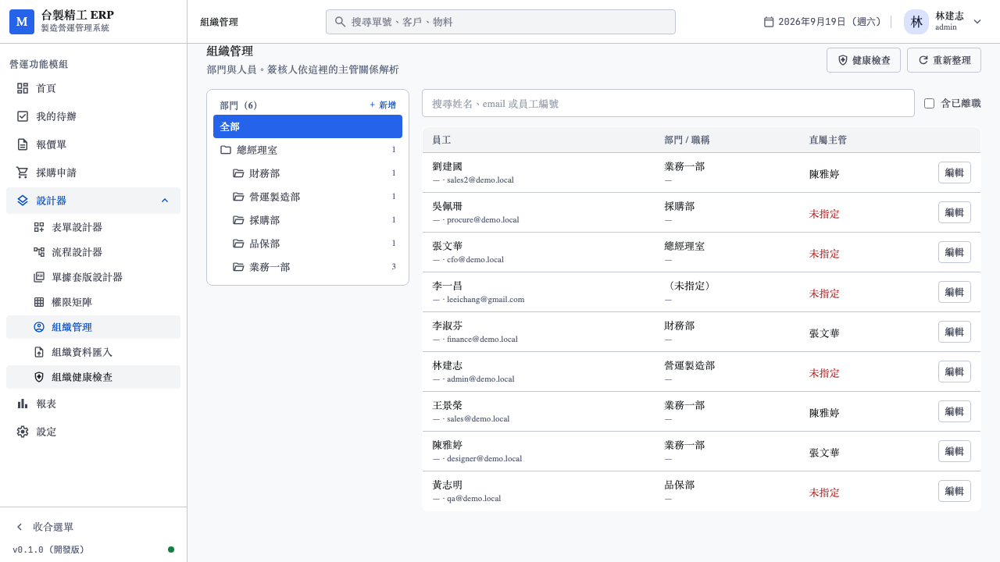
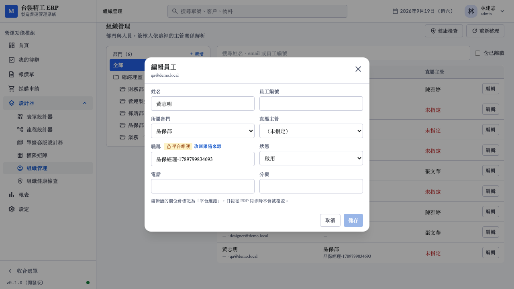
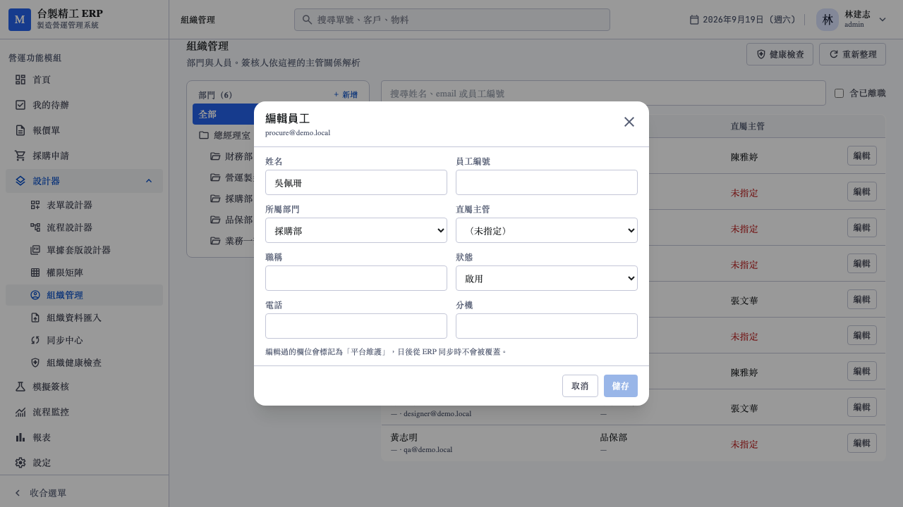
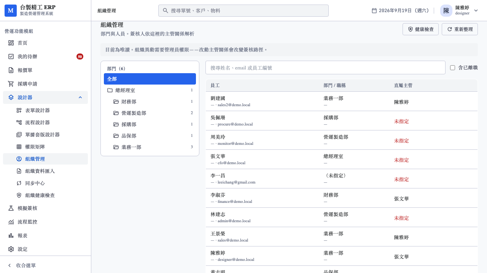
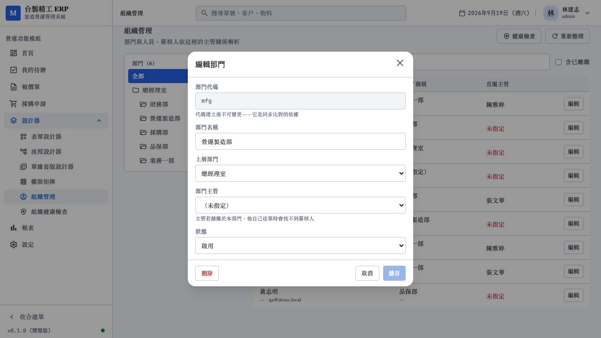
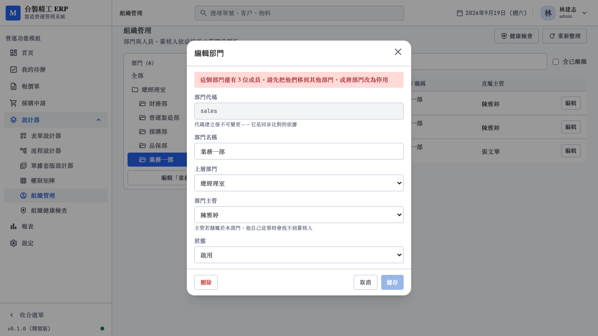

# 15. 組織管理 UI 測試報告

日期：2026-09-19
對應需求：[07_組織基本資料與客戶系統同步需求.md](../../需求規劃/202609/07_組織基本資料與客戶系統同步需求.md) §3、§12.2
範圍：需求 07 的 P0 最後一項（組織管理 UI）

承接 [14_組織健康檢查測試報告.md](14_組織健康檢查測試報告.md)。**需求 07 的 P0 至此完成。**

---

## 1. 這一輪要解決什麼

健康檢查做完後，報表抓到 11 個 HIGH，但**沒有一個修得掉**——
沒有組織管理畫面。報表只能看不能修，等於沒有。

這一輪補上部門樹、員工清單與編輯，並把兩頁串起來：
報表的每一筆都有「前往修正」，點了直接開那個人的編輯。

---

## 2. 兩個開工前確認的決定

### 2.1 MANUAL 來源的編輯要不要記錄欄位鎖定

需求 §3 規則 2 說「管理員編輯某欄位 → 該欄位名自動加入
`platform_managed_fields`」，但 §5.1 又說 MANUAL 來源
「所有欄位視同 `platform_managed_fields`」。目前 `source_system`
全是 MANUAL（同步機制未做），兩條規則對這個情況的指示不同。

**決定：一律記錄。**

不記的話，等 P1 Excel 匯入接上、某人從 MANUAL 轉為 FILE 來源時，
他之前被編輯過的欄位**沒有保護**，第一次同步就被沖掉。
而且 UI 的標記與解鎖按鈕在 P1 之前完全看不到效果，等於機制要等到
P1 才第一次被驗證。

### 2.2 範圍

部門樹 + 員工清單 + 編輯。**代理人管理不做**——
`approval_delegation` 表雖然建好了，但 Q-05（代理是取代還是併存）
未定案，且 Approver Resolver 還沒接代理人展開。做了 UI 也不會生效。

---

## 3. 實作

### 3.1 為什麼 patch 帶明確的 `fields` 清單

PATCH 要能表達「把主管清成空」。單純用 `Option<T>` 做不到——
送 `{"manager_id": null}` 與完全不送這個 key，反序列化後都是 `None`。

常見解法是 `Option<Option<T>>`（double option），但那需要額外的
`serde_with` 依賴。改用明確的清單：

```json
{ "fields": ["manager_id", "job_title"], "manager_id": null, "job_title": "工程師" }
```

不在 `fields` 裡的值一律不動，即使物件裡帶了。

**這個設計正好也是 `platform_managed_fields` 需要的資訊**——
「哪些欄位被改了」本來就要記錄，兩件事合一，不必從值的差異去推導。

前端同樣只送改過的欄位（`changedFields` computed）。整包送出會讓
使用者沒碰過的欄位也被標成平台維護，日後同步就跳過它們——那不是
使用者的意思。

### 3.2 欄位白名單

可編輯的欄位寫死在 `organization.rs`，不從結構推導。
欄位名會進 `platform_managed_fields` 並存進資料庫，等同 API 契約；
允許任意字串會讓同步邏輯日後讀到不認得的名字。

刻意排除：

| 欄位 | 排除的理由 |
|---|---|
| `email` | 登入帳號，改它等於換人 |
| `can_login`、密碼 | 牽涉登入安全，要走獨立端點才看得出誰改了什麼 |
| 角色 | 權限問題，不是組織資料 |
| `department.code` | `unique (tenant_id, code)` 的一部分，也是同步匹配的備援鍵 |

### 3.3 權限：組織編輯要 `admin`，不給 `designer`

既有的 forms / workflows / permissions 寫入都是 `require_any(&["designer"])`。
組織**刻意不同**：改主管等於改簽核路徑，designer 管的是表單與流程定義，
不是人事。

讀取則不限制——下拉選單本來就查得到人與部門。

### 3.4 成環在編輯時就擋，不等健康檢查

主管鏈與部門樹成環都會擋在 PATCH。健康檢查會報出既有的環，
但讓使用者存得進去、再叫他去報表上看到自己剛造成的問題沒有道理。

往上爬而非往下找子孫：往上的路徑長度是樹高（個位數），
往下要掃整棵子樹。

### 3.5 孤兒部門不能消失

`parent_id` 指向不存在的部門時，若只從根節點往下走，那棵子樹
會整個消失在畫面上——使用者看不到，也就無從修正。

`buildTree` 把孤兒當成根節點放在頂層。寧可位置放錯也不要讓它不見。
健康檢查的 `DEPARTMENT_BROKEN_PARENT` 指向的部門，必須在樹上點得到。

---

## 4. 測試結果

### 4.1 後端整合測試（20 項，對真實 PostgreSQL）

`server/crates/http-public/tests/org_api.rs`

| 分類 | 測試 |
|---|---|
| 讀取 | 部門帶成員數、員工帶部門與主管名稱、預設排除離職者、關鍵字過濾 |
| **欄位級 ownership** | 編輯過的欄位進 `platform_managed_fields`、同一欄位改兩次不重複、解除鎖定、解除沒鎖的欄位無害 |
| **成環防護** | 主管不能是自己、主管鏈成環（且擋下後資料不變）、部門不能移到自己下層 |
| 輸入驗證 | 非白名單欄位擋下、不在 `fields` 的值不動、空白代碼、代碼重複 |
| 權限 | designer 四個寫入端點全 403、designer 三個讀取端點全 200、未登入 401、跨租戶不外洩 |
| 稽核 | 記欄位名但不記值 |

最後一項值得說明：組織資料含個資，稽核紀錄不該變成另一份個資副本。
測試實際斷言電話號碼**不出現**在 `audit_event.payload` 裡。

### 4.2 前端單元測試（21 項）

| 檔案 | 內容 |
|---|---|
| `tests/api/org.test.ts`（15） | 健康檢查、部門 CRUD、員工清單與過濾、欄位鎖定 |
| `tests/org/tree.test.ts`（9 之中的 6） | `buildTree` 的孤兒處理、不改動傳入資料 |
| 同上（3） | `descendantIds` 的子樹展開、找不到時回自己 |

`buildTree` 的孤兒測試是重點：`parent_id` 指向不存在的部門時，
那棵子樹不可以消失。

### 4.3 E2E（9 項，對真實服務）

`web/e2e/org-manage.spec.ts`

| 測試 | 驗證什麼 |
|---|---|
| 部門樹與員工清單 | 從側邊欄進得來、樹畫得出來、沒有主管的人標紅字 |
| 選部門連同下層 | 選根節點看到整棵樹，選葉節點只剩直屬 |
| **欄位標記與解鎖** | 改職稱後只有職稱出現標記，解鎖後標記消失 |
| 無改動時儲存鈕停用 | 一打開就能按會讓使用者誤以為改了什麼 |
| 主管下拉不含自己 | 後端也擋，但連選都選不到比較好 |
| **前往修正開到該員工** | 報表要修得掉才有用 |
| 關閉清掉 query | 留著參數重新整理又會跳出對話框 |
| 搜尋過濾 | — |
| designer 唯讀 | 進得來、看得到唯讀提示、沒有編輯按鈕 |





職稱旁有「🔒 平台維護」與「改回跟隨來源」，其他欄位沒有——
只有改過的欄位被鎖定。



點健康檢查裡吳佩珊那筆的「前往修正」，直接開到她的編輯。



### 4.4 回歸

| 套件 | 本輪 | 上一輪 |
|---|---|---|
| Rust workspace | **208 passed** | 188 |
| 前端單元 | **380 passed**（31 檔） | 359 |
| `vue-tsc --noEmit` | 零錯誤 | 零錯誤 |
| Playwright E2E | **88 passed**（198s） | 79 |

---

## 5. 實機驗證

對 demo 租戶直接打 API：

```
PATCH /org/employees/{id}  {"fields":["job_title"],"job_title":"系統管理員"}
  → platform_managed_fields: ['job_title']     ✓ 只鎖改過的欄位

POST /org/employees/{id}/unlock-fields  {"fields":["job_title"]}
  → platform_managed_fields: []                ✓ 解得掉

designer 的 token PATCH → 403                  ✓ 擋得住
designer 的 token GET   → 200                  ✓ 讀得到

PATCH manager_id = 自己 → {"code":"CONFLICT","message":"直屬主管不能是自己"}
```

---

## 6. 開發過程中修掉的錯

| 現象 | 原因 |
|---|---|
| 兩個測試斷言 400 但實際 422 | `ValidationFailed` 映射到 422，與既有 API 一致。**我的斷言寫錯，行為是對的** |
| E2E「選總經理室應看到全部 9 人」失敗（實際 8 人） | 李一昌沒有部門，不屬於任何子樹。**程式正確，我的斷言假設錯了** |
| E2E `getByText('平台維護')` strict mode violation | 對話框底部的說明文字也含這四個字。改用 `getByTitle` 指名標記本身 |
| E2E 第二次跑時儲存鈕一直 disabled | 測試把職稱寫成固定字串「品保部經理」，第一次跑之後它就成了現值，`changedFields` 為空。改用時間戳，並補上收尾把資料還原 |

最後一項是真正的測試設計問題，不只是斷言錯：**E2E 會弄髒 demo 資料**。
修正後連跑兩次都通過，確認可重複執行。

過程中我手動 curl 測試也留下了殘留（林建志的職稱），已清除並確認
全租戶沒有任何 `job_title` 或 `platform_managed_fields` 的殘留。

---

## 7. 需求 07 P0 完成度

| 項目 | 狀態 |
|---|---|
| `app_user` / `department` 欄位擴充 | ✅ migration 0006 |
| `can_login` + nullable password | ✅ 含登入流程的顯式檢查 |
| `platform_managed_fields` 機制 | ✅ 記錄、去重、解鎖，前後端與稽核齊備 |
| 組織管理 UI | ✅ 部門樹 + 員工清單 + 編輯 |
| 組織健康檢查 | ✅ 8 項檢查，含報表到修正的閉環 |

**P0 完成。**

---

## 8. 補做：部門的建立、編輯與刪除

原本列在「尚未完成」，但健康檢查的部門問題（「營運製造部沒有指定主管」）
因此修不掉，閉環只做了一半。同一輪補上。

### 8.1 `DELETE /org/departments/{id}` 的取捨

需求 §7 說「不硬刪，改標記 status」——但那是針對**同步**的規則
（來源系統查不到的人不代表他離職了）。使用者手誤建了一個空部門時
應該刪得掉，否則樹上會永遠留著垃圾。

**只刪得掉沒有成員、也沒有子部門的部門。**

`department.parent_id` 與 `app_user.department_id` 兩個 FK 都是
`on delete set null`。若允許刪除有成員的部門，那些人的
`department_id` 會被**靜默清空**——依部門解析的簽核人全部失效，
而且不會有任何錯誤訊息。擋在應用層而不是靠 FK 的預設行為。

錯誤訊息說有幾個人，並指出替代做法：

> 這個部門還有 3 位成員。請先把他們移到其他部門，或將部門改為停用

### 8.2 這個端點是測試逼出來的

先前的 E2E 用「停用」當收尾，結果**每跑一次就在樹上留一個停用部門**。
連跑兩次後 demo 租戶多了兩筆 `測試部門`，其他測試的截圖也跟著變。

補上 DELETE 後測試可以真正還原。跑完整套 E2E 後確認 demo 租戶
回到 seed 狀態：6 個部門、狀態與主管全對、沒有任何欄位鎖定殘留。

### 8.3 其他設計

- **`code` 建立後不可改**：`unique (tenant_id, code)` 的一部分，
  也是同步匹配的備援鍵。UI 在編輯模式下 disabled，後端白名單也擋
- **上層部門的選項排除自己與所有下層**：後端擋成環，但讓它連選都
  選不到比較好
- **刪除要二次確認且放在左邊**：它不可逆，不該緊鄰主要動作。
  用元件內的狀態而非 `confirm()`——後者樣式不受控，測試也要另外
  掛 dialog handler
- **部門主管的候選人排除離職者**：從現有清單濾掉，不多打一次 API。
  指派離職者會讓 `department_manager_of` 解析出收不到信的人

### 8.4 測試

| 層級 | 新增 |
|---|---|
| 後端整合 | 5 項：空部門刪得掉、有成員刪不掉（且成員仍在）、有子部門刪不掉、刪不存在的回 404、稽核留得下名字 |
| 前端單元 | 2 項：DELETE 方法正確、有成員時拋 ApiError |
| E2E | 9 項：建立、二次確認、有成員擋下、代碼重複、代碼不可改、上層選項排除下層、從健康檢查修部門、**指派主管後報表少一筆**、designer 看不到按鈕 |

「指派主管後報表少一筆」是唯一驗證**整個閉環**的測試：
從報表點進去、改完、回報表確認問題真的消失。





### 8.5 回歸（含 §8）

| 套件 | §8 之後 | §4.4 | 上一輪 |
|---|---|---|---|
| Rust workspace | **213** | 208 | 188 |
| 前端單元 | **382** | 380 | 359 |
| Playwright E2E | **97** | 88 | 79 |
| `vue-tsc --noEmit` | 零錯誤 | 零錯誤 | 零錯誤 |

---

## 9. 尚未完成

| 項目 | 說明 |
|---|---|
| 代理人管理 | 表已建，但 Q-05（取代還是併存）未定案且 Resolver 未接，做了不會生效 |
| P1 | `FILE` connection：Excel / CSV 匯入 + AI 欄位對應 + preview |
| P2 | `REST` connection：Odoo adapter、排程同步 |
| P3 | `SQL` connection：唯讀直連 |

P0 的欄位鎖定機制已經完整實作並測過，P1 接上同步時直接就有保護，
不必回頭補。
