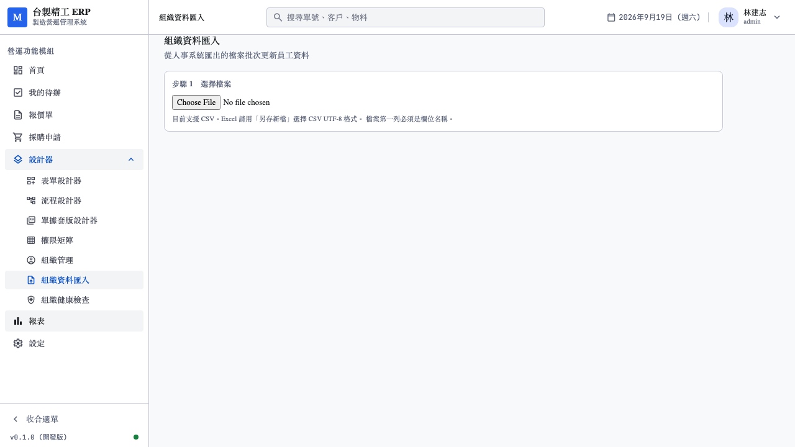
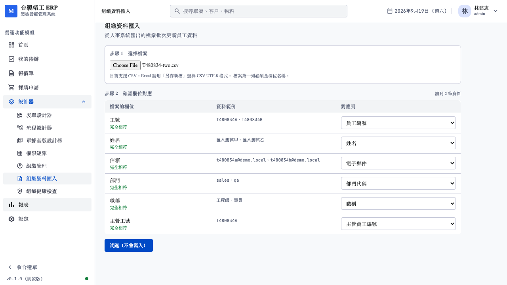
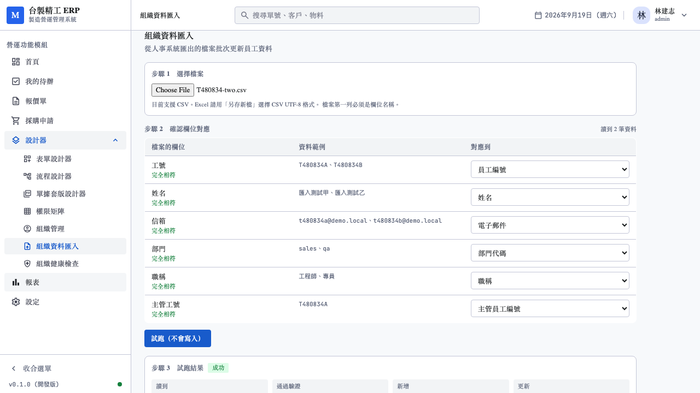
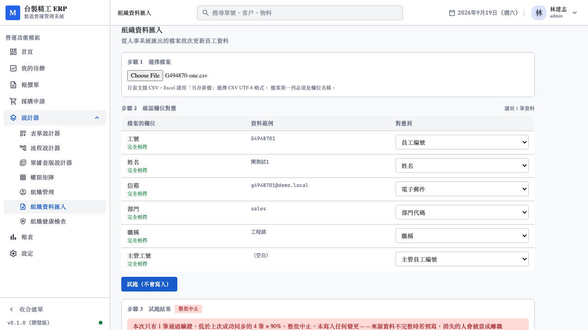

# 16. 組織資料同步 P1 測試報告

日期：2026-09-19
對應需求：[07_組織基本資料與客戶系統同步需求.md](../../需求規劃/202609/07_組織基本資料與客戶系統同步需求.md) §5～§10
範圍：P1（`FILE` connection：CSV 匯入 + 欄位對應 + preview + 完整性閘 + 計數）

承接 [15_組織管理UI測試報告.md](15_組織管理UI測試報告.md)。

---

## 1. 範圍與兩個縮減

使用者要求「P1~P3 同步機制」。P1~P3 完整做完包含整條管線、7 張表、
Temporal 排程、AI 欄位對應、三種 connection 與 UI——不是一輪能做完。

開工前確認了兩件事：

| 問題 | 決定 |
|---|---|
| 這一輪做到哪 | **先把 P1 做完整**。管線建好後 P2/P3 只是換 Extractor |
| AI 欄位對應怎麼做 | **規則式推測**。不依賴外部模型、結果穩定、可測試 |

另外**我自己做的兩個縮減**，都要讓使用者看得到：

### 1.1 只做 CSV，不做 xlsx

需求寫「Excel / CSV」。xlsx 需要額外的解析依賴，而每個 Excel
都另存得出 CSV。管線做對之後，補 xlsx 只是換一個產生
`(headers, rows)` 的函式。

上傳畫面明講「Excel 請用『另存新檔』選擇 CSV UTF-8 格式」，
不讓人上傳 xlsx 之後才拿到看不懂的錯誤。

### 1.2 只做員工，不做部門同步

部門用組織管理手動維護即可——SME 的部門是十位數，而且很少變動。
API 明確回「目前只支援員工資料的同步」而非靜默忽略。

### 1.3 不建 Raw Layer

需求 §10.1 列了 `integration_raw_record`。理由與 §10.2 那些不同，
所以寫進 migration 的註解：

- 它的用途是「保留原始列供比對與重跑」。P1 是檔案上傳，
  **原始檔案本身就是 raw layer**，客戶手上有同一份
- 存原始列等於把整份員工個資再複製一份進資料庫
- P2 的 REST 進來時值得重新評估：API 回應不像檔案那樣留得住

---

## 2. 規則式欄位對應

`domain::field_mapping`。同義詞表涵蓋三類來源：

| 類型 | 例子 |
|---|---|
| 台灣 SME 的中文表頭 | 工號、單位、分機、到職日 |
| SAP / Oracle 欄位代碼 | PERNR、ENAME、ORGEH、BEGDA |
| 英文慣用 | employee no、dept、reports to |

比對前正規化（轉小寫、去掉空白與標點），所以 `Emp No.`、
`emp_no`、`EMP-NO` 都對得到。

### 2.1 順序有意義

`manager_employee_no` 必須排在 `employee_no` 前面。兩者都含「工號」，
順序錯了的話「主管工號」會先被 `employee_no` 吃掉——**整份組織的
主管關係全錯**，而同步會回報成功。

### 2.2 一個 canonical 欄位只建議一次

Excel 常有「部門代碼」與「部門名稱」兩欄。若都對到
`department_code`，管理員確認時兩欄會互相覆蓋，而畫面上看不出來。

### 2.3 開發中抓到的 bug：dataset 限定的同義詞

部門表的表頭常常只寫「名稱」，所以我把它加進 `Name` 的同義詞。
測試通過了——但那是**巧合**。

寫了一支臨時的 probe 驗證，發現：一份**沒有「姓名」欄**的員工表裡，
「部門名稱」會被對成員工的 `name`，confidence 還是 `exact`。
先前的測試之所以通過，是因為「姓名」已經佔用了 `name`，
`used` 機制擋住了第二次。

後果是整份人員名單的姓名欄被寫成部門名，而同步照樣回報成功。

修法：把「名稱」「部門名稱」「deptname」這類移到
`DEPARTMENT_ONLY_SYNONYMS`，只在部門 dataset 生效。
並補了一條測試明確驗證「沒有姓名欄時也不能對錯」。

---

## 3. 完整性閘（§7，「最危險的部分」）

需求的原話：

> 來源 1000 人，API 只回 823 人，若直接刪 177 人，
> 其中只要有一個是主管，**全公司相關流程立刻卡死**

### 3.1 用通過驗證的筆數比較，不是讀到的筆數

一份格式全壞的檔案讀得到 1000 列卻一筆都寫不進去，
那與「來源只回 100 筆」一樣危險。

### 3.2 首次匯入不比較

`last_success_count` 為 `NULL` 代表從未成功同步過，沒有基準。
與 0 是不同的意思。

### 3.3 中止時什麼都不寫

包含**不更新比較基準**。用一次不完整的同步當基準，
下一次的閘就失效了。

### 3.4 前端的 source 必須重用——這是開發中發現的真缺陷

匯入精靈原本每次上傳都 `createSource`。兩個問題：

1. 資料庫有 `unique (tenant_id, connection_id, dataset)`，
   第二次會撞唯一約束
2. **更危險的是**，就算擋得過，新來源沒有 `last_success_count`，
   完整性閘會被當成「首次匯入」而**永遠不生效**

第二點是最糟的失效方式：它安靜。管理員不會發現保護沒了。

修法：加 `GET /integration/sources`，前端重用既有來源並更新 mapping。

---

## 4. 其他保護

| 機制 | 需求 | 說明 |
|---|---|---|
| 永不硬刪 | §7 規則 1 | 來源消失標記 `MISSING_IN_SOURCE`，`status` 不動 |
| 待停用清單 | §7 規則 3 | 連續消失累計次數，**不自動停用**——那等於平台替客戶做人事決定 |
| 欄位級 ownership | §3 | `platform_managed_fields` 的欄位一律跳過並留下明細 |
| 兩階段寫入 | §5.3 | 先 upsert，再回填 `manager_id`。主管可能排在部屬後面 |
| `can_login = false` | §2 | 同步進來的人多數不登入，但必須存在 |
| preview | §12.1 | 「不是加分項。沒有試跑，管理員第一次同步就是盲賭」 |
| 計數契約 | §10.3 | 十個計數每一個都有 |
| 稽核不含個資 | §10.3 | 只記計數，測試實際斷言姓名與 email 不出現 |

---

## 5. 開發中修掉的兩個真 bug

### 5.1 `miss_count` 永遠停在 1

來源消失的查詢原本只找 `sync_status = 'SYNCED'`。第二次同步時
那個人已經被標成 `MISSING_IN_SOURCE`，就抓不到了——
§7 規則 3 的「連續 N 次」完全失效。

測試 `records_pending_deactivation` 抓到的。

### 5.2 消失的人回來後卡住

`sync_status` 原本只在「有改到欄位」時更新。一個先前被標成
`MISSING_IN_SOURCE` 的人重新出現時，他的資料可能一個字都沒變——
狀態會永遠卡住，待停用清單也清不掉，管理員最後真的會把他停用。

補了 `returning_employee_is_restored` 測試，並在同步時清掉
重新出現的人的待停用紀錄。

---

## 6. 測試結果

### 6.1 後端（37 + 25 = 62 項新增）

| 檔案 | 項數 | 重點 |
|---|---|---|
| `domain::field_mapping` 單元 | 14 | 中文/SAP/英文表頭、順序、dataset 限定同義詞 |
| `domain::import` 單元 | 11 | BOM、引號內逗號、長度補齊、重複表頭 |
| `persistence::sync` 單元 | 7 | **完整性閘 5 條**、日期容錯 |
| `integration_api.rs` 整合 | 37 | 見下 |
| `org_api.rs` 新增 | 5 | 刪除員工的四個阻擋條件 |

`integration_api.rs` 的分類：

| 分類 | 測試 |
|---|---|
| 分析 | 表頭建議、樣本只回 5 列、格式錯誤擋下 |
| 首次匯入 | 新增、不可登入、**主管兩階段回填**（含主管排在部屬後面）、部門代碼解析、未知代碼留明細 |
| **完整性閘** | 驟減時中止、**中止時什麼都不寫**、不更新基準、首次不擋 |
| **欄位 ownership** | 平台維護的欄位不被覆蓋、跳過的欄位留明細 |
| **來源消失** | 不硬刪、累計次數、**回來時恢復**、平台自建的人不受影響 |
| preview | 不寫入、仍留 run、不更新基準 |
| 更新 | 更新既有、同步兩次不重複、缺工號的列被擋但其他照寫 |
| 設定 | 必須對應工號、不認得的欄位擋下、門檻不可為 0、只支援 FILE、來源可刪且歷史 cascade |
| 權限 | designer 五個端點全 403、未登入 401、跨租戶不外洩 |
| 稽核 | 記計數不記個資 |

### 6.2 前端（12 項新增）

`tests/api/integration.test.ts`。重點在**前端讀不讀得懂**：
完整性閘中止時回的是 200 而非錯誤（它是同步的一種正常結果），
呼叫端要靠 `status` 而非 HTTP 狀態碼判斷。

### 6.3 E2E（7 項）

`web/e2e/org-import.spec.ts`

| 測試 | 驗證什麼 |
|---|---|
| 四個步驟 | 從側邊欄進入、對應自動填好、**寫入按鈕在試跑前不存在**、寫入後主管關係正確 |
| 試跑不寫入 | 試跑說會新增，但組織裡找不到那個人 |
| 缺工號不能試跑 | 按鈕 disabled 並說明原因 |
| 手動改對應 | 猜不出來的欄位可人工指定，警告跟著消失 |
| 重複對應警告 | 兩欄對到同一個目標時標紅 |
| **完整性閘擋下** | 4 人變 1 人時整批中止，寫入按鈕 disabled |
| designer 唯讀 | 看得到頁面但檔案選擇 disabled |









### 6.4 回歸

| 套件 | 本輪 | 上一輪 |
|---|---|---|
| Rust workspace | **287** | 213 |
| 前端單元 | **394** | 382 |
| `vue-tsc --noEmit` | 零錯誤 | 零錯誤 |
| Playwright E2E | **104**（261s） | 97 |

---

## 7. 實機驗證

對 demo 租戶直接打 API：

```
POST /integration/analyze
  六欄全部 exact，含「主管工號」不被「工號」吃掉

POST /integration/sources/{id}/preview
  status: SUCCESS，新增 2 筆
  組織裡查不到任何人                          ✓ 試跑不寫入

POST /integration/sources/{id}/sync
  T001 測試甲 部門=業務一部 主管=None  可登入=False sync=SYNCED
  T002 測試乙 部門=品保部   主管=測試甲 可登入=False sync=SYNCED
                                              ✓ 部門解析、主管回填、不可登入

再送只有 1 人的檔案
  status: ABORTED_INCOMPLETE
  「本次只有 1 筆通過驗證，低於上次成功同步的 2 筆 × 90%。整批中止」
```

---

## 8. 測試資料污染：第三次遇到同一類問題

E2E 跑完後 demo 租戶多了 6 個停用的員工與 1 個來源。
跟部門那次一樣，**測試沒有真正還原**。

這一輪需要兩個新端點才修得掉：

| 端點 | 條件 | 為什麼是合理的產品功能 |
|---|---|---|
| `DELETE /org/employees/{id}` | 沒有待辦、沒送過單、不是任何人的主管、不是部門主管、沒有代理設定 | 誤建的人應該收得回去 |
| `DELETE /integration/sources/{id}` | 無 | 換了人事系統時重新設定比逐欄改容易 |

`app_user` 有 19 個外鍵指向它，多數是 `on delete set null` 的稽核
欄位。真正會出事的四個全部擋在應用層而非靠 FK 的預設行為——
`set null` 是靜默的，出事時沒有任何訊息。

另外發現 E2E 之間會**互相污染**：所有測試共用同一個 source，
而 source 記著完整性閘的比較基準。上一條測試同步 4 筆，
下一條匯入 2 筆就被擋下。修法是每條測試開頭都清掉 source。

清理順序也有坑：匯入的「甲」是「乙」的主管，直接刪會被擋下，
而且擋下的是哪一個取決於迴圈順序。改成先解除主管關係再刪。

**驗證**：連跑兩次 E2E，demo 租戶都回到 9 人、6 部門、0 來源。

---

## 9. 尚未完成

| 項目 | 說明 |
|---|---|
| xlsx 解析 | 見 §1.1。換一個 parser 即可 |
| 部門同步 | 見 §1.2 |
| 排程同步（§6） | 需求說跑在 Temporal。Sync Now 已可用，排程未做 |
| 待停用的確認流程（§7 規則 3、4） | 清單已在累計，但沒有 UI 讓管理員確認，停用前置檢查也未實作 |
| 同步歷史 UI | API 已具備（`GET /integration/sync-runs`），畫面只顯示當次結果 |
| P2 | `REST` connection：Odoo adapter、增量同步 |
| P3 | `SQL` connection：唯讀直連 + 具名查詢 |

P2/P3 共用這一輪建好的管線（Validate → Upsert → 完整性閘 → 計數），
只需要替換最前面的 Extractor。
