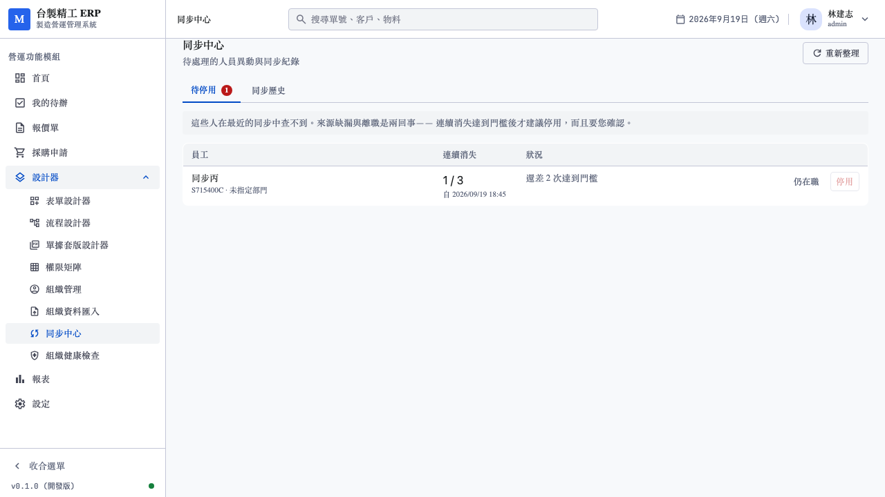
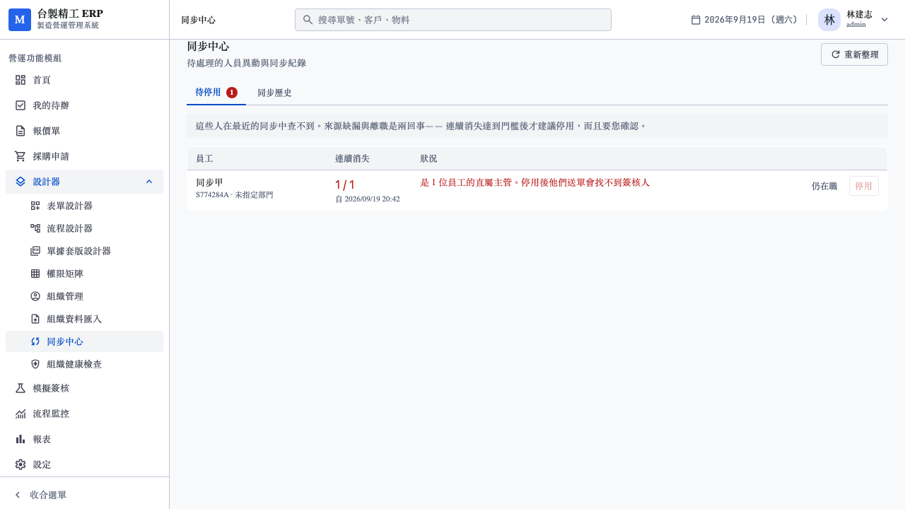
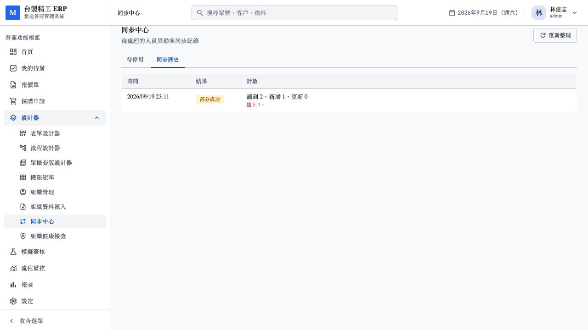
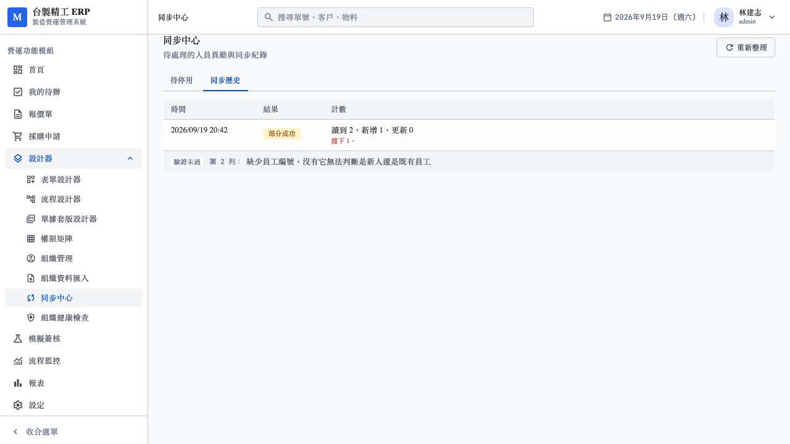

# 17. 待停用確認流程與同步中心測試報告

日期：2026-09-19
對應需求：[07_組織基本資料與客戶系統同步需求.md](../../需求規劃/202609/07_組織基本資料與客戶系統同步需求.md) §6、§7、§10.3、Q-02、Q-03
範圍：P1 剩餘的三項

承接 [A16_組織資料同步P1測試報告.md](A16_組織資料同步P1測試報告.md)。

---

## 1. 排程同步：說明為什麼不做

使用者要求補完「排程同步、待停用確認流程、同步歷史 UI」。
其中**排程對 FILE connection 不成立**，開工前先確認了這點。

需求 §6 說排程跑在 Temporal，但 FILE 的資料來源是「管理員上傳的檔案」。
沒有檔案時，排程要同步什麼？三個選項都不好：

| 做法 | 問題 |
|---|---|
| 重跑上次的檔案 | 資料不會變新，而且要把整份個資 CSV 存進資料庫——正是 P1 刻意不建 Raw Layer 的理由 |
| 加 SFTP 取檔 | 需要 SFTP client 依賴與金鑰管理，且沒有真實 SFTP 伺服器可驗證 |
| 只做排程框架 | 框架沒有東西可觸發，等於寫了不會執行的程式碼 |

**決定：跳過排程**，等 P2 的 REST（平台主動去拉）才有意義。
「Sync Now」已經可用，那是 §6 說的「MVP 最重要的一個按鈕」。

---

## 2. Q-02 順便定案：完整性閘改成雙條件

需求 §15 的 Q-02：

> 完整性閘的門檻預設 0.9 是否合理？人數少的公司（50 人）
> 走掉 6 人就會誤觸發

原本只看比例。50 人走掉 6 人是 12%，超過 0.9 的門檻就被擋下——
那不是資料缺漏，是正常的人員異動。管理員被擋下之後只能調高門檻，
**而調高之後保護就變弱了**。

改成兩個條件**都**成立才中止：

```rust
let ratio_ok = received >= last * threshold;
if ratio_ok { return true; }
// 比例不過，但減少的人數不多——視為正常異動
(last - received) < min_drop
```

`min_drop` 預設 10，每個來源可調。效果：

| 情境 | 比例 | 減少 | 結果 |
|---|---|---|---|
| 50 → 44（小公司正常異動） | 88% ❌ | 6 人 ✅ | **放行** |
| 50 → 40 | 80% ❌ | 10 人 ❌ | 中止 |
| 1000 → 823（需求的例子） | 82% ❌ | 177 人 ❌ | 中止 |
| 10000 → 9950 | 99.5% ✅ | 50 人 | 放行（比例過關不看絕對值） |

### 2.1 這個改動讓三條既有測試失效

`aborts_when_source_shrinks` 等三條用 3 人的資料，少 2 人——
新規則**正確地不擋**了。

修法是在那些測試裡明確把 `min_drop` 設成 1，讓它們測的是比例條件本身；
雙條件的互動另有三條新測試涵蓋。E2E 的完整性閘測試則改用 15 人的資料
（少 14 人，兩個條件都成立）。

---

## 3. 待停用的確認流程（§7 規則 3、4）

### 3.1 Q-03 定案：預設 3 次，每個來源可調

> `MISSING_IN_SOURCE` 連續幾次才進待停用清單？預設 3 次 × 每日同步 = 3 天

做成可調而非寫死：每週匯出一次的客戶，3 次就是三週。

門檻不可設為 0——那等於一次匯出疏漏就能停用人，正是 §7 規則 3
的整個用意要避免的。

### 3.2 停用前置檢查是這一節最重要的部分

§7 規則 4：

> 該員工若是他人的 `manager_id`、或任何 `department.manager_user_id`、
> 或有未完成 Human Task → **擋下停用**，先要求轉派

為什麼非擋不可：`participant::manager_of` 的 join **不看狀態**。
停用一個主管之後，他部屬的簽核人解析**仍會成功**——任務照樣指派給他，
而他收不到通知。這比解析失敗更難發現。

三個檢查每次都即時算，不快取。組織會變動，一小時前算的結果
現在可能已經不成立。

阻擋理由**在清單上就看得到**，不是按了才知道：

> 是 1 位員工的直屬主管。停用後他們送單會找不到簽核人

### 3.3 「仍在職」要刪紀錄而非標記

管理員判斷這個人只是匯出漏了時，紀錄要**刪掉**而非標成 `DISMISSED` 留著。

留著的話，下次他又消失時 `on conflict do update` 會在舊紀錄上加一，
次數立刻超過門檻又跳出來——等於忽略沒有生效。

---

## 4. 同步歷史 UI

§10.3：「同步不能只回 success」。每一列顯示：

- 讀到 / 新增 / 更新
- 擋下幾筆（紅字）、平台維護跳過幾個欄位、來源消失幾人
- 中止時的完整訊息
- **試跑要標示出來**——不標的話會被誤認為真的同步過

點開展開問題明細，每一筆標示類型（驗證未過 / 平台維護跳過 /
來源消失）與來源的第幾列。

與待停用放同一頁：管理員看完歷史常會想看待停用，反之亦然。

---

## 5. 測試結果

### 5.1 後端（16 項新增）

| 檔案 | 新增 | 內容 |
|---|---|---|
| `persistence::sync` 單元 | 4 | 雙條件的四種組合 |
| `integration_api.rs` | 12 | 見下 |

新增的整合測試：

| 分類 | 測試 |
|---|---|
| 待停用清單 | 帶回次數與門檻、未達門檻不可停用（且人仍 ACTIVE）、達門檻可停用（且從清單移除） |
| **前置檢查** | 是別人主管的擋下（blockers 在清單上就有）、有未完成待辦的擋下 |
| 忽略 | 從清單移除，且**下次消失重新累計** |
| 門檻 | 可調、不可設為 0 |
| 權限 | designer 403 |
| **Q-02 雙條件** | 小公司正常異動不誤擋、兩條件都成立才中止、絕對值門檻可調 |

### 5.2 前端（5 項新增）

`tests/api/integration.test.ts`：清單帶回 blockers、可停用時 blockers 為空、
未達門檻與前置檢查不過時的兩種 409。

### 5.3 E2E（8 項）

`web/e2e/sync-center.spec.ts`

| 測試 | 驗證什麼 |
|---|---|
| 待停用清單顯示次數與門檻 | 「1 / 3」與「還差 2 次」 |
| 未達門檻時停用鈕不可用 | §7 規則 3 |
| 達到門檻後可以停用 | 停用後從清單消失 |
| **是別人主管的人不可停用** | 理由在清單上就看得到，按鈕 disabled |
| 標記為仍在職後從清單移除 | — |
| 同步歷史顯示計數，可展開明細 | §10.3 |
| 試跑的紀錄要標示出來 | 不標會被誤認為真的同步過 |
| designer 不能使用 | — |









### 5.4 回歸

| 套件 | 本輪 | 上一輪 |
|---|---|---|
| Rust workspace | **303** | 287 |
| 前端單元 | **399** | 394 |
| `vue-tsc --noEmit` | 零錯誤 | 零錯誤 |
| Playwright E2E | **112**（323s） | 104 |

---

## 6. 測試污染：這次是 E2E 之間互相干擾

單獨跑 `sync-center` 八條全過，但**完整套跑時三條失敗**。

原因：斷言用姓名（「同步乙」）定位，而每條測試的人名都一樣，
只有工號前綴不同。前一條測試若有殘留，後一條會抓到錯的列。

另一條的斷言是「整個待停用清單空」——那在單獨跑時成立，
完整套跑時會因為執行順序而時好時壞。

修法：

- 所有斷言改用**工號前綴**定位，那是每條測試唯一的
- 不再斷言「整個清單空」，只驗證自己那一列消失

另外 `org-import` 的完整性閘 E2E 也因為 Q-02 的改動而失效
（4 人變 1 人只少 3 人，新規則正確地不擋）。改用 15 人的資料。

**驗證**：連續兩次完整跑 112/112，demo 租戶都回到 9 人、0 來源、
0 待停用。

---

## 7. P1 完成度

| 項目 | 狀態 |
|---|---|
| CSV 解析與欄位對應 | ✅ 見報告 A16 |
| 完整性閘 | ✅ 含 Q-02 的雙條件 |
| 欄位級 ownership | ✅ 見報告 A16 |
| preview | ✅ 見報告 A16 |
| 計數契約 | ✅ 十個計數齊備 |
| 待停用確認流程 | ✅ 含 §7 規則 4 的三項前置檢查 |
| 同步歷史 UI | ✅ 含問題明細 |
| 排程同步 | ⬜ 見 §1，等 P2 |

**P1 除排程外全部完成。**

---

## 8. 尚未完成

| 項目 | 說明 |
|---|---|
| 排程同步 | 見 §1。等 P2 的 REST 或 SFTP 取檔 |
| xlsx 解析 | 見報告 A16 §1.1 |
| 部門同步 | 見報告 A16 §1.2 |
| P2 | `REST` connection：Odoo adapter、增量同步、SSRF 防護 |
| P3 | `SQL` connection：唯讀直連 + 具名查詢 |

需求 §15 還有六個未定事項（Q-01、Q-04～Q-08）。這一輪定案了
Q-02 與 Q-03，其餘與 P1 無關。
