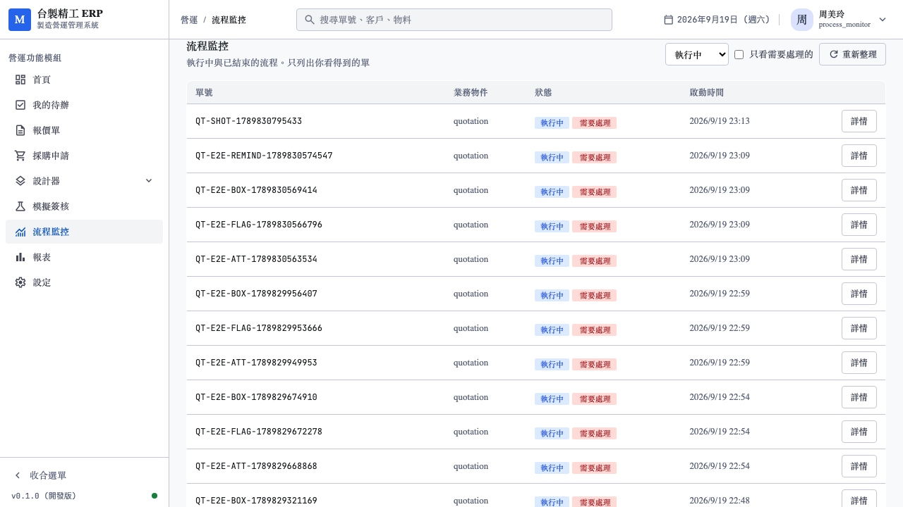
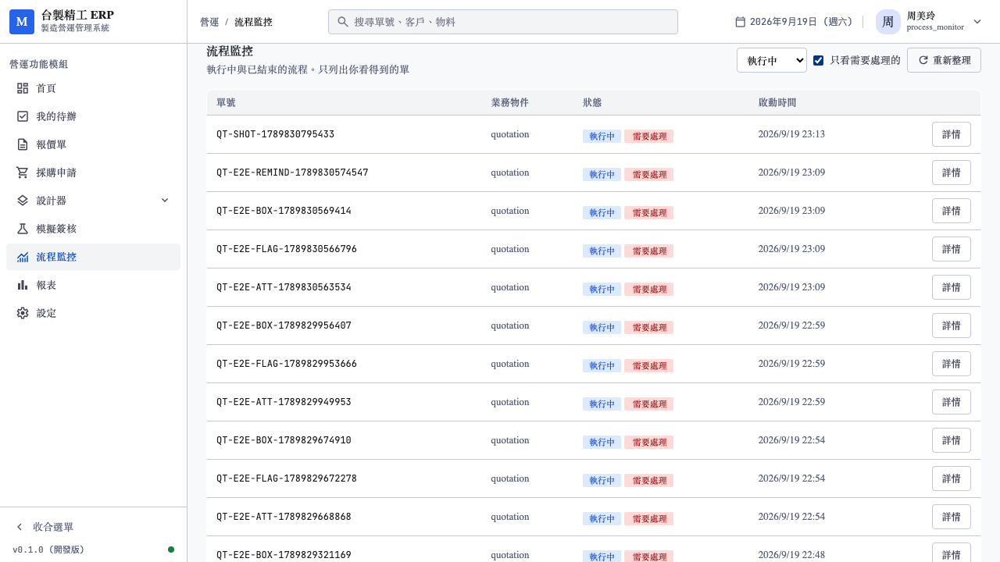
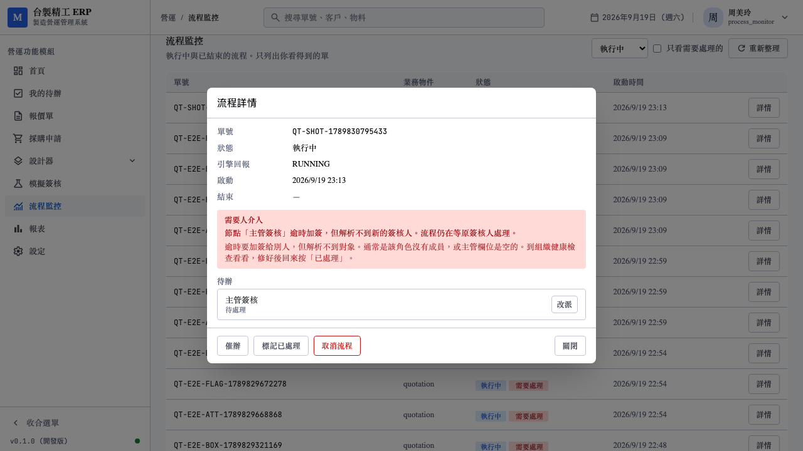
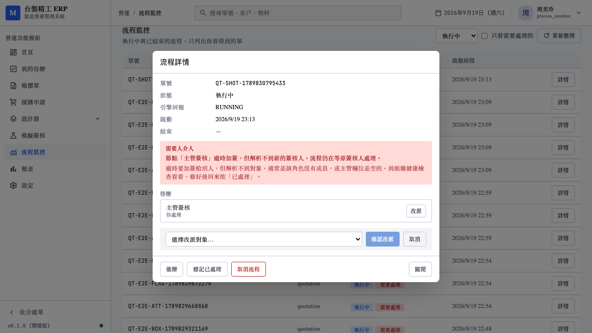
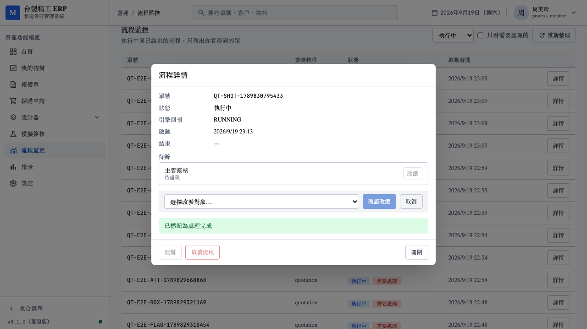
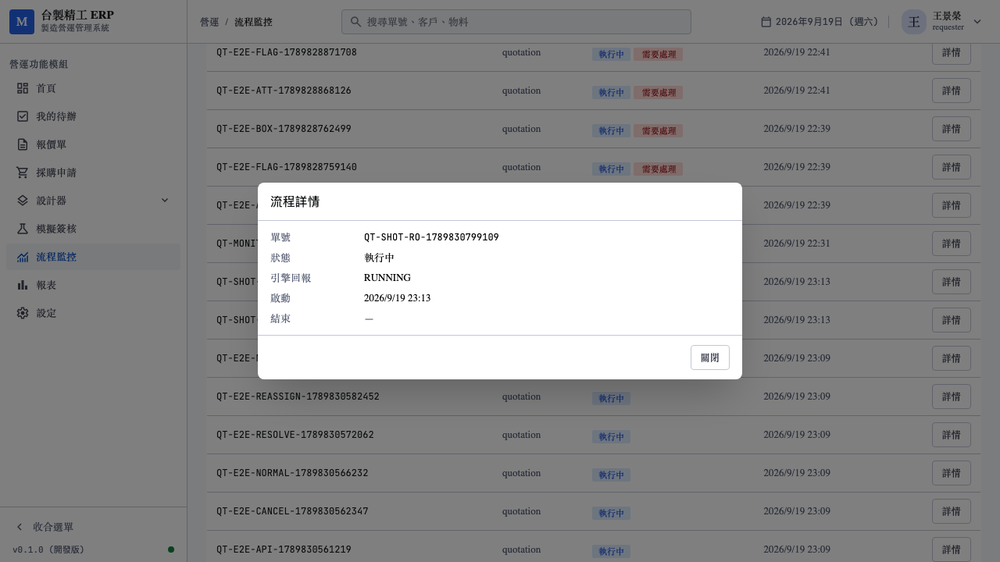

# A19. 流程監控角色與執行期異常標記測試報告

日期：2026-09-19
對應：[04_模擬功能收尾總結](../../實踐規劃/總結/202609/04_模擬功能收尾總結.md) 的 N1、N3
範圍：`process_monitor` 角色、介入動作、`NEEDS_ATTENTION` 執行期異常

承接 [A18_兩台整合與種子修正測試報告](A18_兩台整合與種子修正測試報告.md)。
該報告結尾把 N1、N3 列為「需要人決定」，本輪使用者定案後實作。

---

## 0. 使用者的兩個決定

| 編號 | 決定 | 被否決的選項 |
|---|---|---|
| N1 | 新增 `process_monitor`，權限為**讀 + 催辦 + 取消 + 改派** | 只讀 + 催辦（較保守） |
| N3 | 流程**續跑**，標記 `NEEDS_ATTENTION` | 流程失敗（FAILED）／暫停（SUSPENDED） |

N3 選續跑的理由在下面 §4 展開：原簽核人本來還簽得動，
把跑到一半的流程弄死是破壞性的。

---

## 1. 動工前先問，因為選錯要重寫

兩個決定各有分支，而且分支之間不是「多做一點少做一點」的差別：

- N1 若只給唯讀，就不需要改派 API、不需要員工清單、
  `cancel` 的授權也不用動
- N3 若選 FAILED，那是 `status` 的一個值；選 `NEEDS_ATTENTION`
  則是**正交的新維度**，資料模型完全不同

所以先問了再動手。這兩個問題本來就不是技術問題——
「營運人員能不能中止別人的單」是政策，不是架構。

---

## 2. 做的時候發現一個既有漏洞

`cancel` 端點**完全沒有角色檢查**。

```rust
// 原本：只檢查狀態，沒有檢查是誰
if instance.status != "RUNNING" { ... }
```

清單有 `visible_to` 過濾，單筆查詢有 `visible` 判定，
但取消沒有。也就是說**同租戶任何人只要知道 instance id
就能取消別人的單**——而 id 會出現在通知信的連結、稽核紀錄裡，
不是秘密。

這不在 N1 的範圍內，但加 `process_manager` 角色時若不一併處理，
等於在一個已經破的地方再開一扇門。

修法：限縮成「發起人自己 or 監控角色」，**回 404 而非 403**。
403 等於告訴對方「這張單存在」。

實機驗證（`qa@demo.local` 是 approver，取消 sales 發起的單）：

```
HTTP 404
```

---

## 3. N1：為什麼不讓簽核角色兼差

`approver`、`finance_manager` 的語意是「**會簽到某些單**」，
不是「**該看到全部單**」。兩者混為一談之後很難再拆開，
而且會讓流程監控變成全租戶的資料出口。

因此另立一個語意單一的角色。判斷收斂成一個方法：

```rust
pub fn can_monitor_all(&self) -> bool {
    self.is_admin() || self.has_role("process_monitor")
}
```

做成方法而非在各處寫 `has_role("process_monitor")`：
這個判斷散在清單、單筆、取消、改派、催辦**五處**，
任何一處漏掉 `admin` 或拼錯角色名都是權限漏洞。

### 3.1 實機對照

用 `monitor@demo.local`（只有 `process_monitor`，**不是 admin**）。
拿 admin 測等於完全沒測到新角色。

| 帳號 | 角色 | 看得到 |
|---|---|---|
| `monitor@demo.local` | `process_monitor` | 100 筆（查詢上限） |
| `sales@demo.local` | `requester` | 25 筆（自己發起的） |
| `qa@demo.local` | **`approver`** | **1 筆** |

`approver` 只看得到 1 筆——這正是 N1 的核心決定成立的證據。

### 3.2 介入動作的三個設計決定

| 動作 | 決定 | 理由 |
|---|---|---|
| 催辦 | 走 `internal::deliver`，不自己組信 | 沙箱改寫（標題前綴、收件人換測試者）只做在那裡。自己組信會讓沙箱的催辦信寄給**真的同事** |
| 改派 | 同時清掉 `assignee_role` | `inbox` 查詢是 `user_id = $1 or role = any($2)`。不清的話原角色的人還看得到那張待辦，**等於沒有改派** |
| 取消 | 稽核加 `by_monitor` 欄位 | 查稽核要看得出「這張單是被營運中止的」而非「發起人自己撤的」，兩者責任歸屬不同 |

改派另外擋了離職者。RLS 只隔離租戶，離職的人查得到——
改派給他等於把單丟進黑洞：

```
{"code":"BAD_REQUEST","message":"劉建國 不是在職員工，無法改派"}
```

### 3.3 稽核實機紀錄

```
action     | task.reassign
actor_name | 周美玲
payload    | {"from_user_id": "adc4b764…", "to_user_id": "6296be65…",
              "to_name": "黃志明", "node_id": "manager_approval",
              "reason": "實機走查"}
```

`from` 與 `to` 都記，責任轉移查得出來。

---

## 4. N3：為什麼是「續跑 + 標記」而不是失敗

原本的行為：

```python
workflow.logger.warning("節點 %s 逾時加簽，但解析不到新的參與者，改為繼續等待")
```

**問題不在「繼續等」**——原簽核人本來就還簽得動，讓流程失敗
反而會把一張跑到一半的單弄死。問題在於**沒有任何人看得到**：
畫面沒有、稽核沒有，只有一行沒人會看的 log。

因此保留行為，補上可見性。

### 4.1 為什麼不塞進 `status`

`status` 是流程生命週期（RUNNING / COMPLETED / …），
異常是**正交的維度**。塞進去的話「異常但仍在跑」就無法表達，
而那正是這裡要的語意。

所以新增四個欄位：

```sql
needs_attention  boolean not null default false
attention_code   text     -- 機器可讀，前端據此分支
attention_detail text     -- 給人看的一句話
attention_at     timestamptz
```

`code` 與 `detail` 都存：前端用 `code` 決定顯示哪種處理建議
（訊息會改寫，代碼不會），`detail` 帶當下才知道的節點名稱。

### 4.2 解除為什麼是手動的

修好組織資料之後，**不會有任何事件回來通知系統**。
自動解除只能靠輪詢重試，而重試的時機無從判定。

由處理的人按「已處理」，順帶留下誰處理的稽核。
解除後欄位會被清空，所以稽核是唯一的歷史紀錄——因此刻意記下原代碼：

```
action     | instance.attention_resolved
actor_name | 周美玲
payload    | {"code": "ESCALATE_UNRESOLVED", "note": "實機走查",
              "detail": "節點「主管簽核」逾時加簽，但解析不到新的簽核人。…"}
```

`finish` 也會順手清旗標——已結束的流程不需要人介入，
不清的話監控頁會被已完成的單佔在最前面。

---

## 5. 測試

| 套件 | 本輪 | 上一輪（A18） |
|---|---|---|
| Rust workspace | **353** | 342 |
| Python | **161** | 159 |
| 前端單元 | 435 | 435 |
| Playwright E2E | **136** | 125 |
| `vue-tsc --noEmit` | 零錯誤 | 零錯誤 |

新增：Rust +11、Python +2、E2E +11。

### 5.1 驗證測試「會紅」

全綠的安全測試最不可信。兩項都實際驗過：

**N3（Python）**：把 interpreter 還原成舊的 silent WARNING——

```
FAILED tests/test_timeout.py::TestESCALATE::test_解析不到加簽對象時回報異常但流程繼續
```

**N1（E2E）**：把 `approver` 加進 `can_monitor_all`——

| 測試 | 結果 |
|---|---|
| approver 看不到別人的單 | **failed** ✅ |
| 非發起人不能取消別人的單 | **failed** ✅ |
| 催辦寄出提醒 | failed（連帶：被放行的 approver 取消了測試用的單） |

兩次都改回來確認恢復全綠。

### 5.2 反向測試

只測「解析不到就回報」的話，一個**每次都回報**的實作也會通過，
但那會讓監控頁被正常的單淹沒。因此加了
`test_加簽成功時不回報異常`。

同理，E2E 除了「監控者做得到」，也測「一般使用者看不到按鈕」
與「approver 打 API 被擋 403」——前端隱藏只是 UX，
真正的權限在後端。

---

## 6. 抓到的問題

| 問題 | 怎麼發現的 | 性質 |
|---|---|---|
| `cancel` 沒有角色檢查 | 讀程式碼準備加權限時 | **既有漏洞**，非本次引入 |
| 催辦成功但重載失敗會顯示成失敗 | 寫 `act()` 時推敲錯誤路徑 | 產品缺陷 |
| 催辦 E2E 時紅時綠 | 整套跑時失敗、單跑通過 | 測試缺陷 |

### 6.1 催辦的「假失敗」

`act()` 原本是一個 try 包住「執行動作」與「重新載入畫面」。
催辦成功但重載失敗時，**信已經寄出去了**，畫面卻顯示失敗——
使用者會以為沒寄到而再按一次，收件人收到兩封。

拆成兩段 try：動作失敗才是失敗，重載失敗只提醒畫面不是最新的。

### 6.2 E2E 不穩定的真正原因

先後推測過兩次，都錯了：

1. 以為是 409「沒有待處理的待辦」——查資料庫，instance 是
   RUNNING 且有 1 筆 PENDING，推翻
2. 以為是清單只顯示 50 筆、異常單排前面把新單擠出去——
   改用「執行中」過濾後仍然失敗，推翻

實際量測才找到：

```
remind #1: 5.109s
remind #2: 4.149s
remind #3: 5.769s
```

**催辦會真的走 SMTP 寄信，耗時 4～6 秒，而 Playwright 的
預設 assertion timeout 是 5 秒**——剛好卡在中間，所以時紅時綠。

改成明確的 20 秒。時紅時綠的測試比沒有測試更糟，
因為紅了會被當成雜訊忽略。

**順帶**：清單上限從 50 改成 200。監控是營運要「看完」的清單
而非收件匣，50 筆在幾十條流程同時跑的租戶看不到全部，
而看不到的那幾筆正可能是卡住的。

---

## 7. 實機走查

`monitor@demo.local` / `demo1234`（只有 `process_monitor`）。



「執行中」與紅色「需要處理」**並列**而非取代：這張單同時是
執行中且需要處理，兩件事都要看得到。異常排在最前面。





說明先寫**發生什麼事**，再寫**怎麼處理**。只說「解析不到簽核人」
使用者不知道要去哪裡修，那個提示就等於沒有用。

下方「待辦」回答「卡在誰身上」——流程狀態只說 RUNNING。



只列在職員工，附部門名。



紅框消失，「標記已處理」按鈕也跟著不見（沒有東西可解除了）。



`requester` 王景榮看自己的單：只有「關閉」，
沒有催辦／取消／改派，也沒有待辦區塊。

---

## 8. 沒有驗證到的

| 項目 | 說明 |
|---|---|
| 真實的逾時加簽觸發 | 實機的異常旗標是**直接打 internal API 掛上去的**，不是等真的 `P2D` 逾時。完整路徑只在 Python 的 time-skipping 測試裡驗過 |
| 指派給角色的待辦催辦 | 目前 `resolve_recipients` 只認 user id 與 email，角色型待辦會被跳過並回報 `skipped_role_tasks`。實機的種子資料都是指派給人，這條路徑沒有實機資料 |
| 改派後對方收不收得到通知 | 改派**不發通知**。對方要自己看收件匣才知道多了一張單 |
| 取消流程 | 授權驗過（404），但沒有實機按下去看 Temporal 的清理 |

第三項值得下一輪處理：改派了但對方不知道，等於沒改派。

---

## 9. 給另一台的注意事項

- migration 用了 **0012**，下一個請用 `0013`
- 套用時 `insert ... from tenant` 影響 **3534 筆**——
  沙箱每次複製一個租戶累積的。功能正常，但那個數字本身
  值得記一筆（見總結的「379 個流程定義殘留」是同一現象）
- 種子新增 `monitor@demo.local`，只有 `process_monitor`。
  要測監控功能請用它，**不要用 admin**——admin 本來就看得到全部
